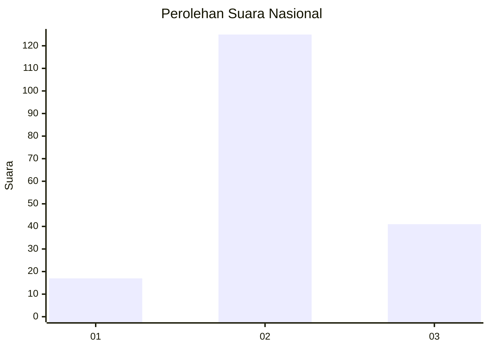
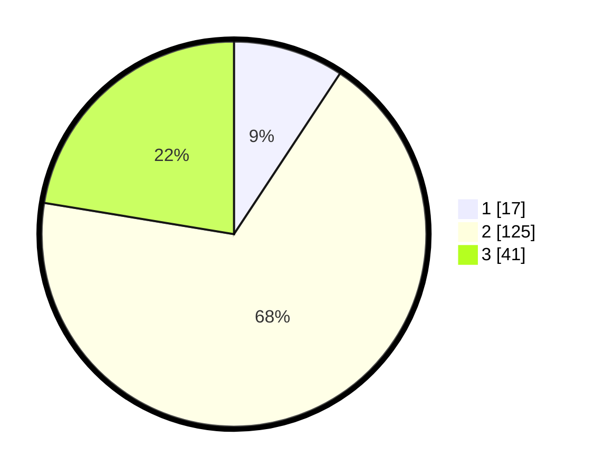

# Hasil

## Grafik

## Tabel

| No. | Nama Paslon    | Suara | Suara (raw) | Persentase |
|:--- |:-------------- | -----:| -----------:| ----------:|
| 1   | ANIES MUHAIMIN | 17    | [17][p-1]   | 9,29       |
| 2   | PRABOWO GIBRAN | 125   | [125][p-2]  | 68,31      |
| 3   | GANJAR MAHFUD  | 41    | [41][p-3]   | 22,40      |

[p-1]: https://github.com/gigit-pemilu/pemilu-2024/blob/main/pilpres/hitung-suara/sub/34-di-yogyakarta/sub/03-gunungkidul/sub/05-paliyan/sub/2005-karangasem/sub/025-tps/sub/paslon-1.txt
[p-2]: https://github.com/gigit-pemilu/pemilu-2024/blob/main/pilpres/hitung-suara/sub/34-di-yogyakarta/sub/03-gunungkidul/sub/05-paliyan/sub/2005-karangasem/sub/025-tps/sub/paslon-2.txt
[p-3]: https://github.com/gigit-pemilu/pemilu-2024/blob/main/pilpres/hitung-suara/sub/34-di-yogyakarta/sub/03-gunungkidul/sub/05-paliyan/sub/2005-karangasem/sub/025-tps/sub/paslon-3.txt

## Foto C Plano

https://sirekap-obj-formc.kpu.go.id/0a61/pemilu/ppwp/34/03/05/20/05/3403052005025-20240216-121024--7c7cf89f-029b-4a0a-8358-10824728934b.jpg

https://sirekap-obj-formc.kpu.go.id/0a61/pemilu/ppwp/34/03/05/20/05/3403052005025-20240216-121026--fda47b9c-a4c4-49ae-8867-e69aae798222.jpg

https://sirekap-obj-formc.kpu.go.id/0a61/pemilu/ppwp/34/03/05/20/05/3403052005025-20240216-100910--a46895f7-6732-4b10-bdb4-b747eaa08ace.jpg

## Metadata

| Key        | Value               |
| ---------- | ------------------- |
| Time Stamp | 2024-02-17 16:00:02 |

## DATA PEMILIH TETAP

Jumlah pemilih dalam DPT: **214**.
 * L: **101**.
 * P: **113**.

## DATA PENGGUNA HAK PILIH

Jumlah pengguna hak pilih dalam DPT: **181**.
 * L: **88**.
 * P: **93**.

Jumlah pengguna hak pilih dalam DPTb: **2**.
 * L: **1**.
 * P: **1**.

Jumlah pengguna hak pilih dalam DPK: **0**.
 * L: **0**.
 * P: **0**.

Jumlah pengguna hak pilih: **183**.
 * L: **89**.
 * P: **94**.

## JUMLAH SUARA SAH DAN TIDAK SAH

JUMLAH SELURUH SUARA SAH: **183**.

JUMLAH SUARA TIDAK SAH: **36**.

JUMLAH SELURUH SUARA SAH DAN SUARA TIDAK SAH: **219**.

