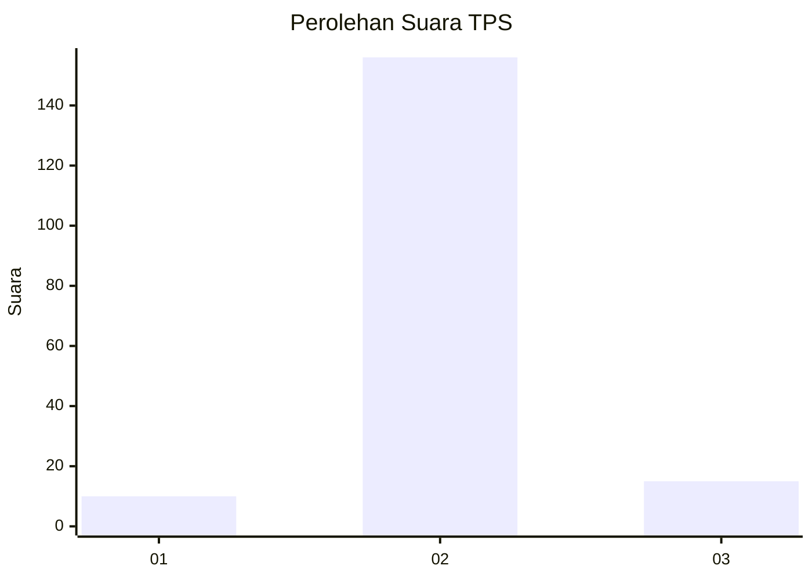
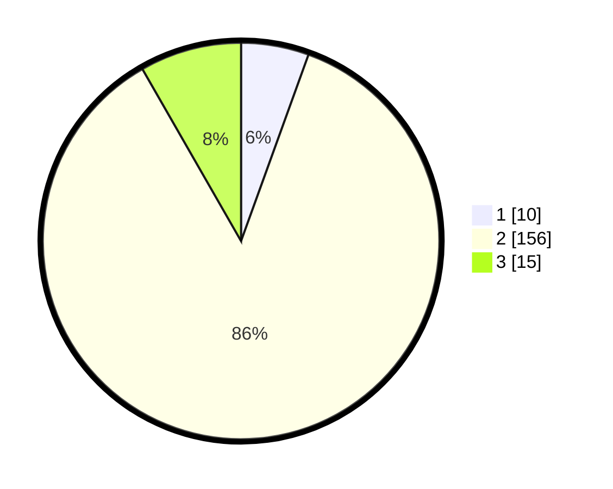

# Hasil

## Grafik

## Tabel

| No. | Nama Paslon    | Suara | Suara (raw) | Persentase |
|:--- |:-------------- | -----:| -----------:| ----------:|
| 1   | ANIES MUHAIMIN | 10    | [10][p-1]   | 5,52       |
| 2   | PRABOWO GIBRAN | 156   | [156][p-2]  | 86,19      |
| 3   | GANJAR MAHFUD  | 15    | [15][p-3]   | 8,29       |

[p-1]: https://github.com/gigit-pemilu/pemilu-2024-34-di-yogyakarta/blob/main/pilpres/hitung-suara/sub/34-di-yogyakarta/sub/03-gunungkidul/sub/06-panggang/sub/2001-girikarto/sub/001-tps/sub/paslon-1.txt
[p-2]: https://github.com/gigit-pemilu/pemilu-2024-34-di-yogyakarta/blob/main/pilpres/hitung-suara/sub/34-di-yogyakarta/sub/03-gunungkidul/sub/06-panggang/sub/2001-girikarto/sub/001-tps/sub/paslon-2.txt
[p-3]: https://github.com/gigit-pemilu/pemilu-2024-34-di-yogyakarta/blob/main/pilpres/hitung-suara/sub/34-di-yogyakarta/sub/03-gunungkidul/sub/06-panggang/sub/2001-girikarto/sub/001-tps/sub/paslon-3.txt

## Foto C Plano

https://sirekap-obj-formc.kpu.go.id/b0ff/pemilu/ppwp/34/03/06/20/01/3403062001001-20240216-130320--9d033a28-f5e0-4a79-901a-293cda3f91b1.jpg

https://sirekap-obj-formc.kpu.go.id/b0ff/pemilu/ppwp/34/03/06/20/01/3403062001001-20240216-130322--f52bd097-8715-498c-84f8-70f4b35b4cce.jpg

https://sirekap-obj-formc.kpu.go.id/b0ff/pemilu/ppwp/34/03/06/20/01/3403062001001-20240216-130321--ea065fd1-ddc7-4a4d-9052-355cdd33e8ad.jpg

## Metadata

| Key        | Value               |
| ---------- | ------------------- |
| Time Stamp | 2024-02-16 16:25:10 |

## DATA PEMILIH TETAP

Jumlah pemilih dalam DPT: **204**.
 * L: **95**.
 * P: **109**.

## DATA PENGGUNA HAK PILIH

Jumlah pengguna hak pilih dalam DPT: **189**.
 * L: **88**.
 * P: **101**.

Jumlah pengguna hak pilih dalam DPTb: **0**.
 * L: **0**.
 * P: **0**.

Jumlah pengguna hak pilih dalam DPK: **0**.
 * L: **0**.
 * P: **0**.

Jumlah pengguna hak pilih: **189**.
 * L: **88**.
 * P: **101**.

## JUMLAH SUARA SAH DAN TIDAK SAH

JUMLAH SELURUH SUARA SAH: **181**.

JUMLAH SUARA TIDAK SAH: **8**.

JUMLAH SELURUH SUARA SAH DAN SUARA TIDAK SAH: **189**.

