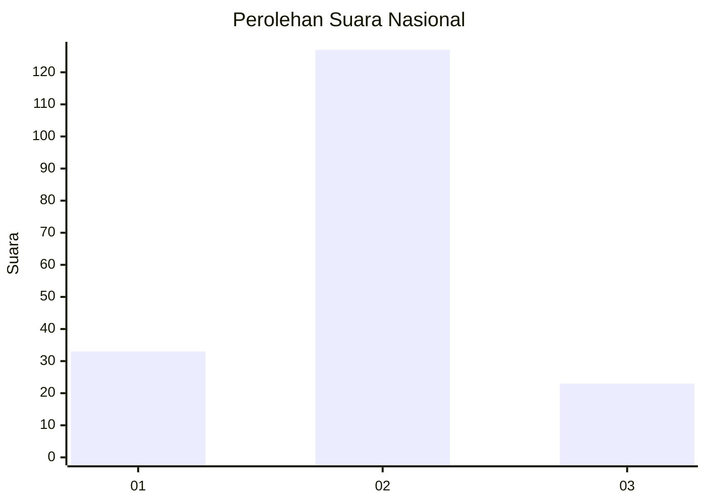
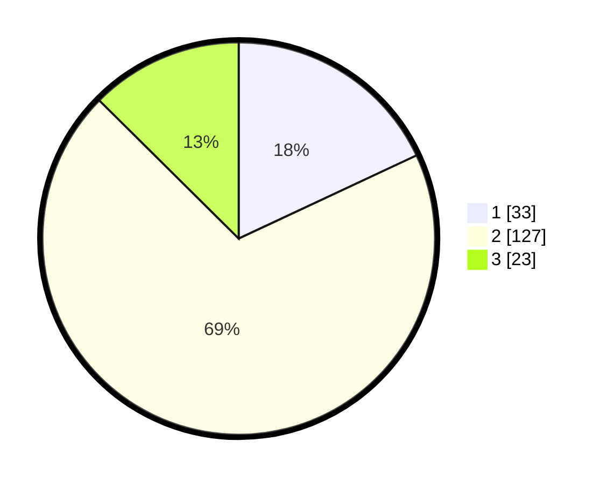

# Hasil

## Grafik

## Tabel

| No. | Nama Paslon    | Suara | Suara (raw) | Persentase |
|:--- |:-------------- | -----:| -----------:| ----------:|
| 1   | ANIES MUHAIMIN | 33    | [33][p-1]   | 18,03      |
| 2   | PRABOWO GIBRAN | 127   | [127][p-2]  | 69,40      |
| 3   | GANJAR MAHFUD  | 23    | [23][p-3]   | 12,57      |

[p-1]: https://github.com/gigit-pemilu/pemilu-2024/blob/main/pilpres/hitung-suara/sub/34-di-yogyakarta/sub/03-gunungkidul/sub/06-panggang/sub/2001-girikarto/sub/003-tps/sub/paslon-1.txt
[p-2]: https://github.com/gigit-pemilu/pemilu-2024/blob/main/pilpres/hitung-suara/sub/34-di-yogyakarta/sub/03-gunungkidul/sub/06-panggang/sub/2001-girikarto/sub/003-tps/sub/paslon-2.txt
[p-3]: https://github.com/gigit-pemilu/pemilu-2024/blob/main/pilpres/hitung-suara/sub/34-di-yogyakarta/sub/03-gunungkidul/sub/06-panggang/sub/2001-girikarto/sub/003-tps/sub/paslon-3.txt

## Foto C Plano

https://sirekap-obj-formc.kpu.go.id/3b76/pemilu/ppwp/34/03/06/20/01/3403062001003-20240216-021207--9e49fcec-5563-48b1-9e83-706a3ba584f5.jpg

https://sirekap-obj-formc.kpu.go.id/3b76/pemilu/ppwp/34/03/06/20/01/3403062001003-20240216-021209--00cb363f-8ecc-4c98-89f4-6f37a3f41e1c.jpg

https://sirekap-obj-formc.kpu.go.id/3b76/pemilu/ppwp/34/03/06/20/01/3403062001003-20240216-021209--acdcb4ce-0c01-4b83-8c49-e981226cef75.jpg

## Metadata

| Key        | Value               |
| ---------- | ------------------- |
| Time Stamp | 2024-02-16 16:25:10 |

## DATA PEMILIH TETAP

Jumlah pemilih dalam DPT: **221**.
 * L: **102**.
 * P: **119**.

## DATA PENGGUNA HAK PILIH

Jumlah pengguna hak pilih dalam DPT: **186**.
 * L: **84**.
 * P: **102**.

Jumlah pengguna hak pilih dalam DPTb: **1**.
 * L: **1**.
 * P: **0**.

Jumlah pengguna hak pilih dalam DPK: **0**.
 * L: **0**.
 * P: **0**.

Jumlah pengguna hak pilih: **187**.
 * L: **85**.
 * P: **102**.

## JUMLAH SUARA SAH DAN TIDAK SAH

JUMLAH SELURUH SUARA SAH: **183**.

JUMLAH SUARA TIDAK SAH: **4**.

JUMLAH SELURUH SUARA SAH DAN SUARA TIDAK SAH: **187**.

