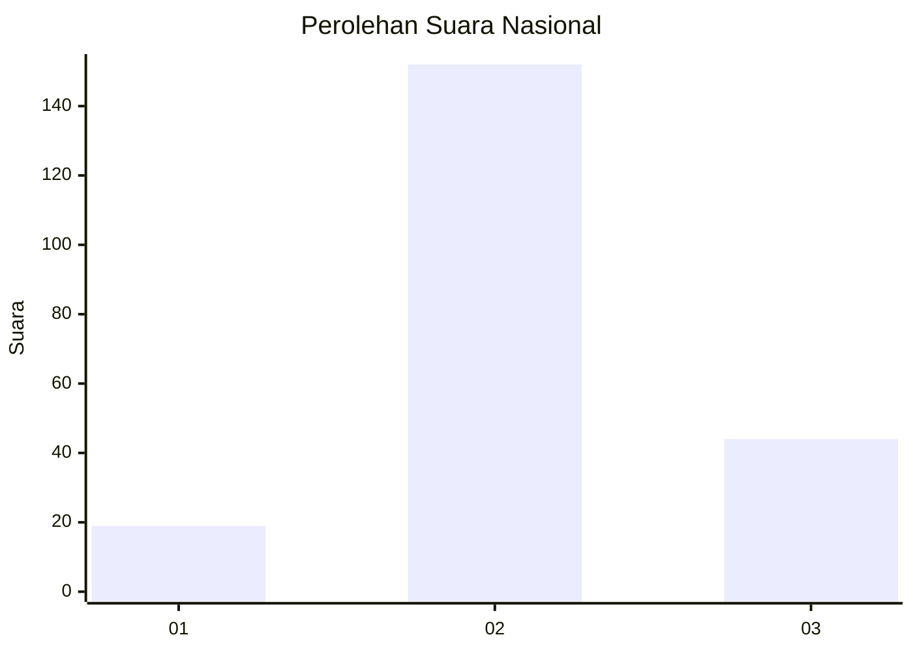
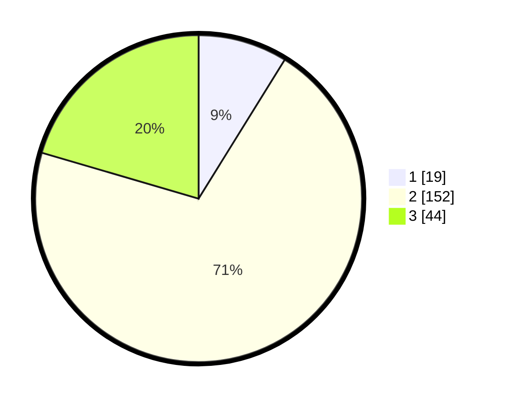

# Hasil

## Grafik

## Tabel

| No. | Nama Paslon    | Suara | Suara (raw) | Persentase |
|:--- |:-------------- | -----:| -----------:| ----------:|
| 1   | ANIES MUHAIMIN | 19    | [19][p-1]   | 8,84       |
| 2   | PRABOWO GIBRAN | 152   | [152][p-2]  | 70,70      |
| 3   | GANJAR MAHFUD  | 44    | [44][p-3]   | 20,47      |

[p-1]: https://github.com/gigit-pemilu/pemilu-2024/blob/main/pilpres/hitung-suara/sub/34-di-yogyakarta/sub/03-gunungkidul/sub/06-panggang/sub/2001-girikarto/sub/004-tps/sub/paslon-1.txt
[p-2]: https://github.com/gigit-pemilu/pemilu-2024/blob/main/pilpres/hitung-suara/sub/34-di-yogyakarta/sub/03-gunungkidul/sub/06-panggang/sub/2001-girikarto/sub/004-tps/sub/paslon-2.txt
[p-3]: https://github.com/gigit-pemilu/pemilu-2024/blob/main/pilpres/hitung-suara/sub/34-di-yogyakarta/sub/03-gunungkidul/sub/06-panggang/sub/2001-girikarto/sub/004-tps/sub/paslon-3.txt

## Foto C Plano

https://sirekap-obj-formc.kpu.go.id/bc53/pemilu/ppwp/34/03/06/20/01/3403062001004-20240214-155342--a6b1b2c2-f06a-4321-b84e-74f8c50a0eba.jpg

https://sirekap-obj-formc.kpu.go.id/bc53/pemilu/ppwp/34/03/06/20/01/3403062001004-20240214-155645--1498021a-5d0c-43de-a2fd-27aebc60d808.jpg

https://sirekap-obj-formc.kpu.go.id/bc53/pemilu/ppwp/34/03/06/20/01/3403062001004-20240214-160144--8bbbd249-8072-46ac-ab64-b51f0201ead1.jpg

## Metadata

| Key        | Value               |
| ---------- | ------------------- |
| Time Stamp | 2024-02-17 19:30:00 |

