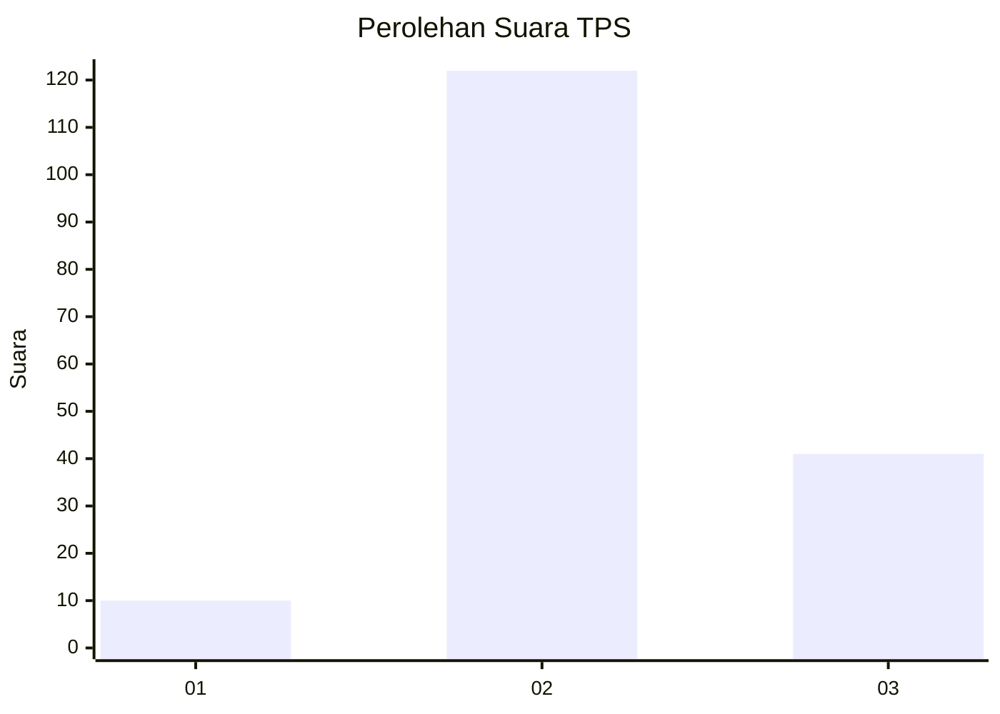
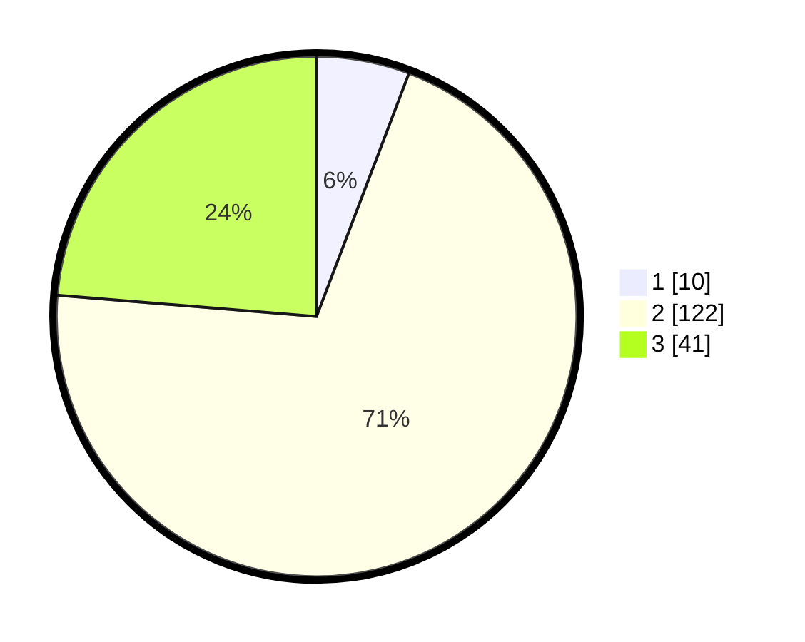

# Hasil

## Grafik

## Tabel

| No. | Nama Paslon    | Suara | Suara (raw) | Persentase |
|:--- |:-------------- | -----:| -----------:| ----------:|
| 1   | ANIES MUHAIMIN | 10    | [10][p-1]   | 5,78       |
| 2   | PRABOWO GIBRAN | 122   | [122][p-2]  | 70,52      |
| 3   | GANJAR MAHFUD  | 41    | [41][p-3]   | 23,70      |

[p-1]: https://github.com/gigit-pemilu/pemilu-2024-34-di-yogyakarta/blob/main/pilpres/hitung-suara/sub/34-di-yogyakarta/sub/03-gunungkidul/sub/06-panggang/sub/2001-girikarto/sub/005-tps/sub/paslon-1.txt
[p-2]: https://github.com/gigit-pemilu/pemilu-2024-34-di-yogyakarta/blob/main/pilpres/hitung-suara/sub/34-di-yogyakarta/sub/03-gunungkidul/sub/06-panggang/sub/2001-girikarto/sub/005-tps/sub/paslon-2.txt
[p-3]: https://github.com/gigit-pemilu/pemilu-2024-34-di-yogyakarta/blob/main/pilpres/hitung-suara/sub/34-di-yogyakarta/sub/03-gunungkidul/sub/06-panggang/sub/2001-girikarto/sub/005-tps/sub/paslon-3.txt

## Foto C Plano

https://sirekap-obj-formc.kpu.go.id/eab4/pemilu/ppwp/34/03/06/20/01/3403062001005-20240216-021349--97f35e96-6d33-4f3d-b5a1-34dfa655cd59.jpg

https://sirekap-obj-formc.kpu.go.id/eab4/pemilu/ppwp/34/03/06/20/01/3403062001005-20240216-021350--3cf8ed4f-7941-4f33-9ba9-df8d5e39e8dc.jpg

https://sirekap-obj-formc.kpu.go.id/eab4/pemilu/ppwp/34/03/06/20/01/3403062001005-20240216-021350--4cb59447-e846-4894-8888-e2d0dc1986c7.jpg

## Metadata

| Key        | Value               |
| ---------- | ------------------- |
| Time Stamp | 2024-02-16 16:25:10 |

## DATA PEMILIH TETAP

Jumlah pemilih dalam DPT: **205**.
 * L: **94**.
 * P: **111**.

## DATA PENGGUNA HAK PILIH

Jumlah pengguna hak pilih dalam DPT: **177**.
 * L: **84**.
 * P: **93**.

Jumlah pengguna hak pilih dalam DPTb: **0**.
 * L: **0**.
 * P: **0**.

Jumlah pengguna hak pilih dalam DPK: **1**.
 * L: **1**.
 * P: **0**.

Jumlah pengguna hak pilih: **178**.
 * L: **85**.
 * P: **93**.

## JUMLAH SUARA SAH DAN TIDAK SAH

JUMLAH SELURUH SUARA SAH: **173**.

JUMLAH SUARA TIDAK SAH: **5**.

JUMLAH SELURUH SUARA SAH DAN SUARA TIDAK SAH: **178**.

