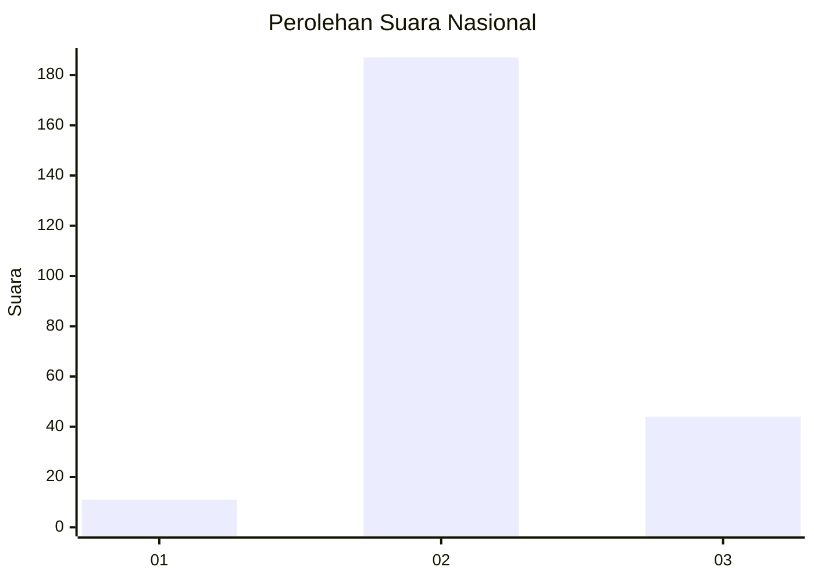

# Hasil

## Grafik

## Tabel

| No. | Nama Paslon    | Suara | Suara (raw) | Persentase |
|:--- |:-------------- | -----:| -----------:| ----------:|
| 1   | ANIES MUHAIMIN | 11    | [11][p-1]   | 4,55       |
| 2   | PRABOWO GIBRAN | 187   | [187][p-2]  | 77,27      |
| 3   | GANJAR MAHFUD  | 44    | [44][p-3]   | 18,18      |

[p-1]: https://github.com/gigit-pemilu/pemilu-2024/blob/main/pilpres/hitung-suara/sub/34-di-yogyakarta/sub/03-gunungkidul/sub/06-panggang/sub/2001-girikarto/sub/006-tps/sub/paslon-1.txt
[p-2]: https://github.com/gigit-pemilu/pemilu-2024/blob/main/pilpres/hitung-suara/sub/34-di-yogyakarta/sub/03-gunungkidul/sub/06-panggang/sub/2001-girikarto/sub/006-tps/sub/paslon-2.txt
[p-3]: https://github.com/gigit-pemilu/pemilu-2024/blob/main/pilpres/hitung-suara/sub/34-di-yogyakarta/sub/03-gunungkidul/sub/06-panggang/sub/2001-girikarto/sub/006-tps/sub/paslon-3.txt

## Foto C Plano

https://sirekap-obj-formc.kpu.go.id/2f0b/pemilu/ppwp/34/03/06/20/01/3403062001006-20240217-212835--a0663142-6205-4336-b793-baf7e66aebc0.jpg

https://sirekap-obj-formc.kpu.go.id/2f0b/pemilu/ppwp/34/03/06/20/01/3403062001006-20240217-212853--1e82be0b-032b-4c82-a219-ff5f51f21ac0.jpg

https://sirekap-obj-formc.kpu.go.id/2f0b/pemilu/ppwp/34/03/06/20/01/3403062001006-20240217-213008--14c1aab1-d74f-4c59-ac89-4f97a3b7822c.jpg

## Metadata

| Key        | Value               |
| ---------- | ------------------- |
| Time Stamp | 2024-02-20 11:00:00 |

