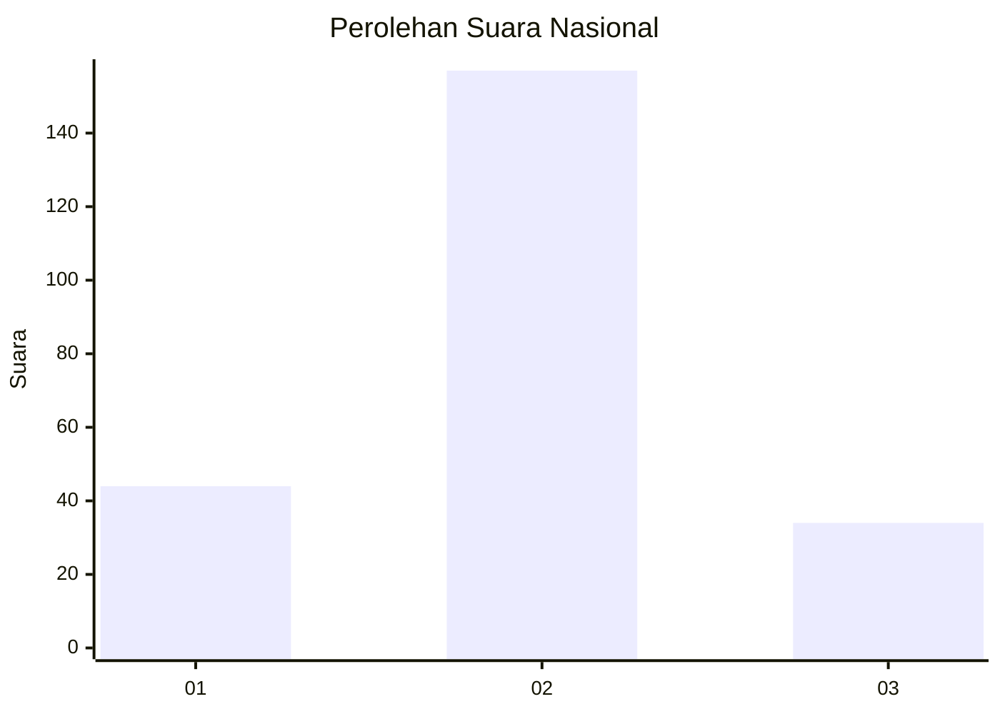
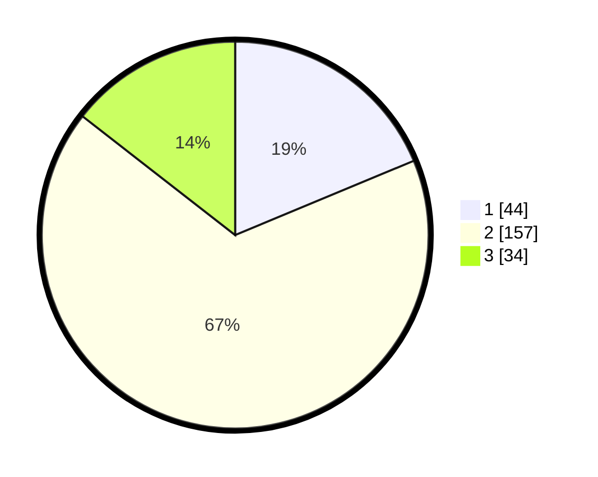

# Hasil

## Grafik

## Tabel

| No. | Nama Paslon    | Suara | Suara (raw) | Persentase |
|:--- |:-------------- | -----:| -----------:| ----------:|
| 1   | ANIES MUHAIMIN | 44    | [44][p-1]   | 18,72      |
| 2   | PRABOWO GIBRAN | 157   | [157][p-2]  | 66,81      |
| 3   | GANJAR MAHFUD  | 34    | [34][p-3]   | 14,47      |

[p-1]: https://github.com/gigit-pemilu/pemilu-2024/blob/main/pilpres/hitung-suara/sub/34-di-yogyakarta/sub/03-gunungkidul/sub/06-panggang/sub/2002-girisekar/sub/004-tps/sub/paslon-1.txt
[p-2]: https://github.com/gigit-pemilu/pemilu-2024/blob/main/pilpres/hitung-suara/sub/34-di-yogyakarta/sub/03-gunungkidul/sub/06-panggang/sub/2002-girisekar/sub/004-tps/sub/paslon-2.txt
[p-3]: https://github.com/gigit-pemilu/pemilu-2024/blob/main/pilpres/hitung-suara/sub/34-di-yogyakarta/sub/03-gunungkidul/sub/06-panggang/sub/2002-girisekar/sub/004-tps/sub/paslon-3.txt

## Foto C Plano

https://sirekap-obj-formc.kpu.go.id/dc33/pemilu/ppwp/34/03/06/20/02/3403062002004-20240215-022621--e0a23175-090b-437c-a122-34d06c1239ea.jpg

https://sirekap-obj-formc.kpu.go.id/dc33/pemilu/ppwp/34/03/06/20/02/3403062002004-20240215-022826--0e1df8cf-697f-4912-984d-a8852304eb88.jpg

https://sirekap-obj-formc.kpu.go.id/dc33/pemilu/ppwp/34/03/06/20/02/3403062002004-20240215-023017--69aed802-62e2-4032-b1ea-c3ea89bf0be7.jpg

## Metadata

| Key        | Value               |
| ---------- | ------------------- |
| Time Stamp | 2024-02-15 05:00:24 |

