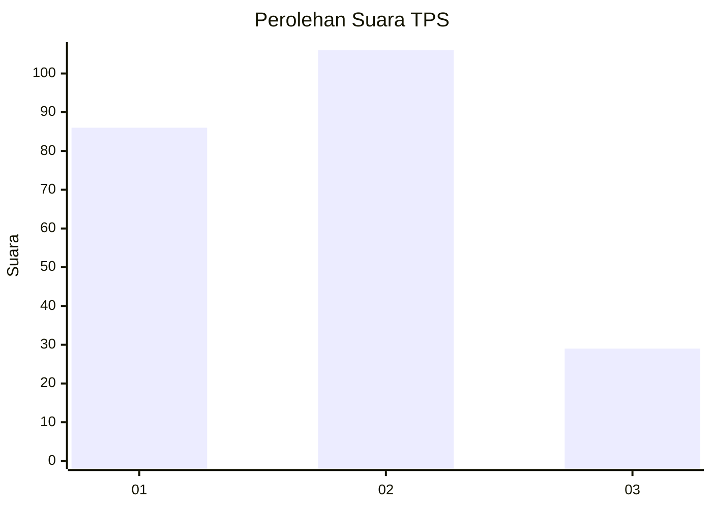
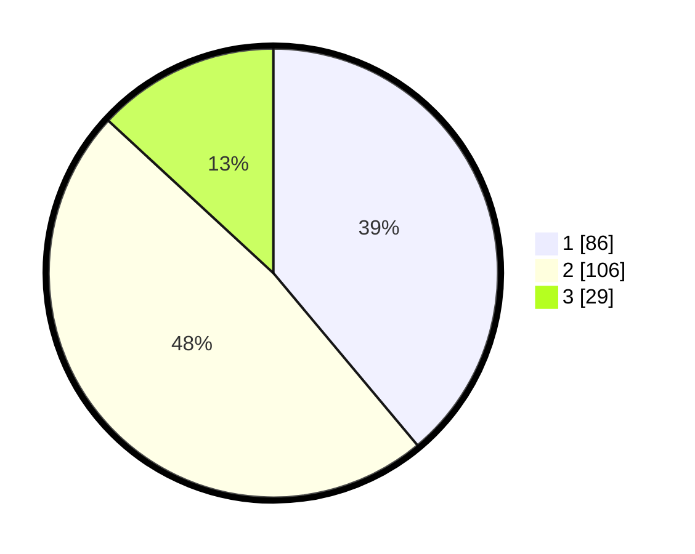

# Hasil

## Grafik

## Tabel

| No. | Nama Paslon    | Suara | Suara (raw) | Persentase |
|:--- |:-------------- | -----:| -----------:| ----------:|
| 1   | ANIES MUHAIMIN | 86    | [86][p-1]   | 38,91      |
| 2   | PRABOWO GIBRAN | 106   | [106][p-2]  | 47,96      |
| 3   | GANJAR MAHFUD  | 29    | [29][p-3]   | 13,12      |

[p-1]: https://github.com/gigit-pemilu/pemilu-2024-34-di-yogyakarta/blob/main/pilpres/hitung-suara/sub/34-di-yogyakarta/sub/03-gunungkidul/sub/06-panggang/sub/2002-girisekar/sub/005-tps/sub/paslon-1.txt
[p-2]: https://github.com/gigit-pemilu/pemilu-2024-34-di-yogyakarta/blob/main/pilpres/hitung-suara/sub/34-di-yogyakarta/sub/03-gunungkidul/sub/06-panggang/sub/2002-girisekar/sub/005-tps/sub/paslon-2.txt
[p-3]: https://github.com/gigit-pemilu/pemilu-2024-34-di-yogyakarta/blob/main/pilpres/hitung-suara/sub/34-di-yogyakarta/sub/03-gunungkidul/sub/06-panggang/sub/2002-girisekar/sub/005-tps/sub/paslon-3.txt

## Foto C Plano

https://sirekap-obj-formc.kpu.go.id/0a53/pemilu/ppwp/34/03/06/20/02/3403062002005-20240215-015852--4bcad59b-aa08-410d-b74b-609ebebe949b.jpg

https://sirekap-obj-formc.kpu.go.id/0a53/pemilu/ppwp/34/03/06/20/02/3403062002005-20240215-020219--4de8f4f5-3f7d-4a0b-867e-a985f07d5fb9.jpg

https://sirekap-obj-formc.kpu.go.id/0a53/pemilu/ppwp/34/03/06/20/02/3403062002005-20240215-020448--601f7d1a-34c8-43fd-97f3-a4566fdabee5.jpg

## Metadata

| Key        | Value               |
| ---------- | ------------------- |
| Time Stamp | 2024-02-15 16:30:25 |

