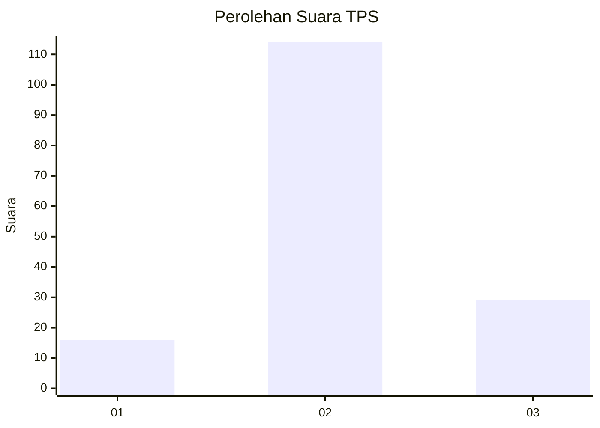
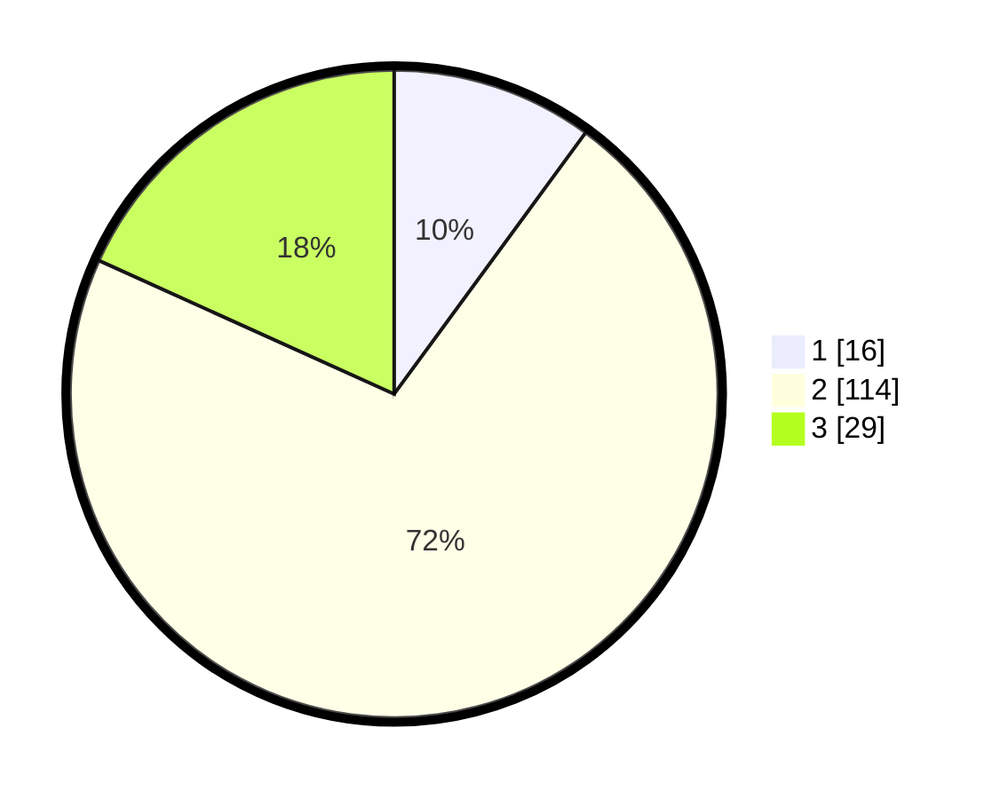

# Hasil

## Grafik

## Tabel

| No. | Nama Paslon    | Suara | Suara (raw) | Persentase |
|:--- |:-------------- | -----:| -----------:| ----------:|
| 1   | ANIES MUHAIMIN | 16    | [16][p-1]   | 10,06      |
| 2   | PRABOWO GIBRAN | 114   | [114][p-2]  | 71,70      |
| 3   | GANJAR MAHFUD  | 29    | [29][p-3]   | 18,24      |

[p-1]: https://github.com/gigit-pemilu/pemilu-2024-34-di-yogyakarta/blob/main/pilpres/hitung-suara/sub/34-di-yogyakarta/sub/03-gunungkidul/sub/06-panggang/sub/2002-girisekar/sub/007-tps/sub/paslon-1.txt
[p-2]: https://github.com/gigit-pemilu/pemilu-2024-34-di-yogyakarta/blob/main/pilpres/hitung-suara/sub/34-di-yogyakarta/sub/03-gunungkidul/sub/06-panggang/sub/2002-girisekar/sub/007-tps/sub/paslon-2.txt
[p-3]: https://github.com/gigit-pemilu/pemilu-2024-34-di-yogyakarta/blob/main/pilpres/hitung-suara/sub/34-di-yogyakarta/sub/03-gunungkidul/sub/06-panggang/sub/2002-girisekar/sub/007-tps/sub/paslon-3.txt

## Foto C Plano

https://sirekap-obj-formc.kpu.go.id/597d/pemilu/ppwp/34/03/06/20/02/3403062002007-20240214-191718--70113ad7-b0fb-4f6b-bd39-1022ddc7a4f1.jpg

https://sirekap-obj-formc.kpu.go.id/597d/pemilu/ppwp/34/03/06/20/02/3403062002007-20240214-192504--1ddabf7b-260a-4433-a6f6-72b584a985b7.jpg

https://sirekap-obj-formc.kpu.go.id/597d/pemilu/ppwp/34/03/06/20/02/3403062002007-20240215-055404--b65a7fa5-1765-434c-bb53-fcc2ca44c3ac.jpg

## Metadata

| Key        | Value               |
| ---------- | ------------------- |
| Time Stamp | 2024-02-15 06:00:23 |

