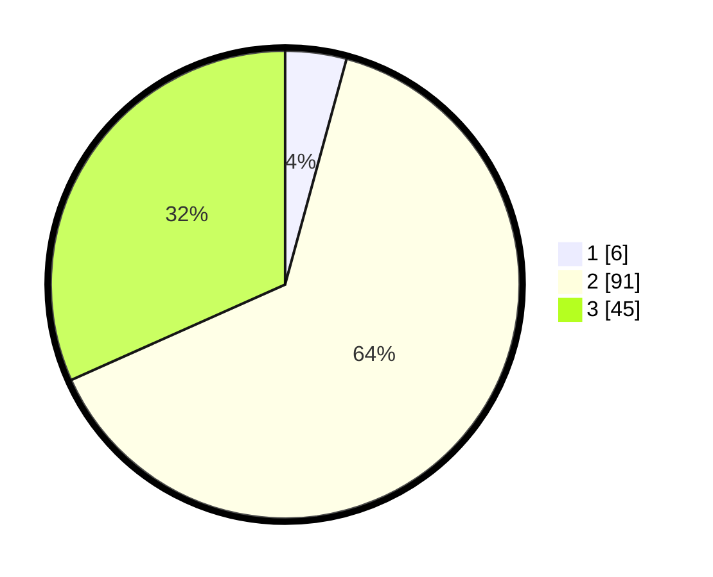

# Hasil

## Grafik

## Tabel

| No. | Nama Paslon    | Suara | Suara (raw) | Persentase |
|:--- |:-------------- | -----:| -----------:| ----------:|
| 1   | ANIES MUHAIMIN | 6     | [6][p-1]    | 4,23       |
| 2   | PRABOWO GIBRAN | 91    | [91][p-2]   | 64,08      |
| 3   | GANJAR MAHFUD  | 45    | [45][p-3]   | 31,69      |

[p-1]: https://github.com/gigit-pemilu/pemilu-2024-34-di-yogyakarta/blob/main/pilpres/hitung-suara/sub/34-di-yogyakarta/sub/03-gunungkidul/sub/06-panggang/sub/2002-girisekar/sub/011-tps/sub/paslon-1.txt
[p-2]: https://github.com/gigit-pemilu/pemilu-2024-34-di-yogyakarta/blob/main/pilpres/hitung-suara/sub/34-di-yogyakarta/sub/03-gunungkidul/sub/06-panggang/sub/2002-girisekar/sub/011-tps/sub/paslon-2.txt
[p-3]: https://github.com/gigit-pemilu/pemilu-2024-34-di-yogyakarta/blob/main/pilpres/hitung-suara/sub/34-di-yogyakarta/sub/03-gunungkidul/sub/06-panggang/sub/2002-girisekar/sub/011-tps/sub/paslon-3.txt

## Foto C Plano

https://sirekap-obj-formc.kpu.go.id/cd49/pemilu/ppwp/34/03/06/20/02/3403062002011-20240214-155417--8d15f400-a9f3-454e-b36c-3dd04891351d.jpg

https://sirekap-obj-formc.kpu.go.id/cd49/pemilu/ppwp/34/03/06/20/02/3403062002011-20240214-160120--c37b46d2-3c36-4431-9452-21969aaf8720.jpg

https://sirekap-obj-formc.kpu.go.id/cd49/pemilu/ppwp/34/03/06/20/02/3403062002011-20240215-011610--026fbb91-32b3-47df-a3dd-548ba333e2aa.jpg

## Metadata

| Key        | Value               |
| ---------- | ------------------- |
| Time Stamp | 2024-02-15 01:47:43 |

