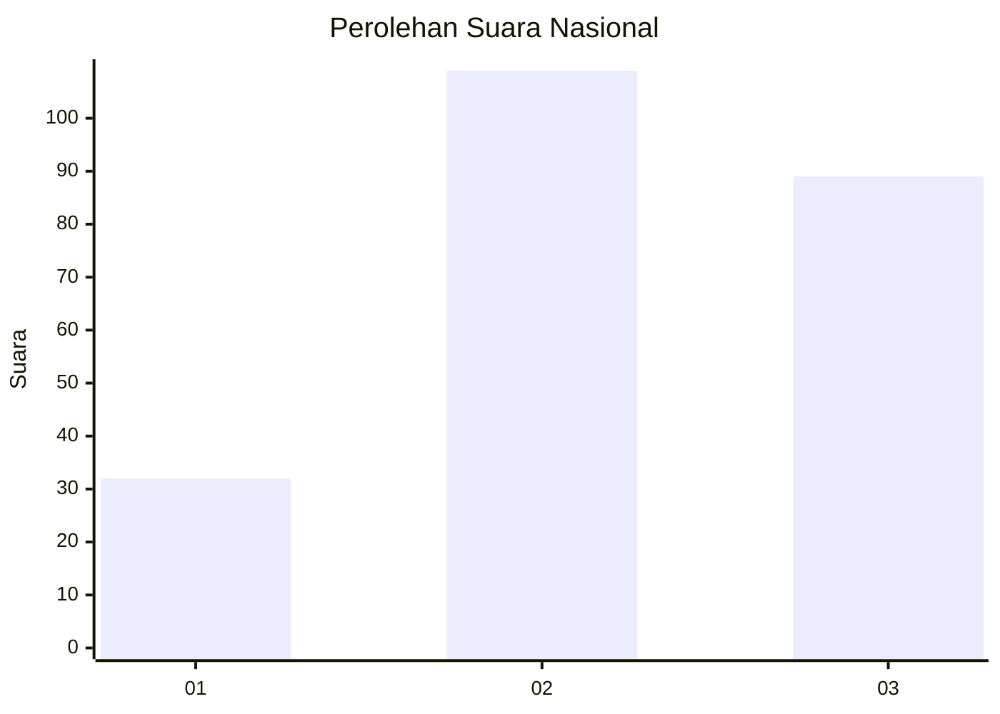
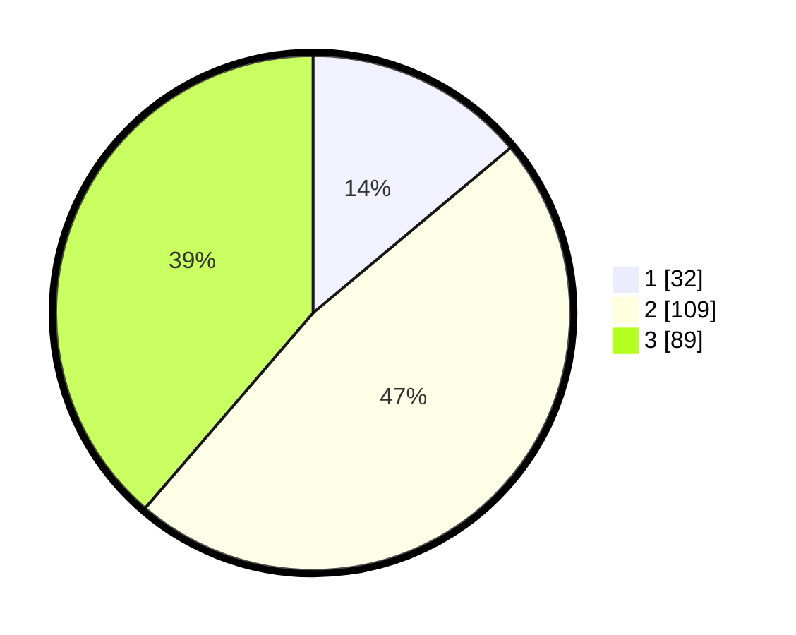

# Hasil

## Grafik

## Tabel

| No. | Nama Paslon    | Suara | Suara (raw) | Persentase |
|:--- |:-------------- | -----:| -----------:| ----------:|
| 1   | ANIES MUHAIMIN | 32    | [32][p-1]   | 13,91      |
| 2   | PRABOWO GIBRAN | 109   | [109][p-2]  | 47,39      |
| 3   | GANJAR MAHFUD  | 89    | [89][p-3]   | 38,70      |

[p-1]: https://github.com/gigit-pemilu/pemilu-2024/blob/main/pilpres/hitung-suara/sub/34-di-yogyakarta/sub/03-gunungkidul/sub/06-panggang/sub/2002-girisekar/sub/015-tps/sub/paslon-1.txt
[p-2]: https://github.com/gigit-pemilu/pemilu-2024/blob/main/pilpres/hitung-suara/sub/34-di-yogyakarta/sub/03-gunungkidul/sub/06-panggang/sub/2002-girisekar/sub/015-tps/sub/paslon-2.txt
[p-3]: https://github.com/gigit-pemilu/pemilu-2024/blob/main/pilpres/hitung-suara/sub/34-di-yogyakarta/sub/03-gunungkidul/sub/06-panggang/sub/2002-girisekar/sub/015-tps/sub/paslon-3.txt

## Foto C Plano

https://sirekap-obj-formc.kpu.go.id/7210/pemilu/ppwp/34/03/06/20/02/3403062002015-20240214-200515--83ef4b3e-dde6-4057-884a-6aa0ed06870a.jpg

https://sirekap-obj-formc.kpu.go.id/7210/pemilu/ppwp/34/03/06/20/02/3403062002015-20240214-200543--55f0058c-6f76-496e-986b-5baecf7505cf.jpg

https://sirekap-obj-formc.kpu.go.id/7210/pemilu/ppwp/34/03/06/20/02/3403062002015-20240214-200628--bc3ce882-5b33-4a45-ad4e-90e38c4d0230.jpg

## Metadata

| Key        | Value               |
| ---------- | ------------------- |
| Time Stamp | 2024-02-17 19:30:00 |

