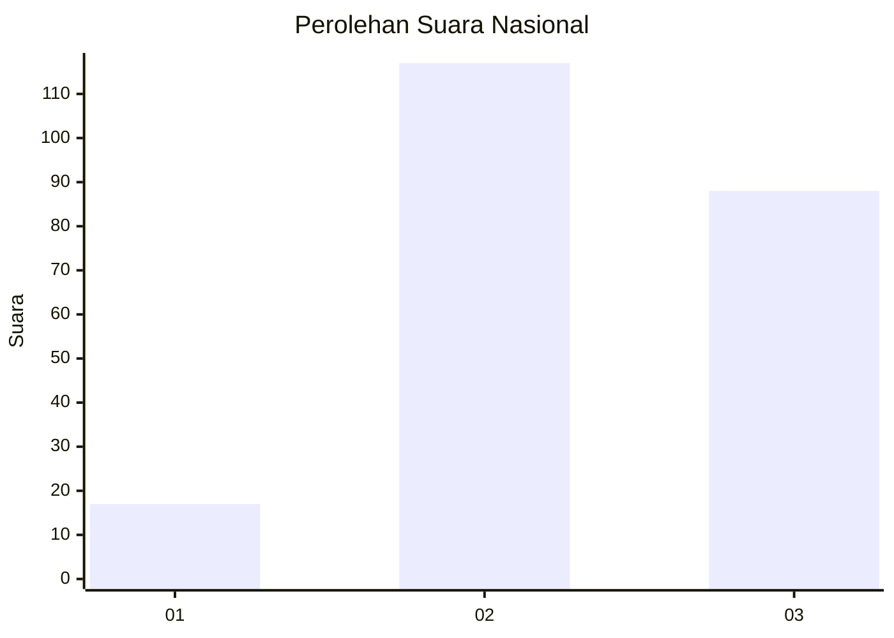
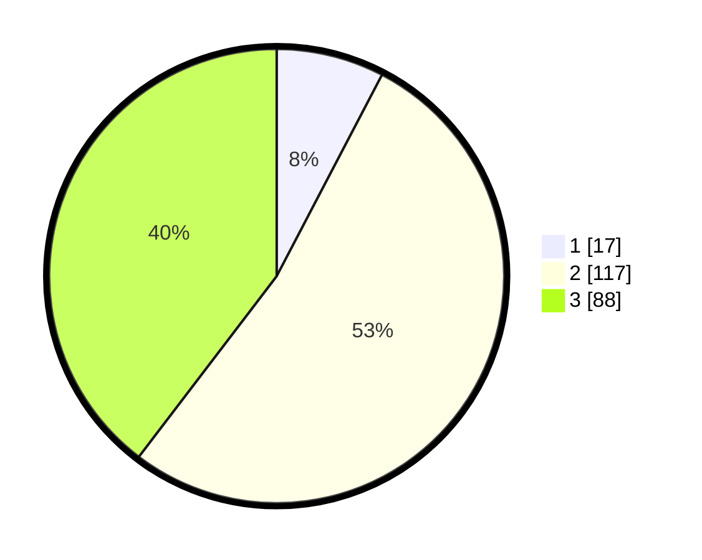

# Hasil

## Grafik

## Tabel

| No. | Nama Paslon    | Suara | Suara (raw) | Persentase |
|:--- |:-------------- | -----:| -----------:| ----------:|
| 1   | ANIES MUHAIMIN | 17    | [17][p-1]   | 7,66       |
| 2   | PRABOWO GIBRAN | 117   | [117][p-2]  | 52,70      |
| 3   | GANJAR MAHFUD  | 88    | [88][p-3]   | 39,64      |

[p-1]: https://github.com/gigit-pemilu/pemilu-2024/blob/main/pilpres/hitung-suara/sub/34-di-yogyakarta/sub/03-gunungkidul/sub/06-panggang/sub/2003-girimulyo/sub/002-tps/sub/paslon-1.txt
[p-2]: https://github.com/gigit-pemilu/pemilu-2024/blob/main/pilpres/hitung-suara/sub/34-di-yogyakarta/sub/03-gunungkidul/sub/06-panggang/sub/2003-girimulyo/sub/002-tps/sub/paslon-2.txt
[p-3]: https://github.com/gigit-pemilu/pemilu-2024/blob/main/pilpres/hitung-suara/sub/34-di-yogyakarta/sub/03-gunungkidul/sub/06-panggang/sub/2003-girimulyo/sub/002-tps/sub/paslon-3.txt

## Foto C Plano

https://sirekap-obj-formc.kpu.go.id/42c8/pemilu/ppwp/34/03/06/20/03/3403062003002-20240217-112356--ad36f778-6159-4087-b6c4-2d76d0feca4a.jpg

https://sirekap-obj-formc.kpu.go.id/42c8/pemilu/ppwp/34/03/06/20/03/3403062003002-20240217-111930--2c5e4707-c2f3-46f2-ac95-0f48151b931b.jpg

https://sirekap-obj-formc.kpu.go.id/42c8/pemilu/ppwp/34/03/06/20/03/3403062003002-20240217-112138--569ec529-665c-47c3-89cb-342965721288.jpg

## Metadata

| Key        | Value               |
| ---------- | ------------------- |
| Time Stamp | 2024-02-17 19:30:00 |

