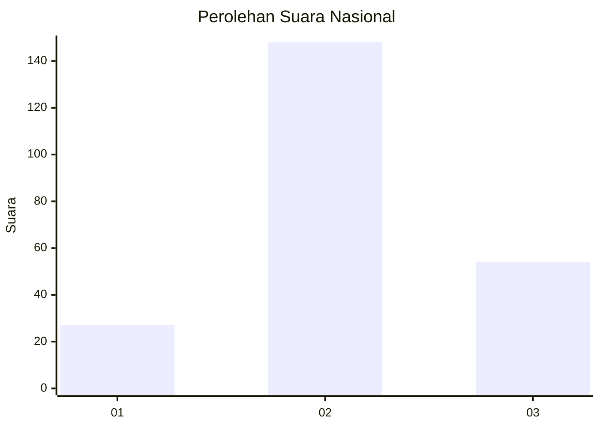
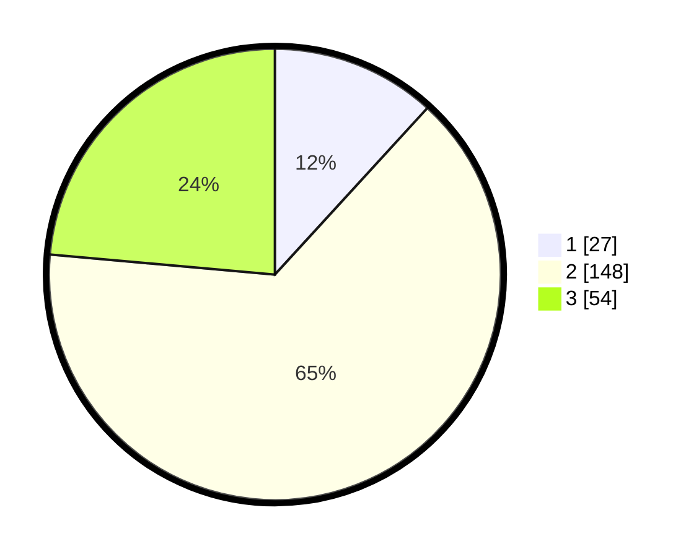

# Hasil

## Grafik

## Tabel

| No. | Nama Paslon    | Suara | Suara (raw) | Persentase |
|:--- |:-------------- | -----:| -----------:| ----------:|
| 1   | ANIES MUHAIMIN | 27    | [27][p-1]   | 11,79      |
| 2   | PRABOWO GIBRAN | 148   | [148][p-2]  | 64,63      |
| 3   | GANJAR MAHFUD  | 54    | [54][p-3]   | 23,58      |

[p-1]: https://github.com/gigit-pemilu/pemilu-2024/blob/main/pilpres/hitung-suara/sub/34-di-yogyakarta/sub/03-gunungkidul/sub/06-panggang/sub/2003-girimulyo/sub/006-tps/sub/paslon-1.txt
[p-2]: https://github.com/gigit-pemilu/pemilu-2024/blob/main/pilpres/hitung-suara/sub/34-di-yogyakarta/sub/03-gunungkidul/sub/06-panggang/sub/2003-girimulyo/sub/006-tps/sub/paslon-2.txt
[p-3]: https://github.com/gigit-pemilu/pemilu-2024/blob/main/pilpres/hitung-suara/sub/34-di-yogyakarta/sub/03-gunungkidul/sub/06-panggang/sub/2003-girimulyo/sub/006-tps/sub/paslon-3.txt

## Foto C Plano

https://sirekap-obj-formc.kpu.go.id/055d/pemilu/ppwp/34/03/06/20/03/3403062003006-20240215-021123--21783868-3afd-42f6-a235-0e742ccae707.jpg

https://sirekap-obj-formc.kpu.go.id/055d/pemilu/ppwp/34/03/06/20/03/3403062003006-20240215-021704--a241a0c7-669b-4319-9337-003734ae2540.jpg

https://sirekap-obj-formc.kpu.go.id/055d/pemilu/ppwp/34/03/06/20/03/3403062003006-20240215-021937--94fee6c0-3a9b-44c2-96a4-2563e0d951c8.jpg

## Metadata

| Key        | Value               |
| ---------- | ------------------- |
| Time Stamp | 2024-02-17 19:30:00 |

