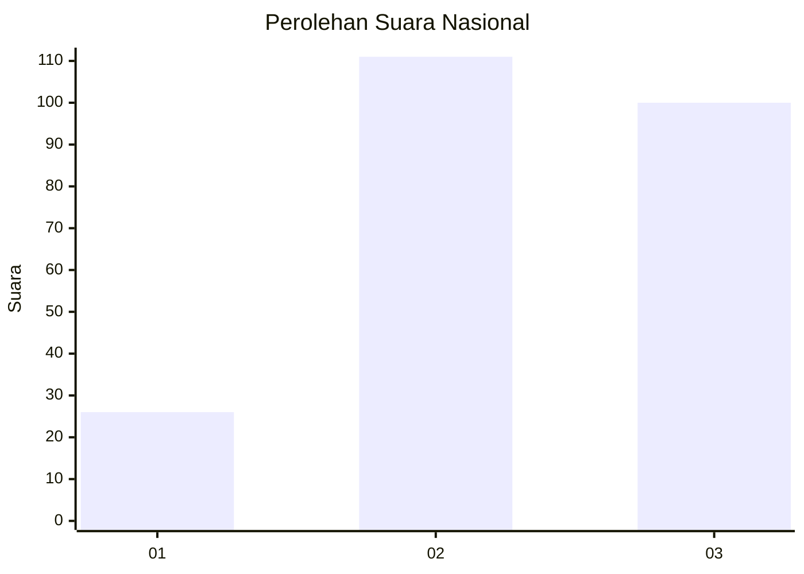
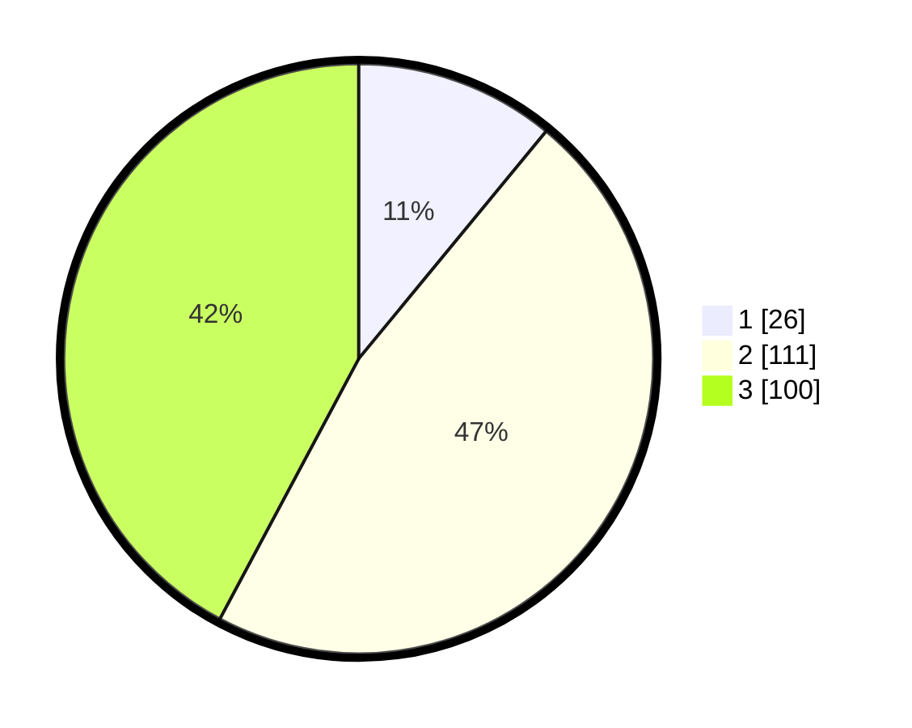

# Hasil

## Grafik

## Tabel

| No. | Nama Paslon    | Suara | Suara (raw) | Persentase |
|:--- |:-------------- | -----:| -----------:| ----------:|
| 1   | ANIES MUHAIMIN | 26    | [26][p-1]   | 10,97      |
| 2   | PRABOWO GIBRAN | 111   | [111][p-2]  | 46,84      |
| 3   | GANJAR MAHFUD  | 100   | [100][p-3]  | 42,19      |

[p-1]: https://github.com/gigit-pemilu/pemilu-2024/blob/main/pilpres/hitung-suara/sub/34-di-yogyakarta/sub/03-gunungkidul/sub/06-panggang/sub/2003-girimulyo/sub/007-tps/sub/paslon-1.txt
[p-2]: https://github.com/gigit-pemilu/pemilu-2024/blob/main/pilpres/hitung-suara/sub/34-di-yogyakarta/sub/03-gunungkidul/sub/06-panggang/sub/2003-girimulyo/sub/007-tps/sub/paslon-2.txt
[p-3]: https://github.com/gigit-pemilu/pemilu-2024/blob/main/pilpres/hitung-suara/sub/34-di-yogyakarta/sub/03-gunungkidul/sub/06-panggang/sub/2003-girimulyo/sub/007-tps/sub/paslon-3.txt

## Foto C Plano

https://sirekap-obj-formc.kpu.go.id/0066/pemilu/ppwp/34/03/06/20/03/3403062003007-20240217-143639--ca003144-873f-4b53-b0f2-b7b61898d7c4.jpg

https://sirekap-obj-formc.kpu.go.id/0066/pemilu/ppwp/34/03/06/20/03/3403062003007-20240217-143538--6d0b334e-83f9-47c2-82e3-32bb4afb2d94.jpg

https://sirekap-obj-formc.kpu.go.id/0066/pemilu/ppwp/34/03/06/20/03/3403062003007-20240217-143558--b15803f1-3101-4c8e-aabc-494c2fc78608.jpg

## Metadata

| Key        | Value               |
| ---------- | ------------------- |
| Time Stamp | 2024-02-17 19:30:00 |

