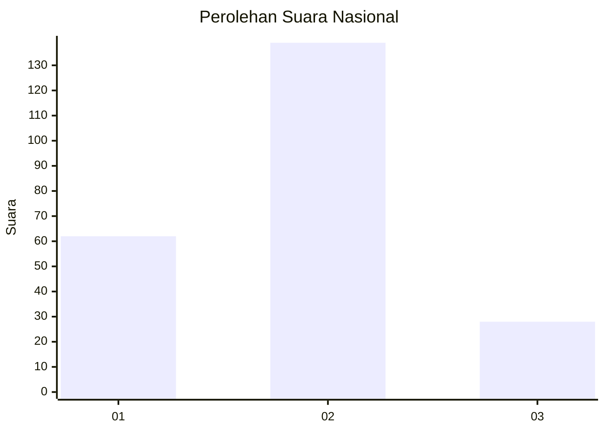
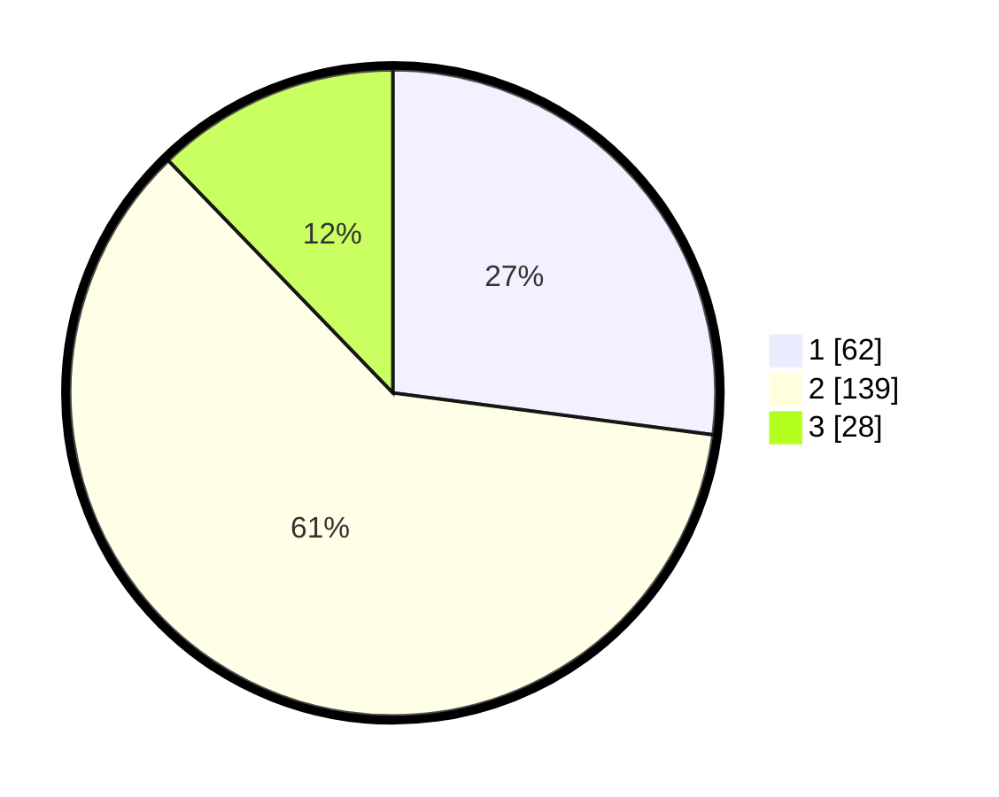

# Hasil

## Grafik

## Tabel

| No. | Nama Paslon    | Suara | Suara (raw) | Persentase |
|:--- |:-------------- | -----:| -----------:| ----------:|
| 1   | ANIES MUHAIMIN | 62    | [62][p-1]   | 27,07      |
| 2   | PRABOWO GIBRAN | 139   | [139][p-2]  | 60,70      |
| 3   | GANJAR MAHFUD  | 28    | [28][p-3]   | 12,23      |

[p-1]: https://github.com/gigit-pemilu/pemilu-2024/blob/main/pilpres/hitung-suara/sub/34-di-yogyakarta/sub/03-gunungkidul/sub/06-panggang/sub/2003-girimulyo/sub/013-tps/sub/paslon-1.txt
[p-2]: https://github.com/gigit-pemilu/pemilu-2024/blob/main/pilpres/hitung-suara/sub/34-di-yogyakarta/sub/03-gunungkidul/sub/06-panggang/sub/2003-girimulyo/sub/013-tps/sub/paslon-2.txt
[p-3]: https://github.com/gigit-pemilu/pemilu-2024/blob/main/pilpres/hitung-suara/sub/34-di-yogyakarta/sub/03-gunungkidul/sub/06-panggang/sub/2003-girimulyo/sub/013-tps/sub/paslon-3.txt

## Foto C Plano

https://sirekap-obj-formc.kpu.go.id/d059/pemilu/ppwp/34/03/06/20/03/3403062003013-20240214-204421--b75a17b4-c5e2-46c6-a2a6-78e6b15931df.jpg

https://sirekap-obj-formc.kpu.go.id/d059/pemilu/ppwp/34/03/06/20/03/3403062003013-20240214-204712--d15d785d-96fb-4b53-bf00-3a2a3fc3a9ab.jpg

https://sirekap-obj-formc.kpu.go.id/d059/pemilu/ppwp/34/03/06/20/03/3403062003013-20240214-204826--bf9c10da-79da-4152-bce6-3468212d05d9.jpg

## Metadata

| Key        | Value               |
| ---------- | ------------------- |
| Time Stamp | 2024-02-19 06:16:00 |

