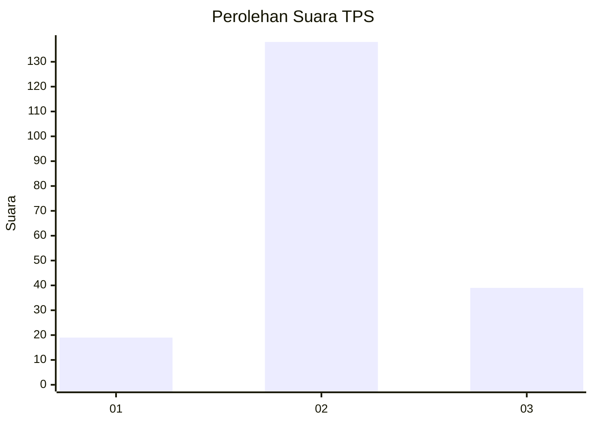
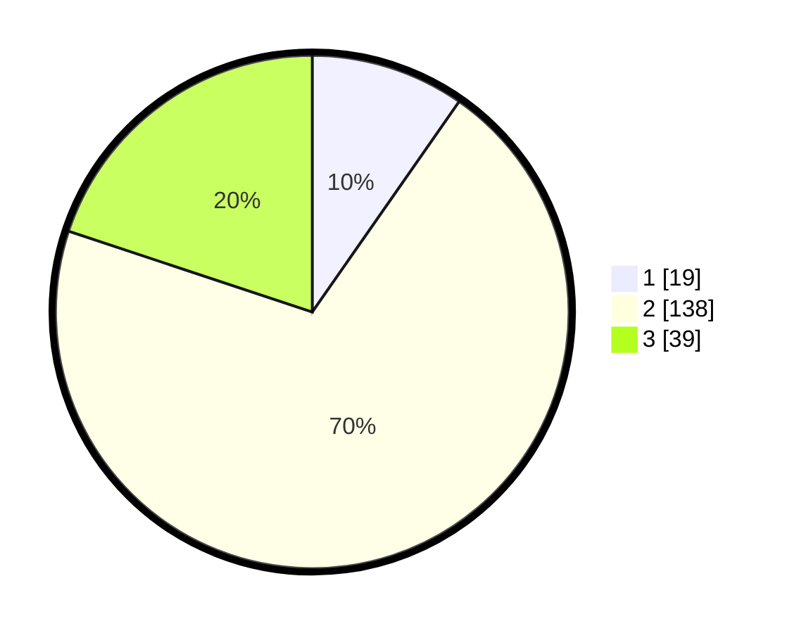

# Hasil

## Grafik

## Tabel

| No. | Nama Paslon    | Suara | Suara (raw) | Persentase |
|:--- |:-------------- | -----:| -----------:| ----------:|
| 1   | ANIES MUHAIMIN | 19    | [19][p-1]   | 9,69       |
| 2   | PRABOWO GIBRAN | 138   | [138][p-2]  | 70,41      |
| 3   | GANJAR MAHFUD  | 39    | [39][p-3]   | 19,90      |

[p-1]: https://github.com/gigit-pemilu/pemilu-2024-34-di-yogyakarta/blob/main/pilpres/hitung-suara/sub/34-di-yogyakarta/sub/03-gunungkidul/sub/06-panggang/sub/2003-girimulyo/sub/016-tps/sub/paslon-1.txt
[p-2]: https://github.com/gigit-pemilu/pemilu-2024-34-di-yogyakarta/blob/main/pilpres/hitung-suara/sub/34-di-yogyakarta/sub/03-gunungkidul/sub/06-panggang/sub/2003-girimulyo/sub/016-tps/sub/paslon-2.txt
[p-3]: https://github.com/gigit-pemilu/pemilu-2024-34-di-yogyakarta/blob/main/pilpres/hitung-suara/sub/34-di-yogyakarta/sub/03-gunungkidul/sub/06-panggang/sub/2003-girimulyo/sub/016-tps/sub/paslon-3.txt

## Foto C Plano

https://sirekap-obj-formc.kpu.go.id/b74e/pemilu/ppwp/34/03/06/20/03/3403062003016-20240215-055600--97867b2d-ccee-4b63-a17b-95ab301f749a.jpg

https://sirekap-obj-formc.kpu.go.id/b74e/pemilu/ppwp/34/03/06/20/03/3403062003016-20240215-023603--b9d63753-17ed-40f1-855b-c2959af294d3.jpg

https://sirekap-obj-formc.kpu.go.id/b74e/pemilu/ppwp/34/03/06/20/03/3403062003016-20240215-023659--56321ca6-2e0c-421c-bba5-65c01ff34572.jpg

## Metadata

| Key        | Value               |
| ---------- | ------------------- |
| Time Stamp | 2024-02-17 19:30:00 |

