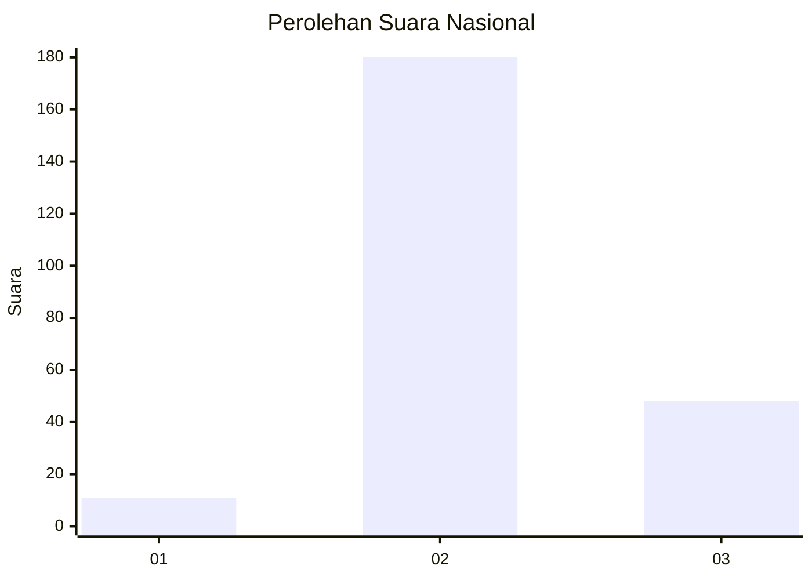

# Hasil

## Grafik

## Tabel

| No. | Nama Paslon    | Suara | Suara (raw) | Persentase |
|:--- |:-------------- | -----:| -----------:| ----------:|
| 1   | ANIES MUHAIMIN | 11    | [11][p-1]   | 4,60       |
| 2   | PRABOWO GIBRAN | 180   | [180][p-2]  | 75,31      |
| 3   | GANJAR MAHFUD  | 48    | [48][p-3]   | 20,08      |

[p-1]: https://github.com/gigit-pemilu/pemilu-2024/blob/main/pilpres/hitung-suara/sub/34-di-yogyakarta/sub/03-gunungkidul/sub/06-panggang/sub/2004-giriwungu/sub/005-tps/sub/paslon-1.txt
[p-2]: https://github.com/gigit-pemilu/pemilu-2024/blob/main/pilpres/hitung-suara/sub/34-di-yogyakarta/sub/03-gunungkidul/sub/06-panggang/sub/2004-giriwungu/sub/005-tps/sub/paslon-2.txt
[p-3]: https://github.com/gigit-pemilu/pemilu-2024/blob/main/pilpres/hitung-suara/sub/34-di-yogyakarta/sub/03-gunungkidul/sub/06-panggang/sub/2004-giriwungu/sub/005-tps/sub/paslon-3.txt

## Foto C Plano

https://sirekap-obj-formc.kpu.go.id/c1f1/pemilu/ppwp/34/03/06/20/04/3403062004005-20240215-051636--fff0d239-037c-4be5-8457-fff2f19c454a.jpg

https://sirekap-obj-formc.kpu.go.id/c1f1/pemilu/ppwp/34/03/06/20/04/3403062004005-20240215-051653--7fbc3d28-4d7d-4f27-8e5e-0d6c25cf5e45.jpg

https://sirekap-obj-formc.kpu.go.id/c1f1/pemilu/ppwp/34/03/06/20/04/3403062004005-20240215-051712--34b6a498-3d29-444c-a32e-38779d03ceee.jpg

## Metadata

| Key        | Value               |
| ---------- | ------------------- |
| Time Stamp | 2024-02-15 18:00:26 |

