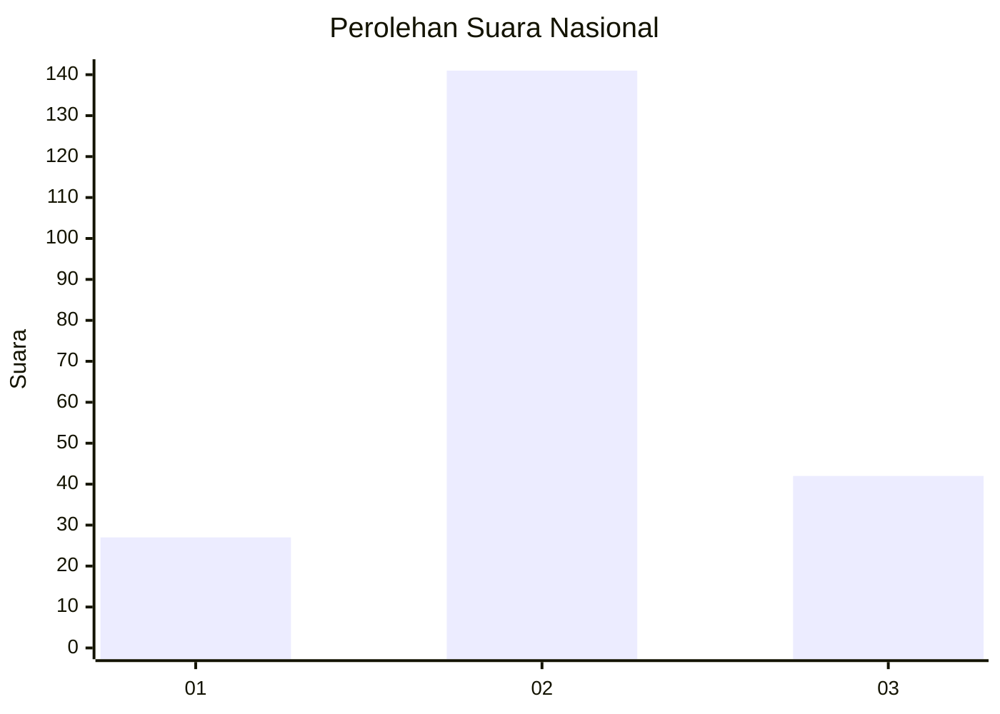
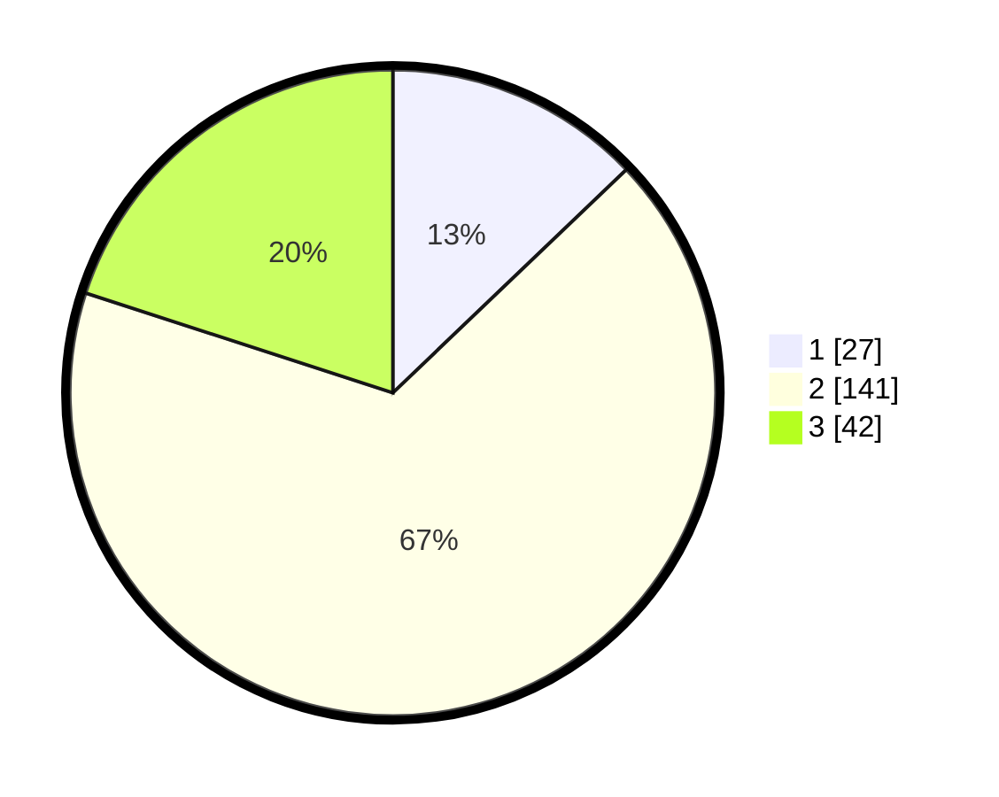

# Hasil

## Grafik

## Tabel

| No. | Nama Paslon    | Suara | Suara (raw) | Persentase |
|:--- |:-------------- | -----:| -----------:| ----------:|
| 1   | ANIES MUHAIMIN | 27    | [27][p-1]   | 12,86      |
| 2   | PRABOWO GIBRAN | 141   | [141][p-2]  | 67,14      |
| 3   | GANJAR MAHFUD  | 42    | [42][p-3]   | 20,00      |

[p-1]: https://github.com/gigit-pemilu/pemilu-2024/blob/main/pilpres/hitung-suara/sub/34-di-yogyakarta/sub/03-gunungkidul/sub/06-panggang/sub/2004-giriwungu/sub/006-tps/sub/paslon-1.txt
[p-2]: https://github.com/gigit-pemilu/pemilu-2024/blob/main/pilpres/hitung-suara/sub/34-di-yogyakarta/sub/03-gunungkidul/sub/06-panggang/sub/2004-giriwungu/sub/006-tps/sub/paslon-2.txt
[p-3]: https://github.com/gigit-pemilu/pemilu-2024/blob/main/pilpres/hitung-suara/sub/34-di-yogyakarta/sub/03-gunungkidul/sub/06-panggang/sub/2004-giriwungu/sub/006-tps/sub/paslon-3.txt

## Foto C Plano

https://sirekap-obj-formc.kpu.go.id/dc0d/pemilu/ppwp/34/03/06/20/04/3403062004006-20240214-141427--d3a1ffdc-7c01-4024-829a-89c6efcbbe21.jpg

https://sirekap-obj-formc.kpu.go.id/dc0d/pemilu/ppwp/34/03/06/20/04/3403062004006-20240214-141430--ff321c84-c765-4871-a9ad-8b0a8cd27a8a.jpg

https://sirekap-obj-formc.kpu.go.id/dc0d/pemilu/ppwp/34/03/06/20/04/3403062004006-20240214-141406--d3a097d6-1d10-4264-9171-ed1c8bd0b10e.jpg

## Metadata

| Key        | Value               |
| ---------- | ------------------- |
| Time Stamp | 2024-02-14 21:46:01 |

