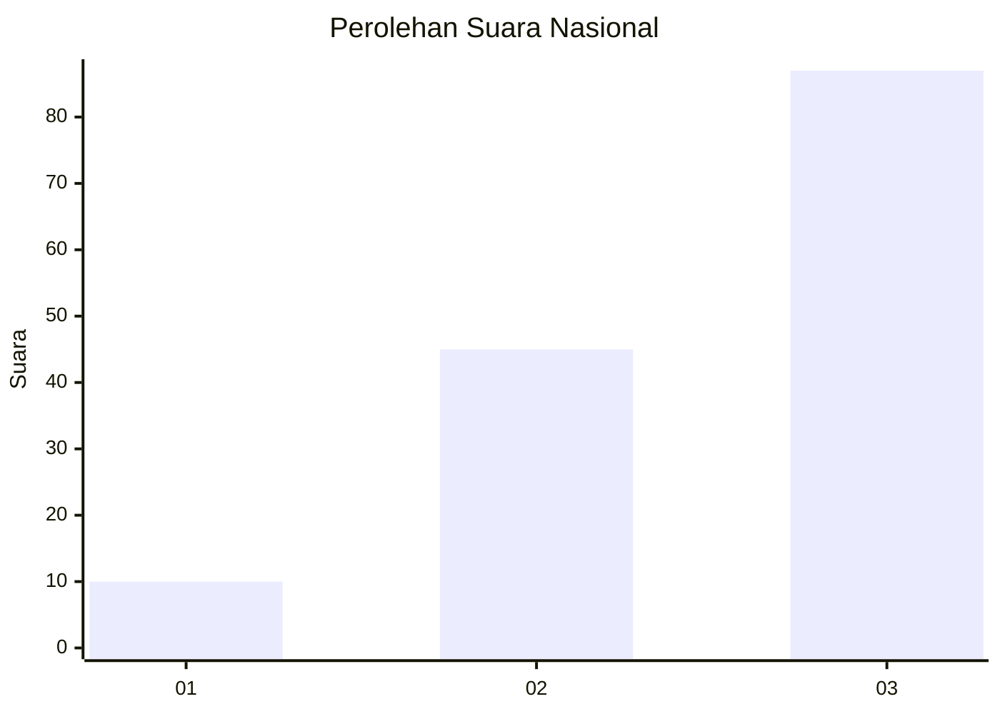
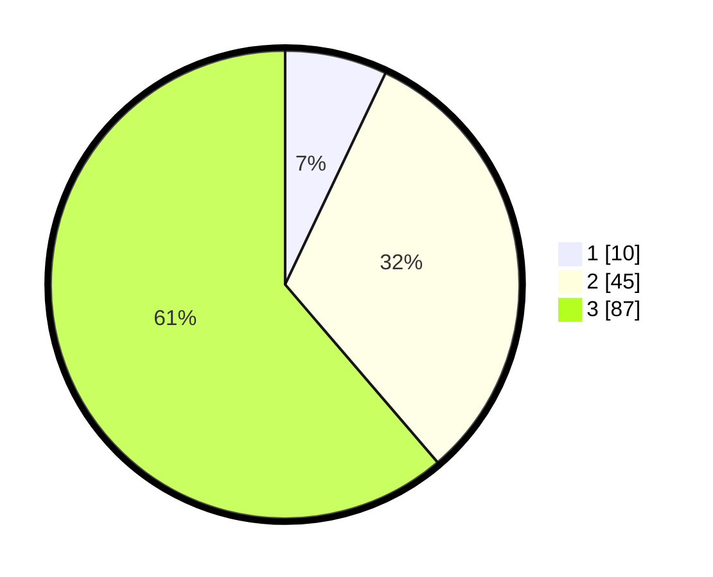

# Hasil

## Grafik

## Tabel

| No. | Nama Paslon    | Suara | Suara (raw) | Persentase |
|:--- |:-------------- | -----:| -----------:| ----------:|
| 1   | ANIES MUHAIMIN | 10    | [10][p-1]   | 7,04       |
| 2   | PRABOWO GIBRAN | 45    | [45][p-2]   | 31,69      |
| 3   | GANJAR MAHFUD  | 87    | [87][p-3]   | 61,27      |

[p-1]: https://github.com/gigit-pemilu/pemilu-2024/blob/main/pilpres/hitung-suara/sub/34-di-yogyakarta/sub/03-gunungkidul/sub/06-panggang/sub/2004-giriwungu/sub/008-tps/sub/paslon-1.txt
[p-2]: https://github.com/gigit-pemilu/pemilu-2024/blob/main/pilpres/hitung-suara/sub/34-di-yogyakarta/sub/03-gunungkidul/sub/06-panggang/sub/2004-giriwungu/sub/008-tps/sub/paslon-2.txt
[p-3]: https://github.com/gigit-pemilu/pemilu-2024/blob/main/pilpres/hitung-suara/sub/34-di-yogyakarta/sub/03-gunungkidul/sub/06-panggang/sub/2004-giriwungu/sub/008-tps/sub/paslon-3.txt

## Foto C Plano

https://sirekap-obj-formc.kpu.go.id/9bba/pemilu/ppwp/34/03/06/20/04/3403062004008-20240215-022832--db831068-0271-432c-bd42-9ebcecee92a2.jpg

https://sirekap-obj-formc.kpu.go.id/9bba/pemilu/ppwp/34/03/06/20/04/3403062004008-20240215-022846--75a8b01f-8e9d-44cf-8f78-b37b86a73ac3.jpg

https://sirekap-obj-formc.kpu.go.id/9bba/pemilu/ppwp/34/03/06/20/04/3403062004008-20240215-022901--ef3a4299-c1ce-4fe6-88a9-052f14f15d20.jpg

## Metadata

| Key        | Value               |
| ---------- | ------------------- |
| Time Stamp | 2024-02-15 15:00:29 |

