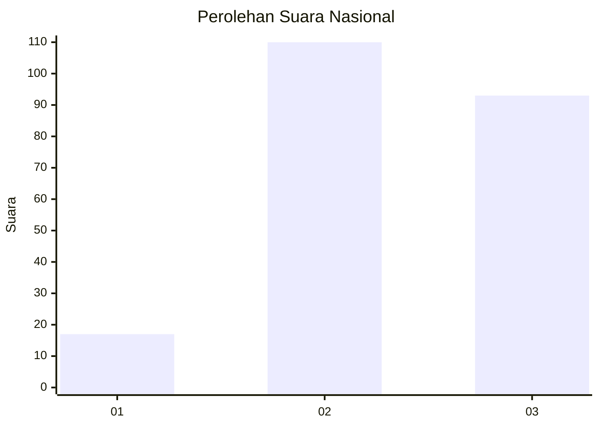
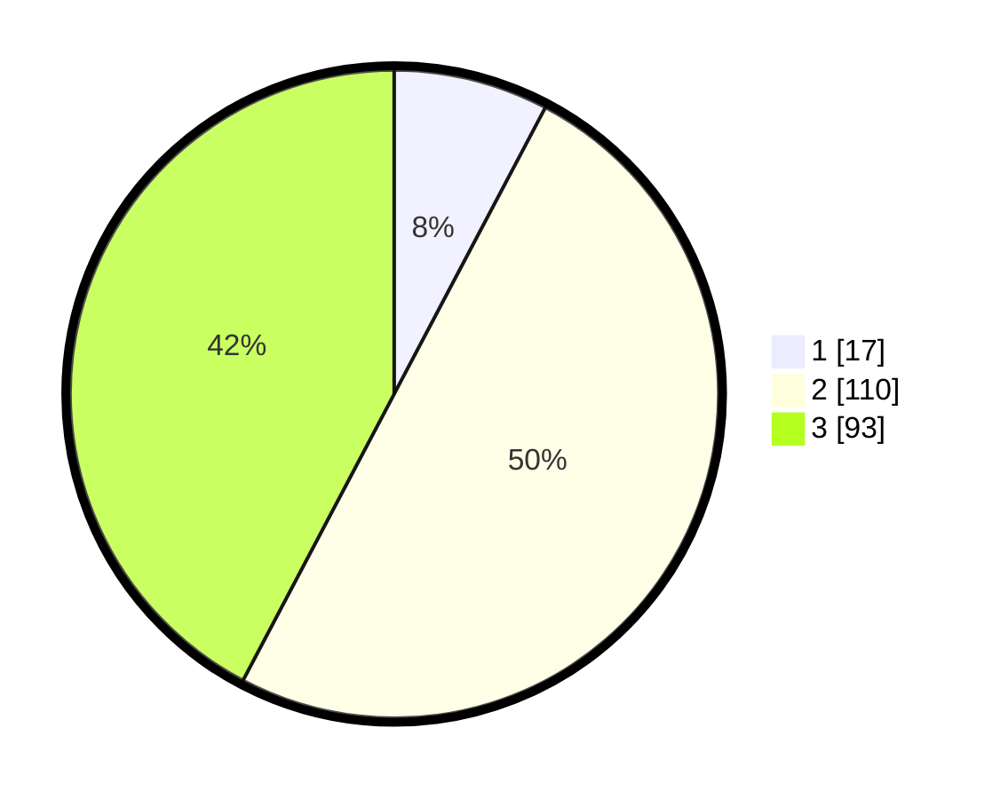

# Hasil

## Grafik

## Tabel

| No. | Nama Paslon    | Suara | Suara (raw) | Persentase |
|:--- |:-------------- | -----:| -----------:| ----------:|
| 1   | ANIES MUHAIMIN | 17    | [17][p-1]   | 7,73       |
| 2   | PRABOWO GIBRAN | 110   | [110][p-2]  | 50,00      |
| 3   | GANJAR MAHFUD  | 93    | [93][p-3]   | 42,27      |

[p-1]: https://github.com/gigit-pemilu/pemilu-2024/blob/main/pilpres/hitung-suara/sub/34-di-yogyakarta/sub/03-gunungkidul/sub/06-panggang/sub/2005-giriharjo/sub/002-tps/sub/paslon-1.txt
[p-2]: https://github.com/gigit-pemilu/pemilu-2024/blob/main/pilpres/hitung-suara/sub/34-di-yogyakarta/sub/03-gunungkidul/sub/06-panggang/sub/2005-giriharjo/sub/002-tps/sub/paslon-2.txt
[p-3]: https://github.com/gigit-pemilu/pemilu-2024/blob/main/pilpres/hitung-suara/sub/34-di-yogyakarta/sub/03-gunungkidul/sub/06-panggang/sub/2005-giriharjo/sub/002-tps/sub/paslon-3.txt

## Foto C Plano

https://sirekap-obj-formc.kpu.go.id/e505/pemilu/ppwp/34/03/06/20/05/3403062005002-20240214-155903--02064ac0-b938-4857-837d-2daf6eccbcbf.jpg

https://sirekap-obj-formc.kpu.go.id/e505/pemilu/ppwp/34/03/06/20/05/3403062005002-20240214-155923--23b3c74b-630e-4c1d-8cdb-e37141cd6a02.jpg

https://sirekap-obj-formc.kpu.go.id/e505/pemilu/ppwp/34/03/06/20/05/3403062005002-20240214-160106--142e12c2-26be-49d3-b546-f082e1d57826.jpg

## Metadata

| Key        | Value               |
| ---------- | ------------------- |
| Time Stamp | 2024-02-19 06:16:00 |

