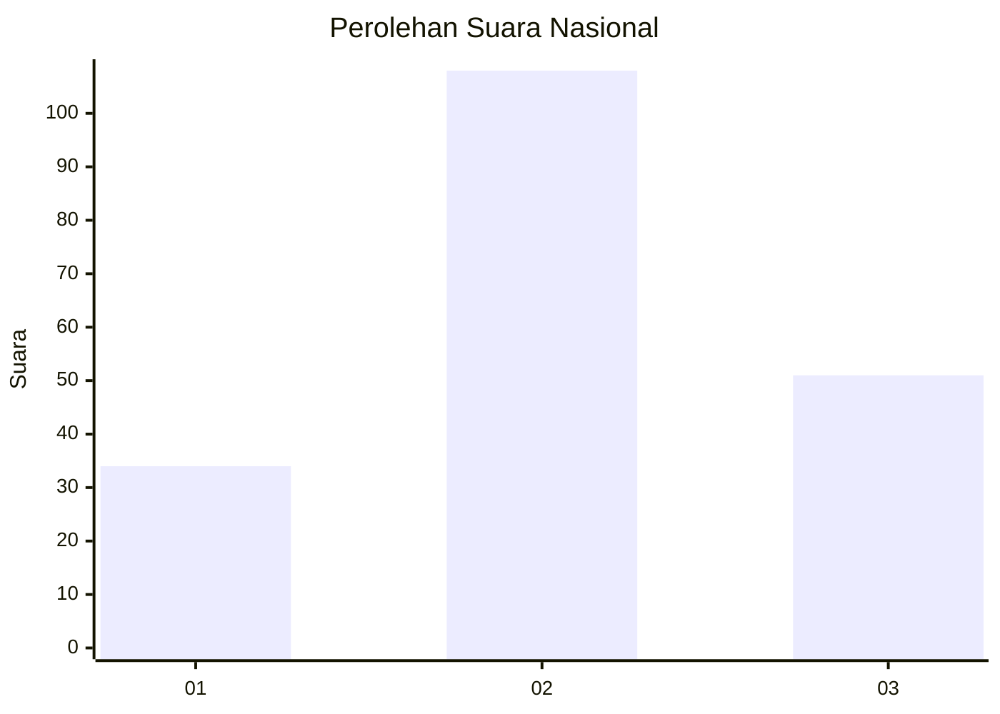
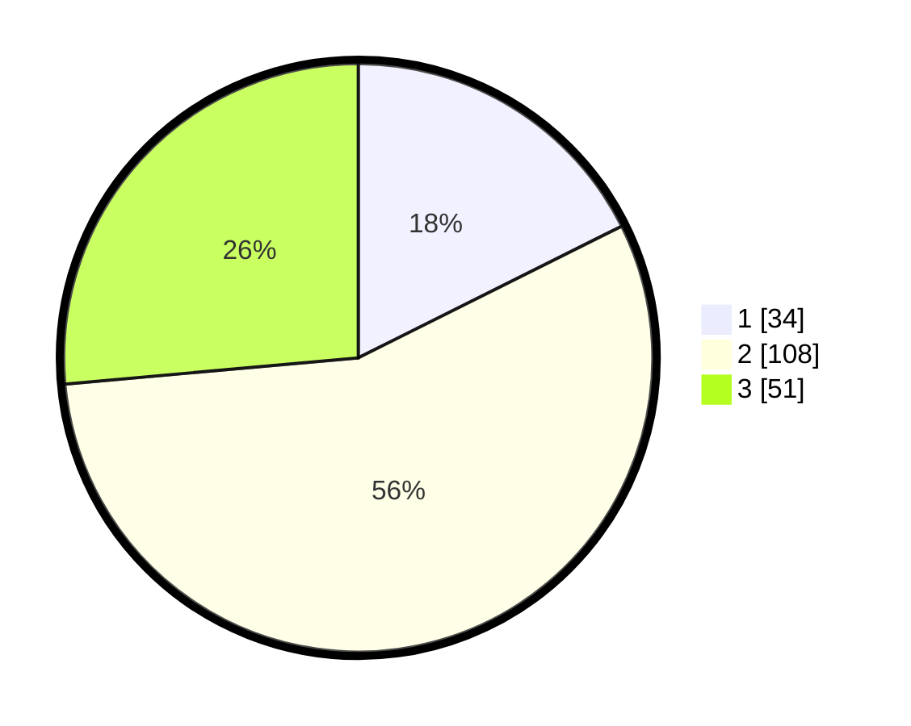

# Hasil

## Grafik

## Tabel

| No. | Nama Paslon    | Suara | Suara (raw) | Persentase |
|:--- |:-------------- | -----:| -----------:| ----------:|
| 1   | ANIES MUHAIMIN | 34    | [34][p-1]   | 17,62      |
| 2   | PRABOWO GIBRAN | 108   | [108][p-2]  | 55,96      |
| 3   | GANJAR MAHFUD  | 51    | [51][p-3]   | 26,42      |

[p-1]: https://github.com/gigit-pemilu/pemilu-2024/blob/main/pilpres/hitung-suara/sub/34-di-yogyakarta/sub/03-gunungkidul/sub/06-panggang/sub/2005-giriharjo/sub/007-tps/sub/paslon-1.txt
[p-2]: https://github.com/gigit-pemilu/pemilu-2024/blob/main/pilpres/hitung-suara/sub/34-di-yogyakarta/sub/03-gunungkidul/sub/06-panggang/sub/2005-giriharjo/sub/007-tps/sub/paslon-2.txt
[p-3]: https://github.com/gigit-pemilu/pemilu-2024/blob/main/pilpres/hitung-suara/sub/34-di-yogyakarta/sub/03-gunungkidul/sub/06-panggang/sub/2005-giriharjo/sub/007-tps/sub/paslon-3.txt

## Foto C Plano

https://sirekap-obj-formc.kpu.go.id/3bb1/pemilu/ppwp/34/03/06/20/05/3403062005007-20240216-153921--c13ad1aa-b020-43bd-a128-ee0eafad3eda.jpg

https://sirekap-obj-formc.kpu.go.id/3bb1/pemilu/ppwp/34/03/06/20/05/3403062005007-20240216-154056--25d4aa88-0952-404f-a4e6-534ec53d91bf.jpg

https://sirekap-obj-formc.kpu.go.id/3bb1/pemilu/ppwp/34/03/06/20/05/3403062005007-20240216-154212--c8928aa0-a59a-4124-8a50-f6f11849f4a2.jpg

## Metadata

| Key        | Value               |
| ---------- | ------------------- |
| Time Stamp | 2024-02-19 06:16:00 |

