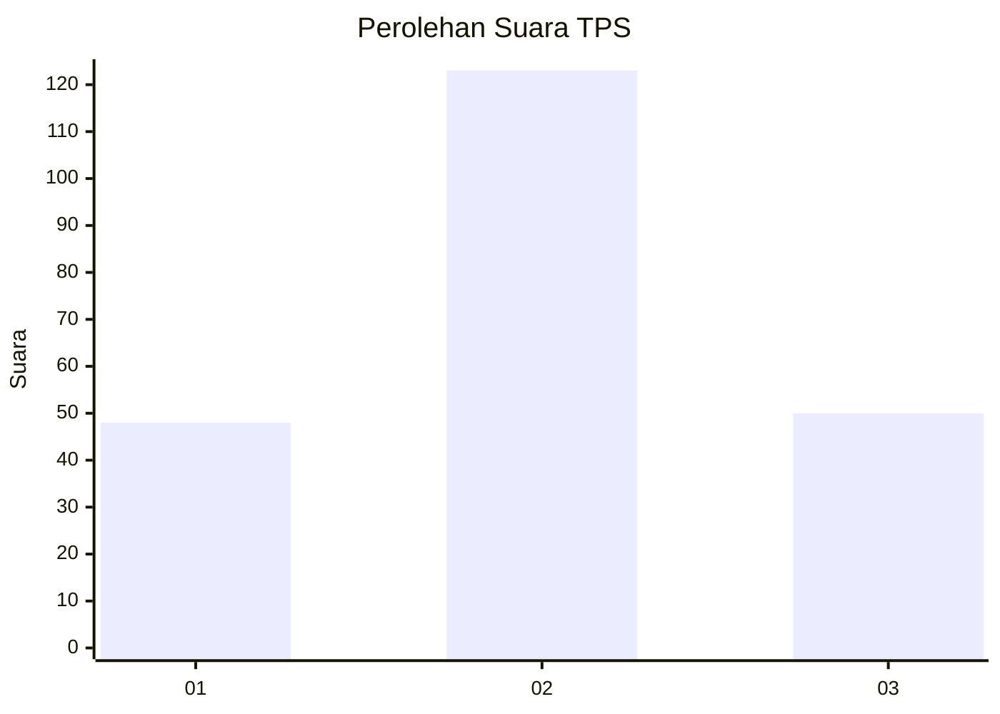
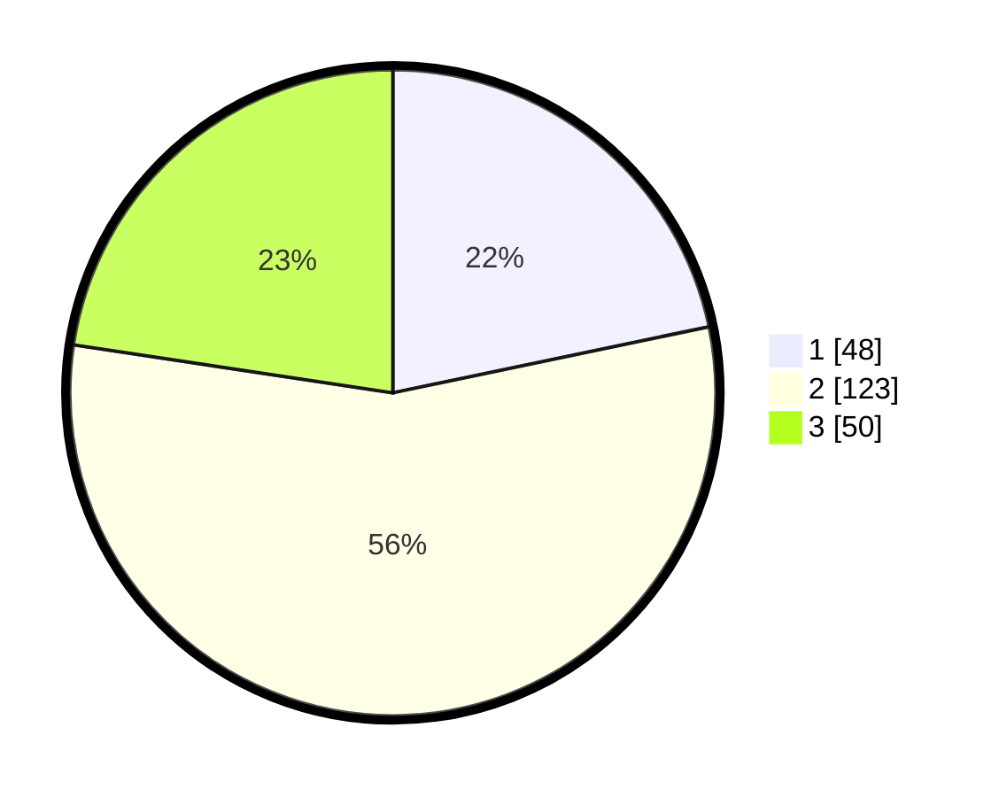

# Hasil

## Grafik

## Tabel

| No. | Nama Paslon    | Suara | Suara (raw) | Persentase |
|:--- |:-------------- | -----:| -----------:| ----------:|
| 1   | ANIES MUHAIMIN | 48    | [48][p-1]   | 21,72      |
| 2   | PRABOWO GIBRAN | 123   | [123][p-2]  | 55,66      |
| 3   | GANJAR MAHFUD  | 50    | [50][p-3]   | 22,62      |

[p-1]: https://github.com/gigit-pemilu/pemilu-2024-34-di-yogyakarta/blob/main/pilpres/hitung-suara/sub/34-di-yogyakarta/sub/03-gunungkidul/sub/06-panggang/sub/2005-giriharjo/sub/009-tps/sub/paslon-1.txt
[p-2]: https://github.com/gigit-pemilu/pemilu-2024-34-di-yogyakarta/blob/main/pilpres/hitung-suara/sub/34-di-yogyakarta/sub/03-gunungkidul/sub/06-panggang/sub/2005-giriharjo/sub/009-tps/sub/paslon-2.txt
[p-3]: https://github.com/gigit-pemilu/pemilu-2024-34-di-yogyakarta/blob/main/pilpres/hitung-suara/sub/34-di-yogyakarta/sub/03-gunungkidul/sub/06-panggang/sub/2005-giriharjo/sub/009-tps/sub/paslon-3.txt

## Foto C Plano

https://sirekap-obj-formc.kpu.go.id/853b/pemilu/ppwp/34/03/06/20/05/3403062005009-20240214-213731--a2c3ab56-ff88-4a66-9f3a-0c80feee259f.jpg

https://sirekap-obj-formc.kpu.go.id/853b/pemilu/ppwp/34/03/06/20/05/3403062005009-20240214-213951--c95e9fc8-fe6b-4f2b-877c-275aa89eda53.jpg

https://sirekap-obj-formc.kpu.go.id/853b/pemilu/ppwp/34/03/06/20/05/3403062005009-20240215-020057--949547da-fec3-43a4-894b-6f6c3fc55698.jpg

## Metadata

| Key        | Value               |
| ---------- | ------------------- |
| Time Stamp | 2024-02-15 06:00:23 |

