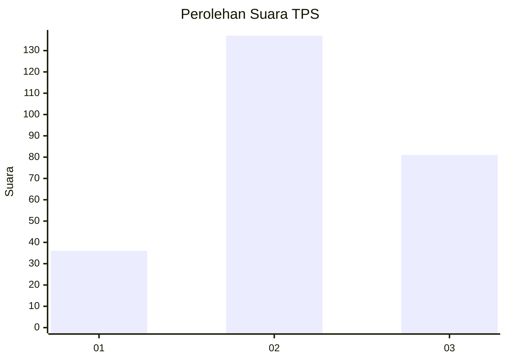
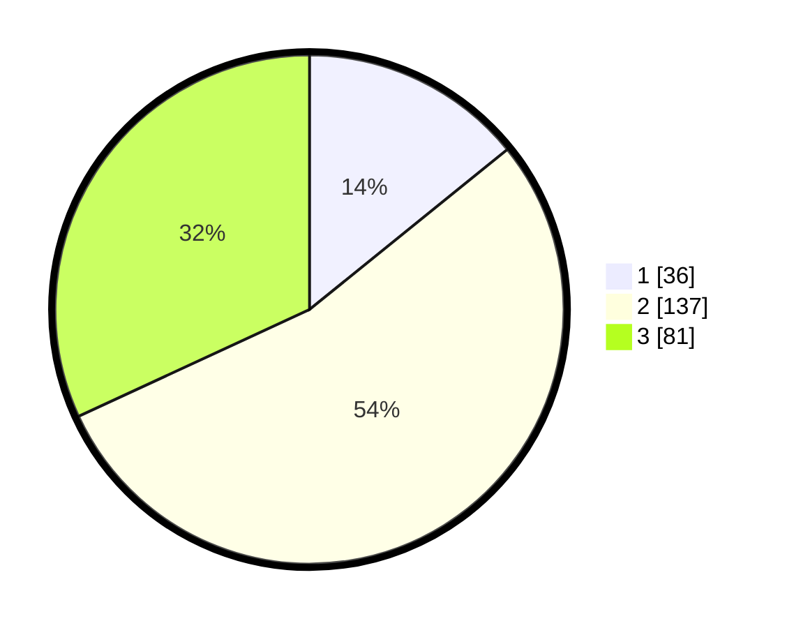

# Hasil

## Grafik

## Tabel

| No. | Nama Paslon    | Suara | Suara (raw) | Persentase |
|:--- |:-------------- | -----:| -----------:| ----------:|
| 1   | ANIES MUHAIMIN | 36    | [36][p-1]   | 14,17      |
| 2   | PRABOWO GIBRAN | 137   | [137][p-2]  | 53,94      |
| 3   | GANJAR MAHFUD  | 81    | [81][p-3]   | 31,89      |

[p-1]: https://github.com/gigit-pemilu/pemilu-2024-34-di-yogyakarta/blob/main/pilpres/hitung-suara/sub/34-di-yogyakarta/sub/03-gunungkidul/sub/06-panggang/sub/2005-giriharjo/sub/012-tps/sub/paslon-1.txt
[p-2]: https://github.com/gigit-pemilu/pemilu-2024-34-di-yogyakarta/blob/main/pilpres/hitung-suara/sub/34-di-yogyakarta/sub/03-gunungkidul/sub/06-panggang/sub/2005-giriharjo/sub/012-tps/sub/paslon-2.txt
[p-3]: https://github.com/gigit-pemilu/pemilu-2024-34-di-yogyakarta/blob/main/pilpres/hitung-suara/sub/34-di-yogyakarta/sub/03-gunungkidul/sub/06-panggang/sub/2005-giriharjo/sub/012-tps/sub/paslon-3.txt

## Foto C Plano

https://sirekap-obj-formc.kpu.go.id/f0e1/pemilu/ppwp/34/03/06/20/05/3403062005012-20240214-230737--c2fc135e-0e54-4e89-a441-4f189bf04427.jpg

https://sirekap-obj-formc.kpu.go.id/f0e1/pemilu/ppwp/34/03/06/20/05/3403062005012-20240214-230917--34d9b3bb-c88c-429b-84fd-1f025698cc10.jpg

https://sirekap-obj-formc.kpu.go.id/f0e1/pemilu/ppwp/34/03/06/20/05/3403062005012-20240214-231116--40aba90d-4905-48cd-8e16-20a64a740c11.jpg

## Metadata

| Key        | Value               |
| ---------- | ------------------- |
| Time Stamp | 2024-02-17 19:30:00 |

