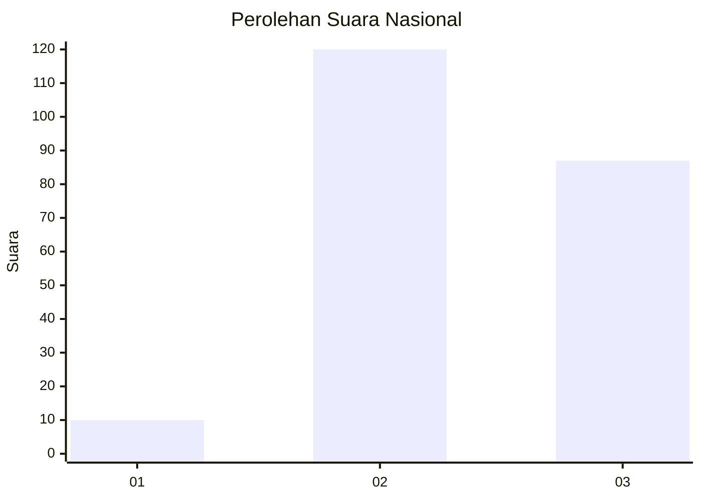
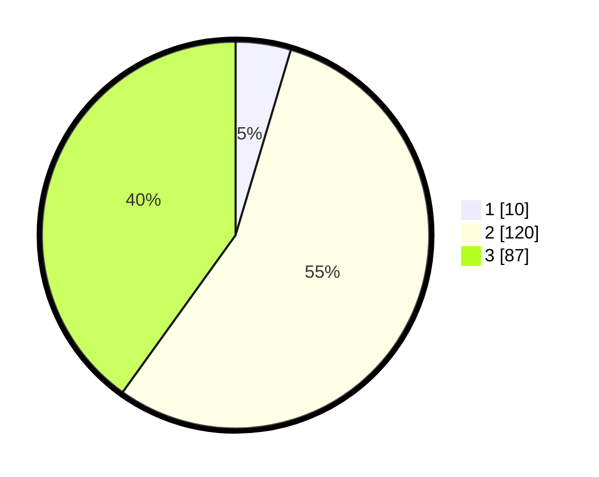

# Hasil

## Grafik

## Tabel

| No. | Nama Paslon    | Suara | Suara (raw) | Persentase |
|:--- |:-------------- | -----:| -----------:| ----------:|
| 1   | ANIES MUHAIMIN | 10    | [10][p-1]   | 4,61       |
| 2   | PRABOWO GIBRAN | 120   | [120][p-2]  | 55,30      |
| 3   | GANJAR MAHFUD  | 87    | [87][p-3]   | 40,09      |

[p-1]: https://github.com/gigit-pemilu/pemilu-2024/blob/main/pilpres/hitung-suara/sub/34-di-yogyakarta/sub/03-gunungkidul/sub/07-tepus/sub/2001-giripanggung/sub/002-tps/sub/paslon-1.txt
[p-2]: https://github.com/gigit-pemilu/pemilu-2024/blob/main/pilpres/hitung-suara/sub/34-di-yogyakarta/sub/03-gunungkidul/sub/07-tepus/sub/2001-giripanggung/sub/002-tps/sub/paslon-2.txt
[p-3]: https://github.com/gigit-pemilu/pemilu-2024/blob/main/pilpres/hitung-suara/sub/34-di-yogyakarta/sub/03-gunungkidul/sub/07-tepus/sub/2001-giripanggung/sub/002-tps/sub/paslon-3.txt

## Foto C Plano

https://sirekap-obj-formc.kpu.go.id/9b6e/pemilu/ppwp/34/03/07/20/01/3403072001002-20240216-125742--8b0fdc88-d590-47f1-a950-fd9afaaa80e5.jpg

https://sirekap-obj-formc.kpu.go.id/9b6e/pemilu/ppwp/34/03/07/20/01/3403072001002-20240216-125748--f8fa6864-da42-4368-abd1-c04f65f7bce5.jpg

https://sirekap-obj-formc.kpu.go.id/9b6e/pemilu/ppwp/34/03/07/20/01/3403072001002-20240216-125745--b27296c8-0c4b-4e0f-8891-a3b8a85c1221.jpg

## Metadata

| Key        | Value               |
| ---------- | ------------------- |
| Time Stamp | 2024-02-17 14:45:18 |

## DATA PEMILIH TETAP

Jumlah pemilih dalam DPT: **293**.
 * L: **137**.
 * P: **156**.

## DATA PENGGUNA HAK PILIH

Jumlah pengguna hak pilih dalam DPT: **229**.
 * L: **110**.
 * P: **119**.

Jumlah pengguna hak pilih dalam DPTb: **2**.
 * L: **2**.
 * P: **0**.

Jumlah pengguna hak pilih dalam DPK: **0**.
 * L: **0**.
 * P: **0**.

Jumlah pengguna hak pilih: **231**.
 * L: **112**.
 * P: **119**.

## JUMLAH SUARA SAH DAN TIDAK SAH

JUMLAH SELURUH SUARA SAH: **217**.

JUMLAH SUARA TIDAK SAH: **14**.

JUMLAH SELURUH SUARA SAH DAN SUARA TIDAK SAH: **231**.

