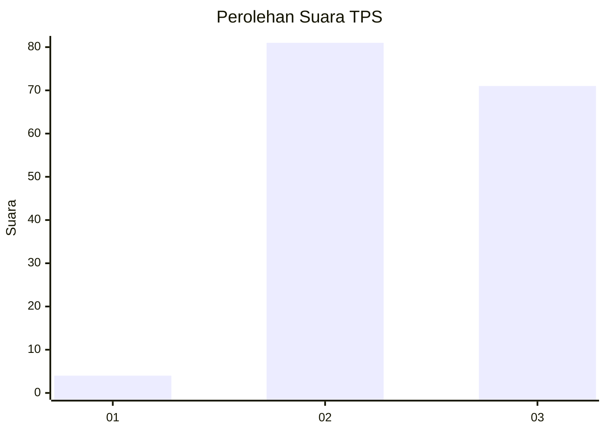
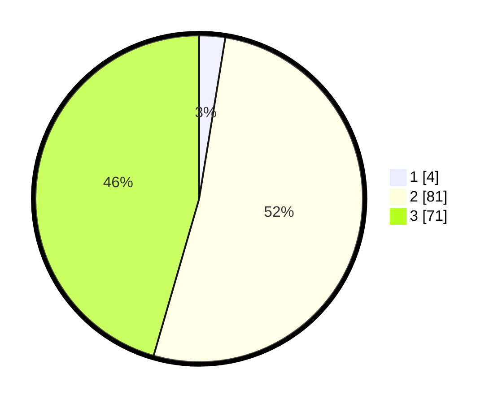

# Hasil

## Grafik

## Tabel

| No. | Nama Paslon    | Suara | Suara (raw) | Persentase |
|:--- |:-------------- | -----:| -----------:| ----------:|
| 1   | ANIES MUHAIMIN | 4     | [4][p-1]    | 2,56       |
| 2   | PRABOWO GIBRAN | 81    | [81][p-2]   | 51,92      |
| 3   | GANJAR MAHFUD  | 71    | [71][p-3]   | 45,51      |

[p-1]: https://github.com/gigit-pemilu/pemilu-2024-34-di-yogyakarta/blob/main/pilpres/hitung-suara/sub/34-di-yogyakarta/sub/03-gunungkidul/sub/07-tepus/sub/2001-giripanggung/sub/003-tps/sub/paslon-1.txt
[p-2]: https://github.com/gigit-pemilu/pemilu-2024-34-di-yogyakarta/blob/main/pilpres/hitung-suara/sub/34-di-yogyakarta/sub/03-gunungkidul/sub/07-tepus/sub/2001-giripanggung/sub/003-tps/sub/paslon-2.txt
[p-3]: https://github.com/gigit-pemilu/pemilu-2024-34-di-yogyakarta/blob/main/pilpres/hitung-suara/sub/34-di-yogyakarta/sub/03-gunungkidul/sub/07-tepus/sub/2001-giripanggung/sub/003-tps/sub/paslon-3.txt

## Foto C Plano

https://sirekap-obj-formc.kpu.go.id/d71f/pemilu/ppwp/34/03/07/20/01/3403072001003-20240216-035943--4ff0e714-461a-45f7-81f9-6ff48933e60e.jpg

https://sirekap-obj-formc.kpu.go.id/d71f/pemilu/ppwp/34/03/07/20/01/3403072001003-20240216-035945--95542f5d-36da-417b-b1e4-a7a2bbc7ef12.jpg

https://sirekap-obj-formc.kpu.go.id/d71f/pemilu/ppwp/34/03/07/20/01/3403072001003-20240216-035944--fb824ad1-0944-485b-8d14-f582e895d368.jpg

## Metadata

| Key        | Value               |
| ---------- | ------------------- |
| Time Stamp | 2024-02-17 14:45:18 |

## DATA PEMILIH TETAP

Jumlah pemilih dalam DPT: **176**.
 * L: **84**.
 * P: **92**.

## DATA PENGGUNA HAK PILIH

Jumlah pengguna hak pilih dalam DPT: **158**.
 * L: **76**.
 * P: **82**.

Jumlah pengguna hak pilih dalam DPTb: **1**.
 * L: **1**.
 * P: **0**.

Jumlah pengguna hak pilih dalam DPK: **0**.
 * L: **0**.
 * P: **0**.

Jumlah pengguna hak pilih: **159**.
 * L: **77**.
 * P: **82**.

## JUMLAH SUARA SAH DAN TIDAK SAH

JUMLAH SELURUH SUARA SAH: **156**.

JUMLAH SUARA TIDAK SAH: **3**.

JUMLAH SELURUH SUARA SAH DAN SUARA TIDAK SAH: **159**.

