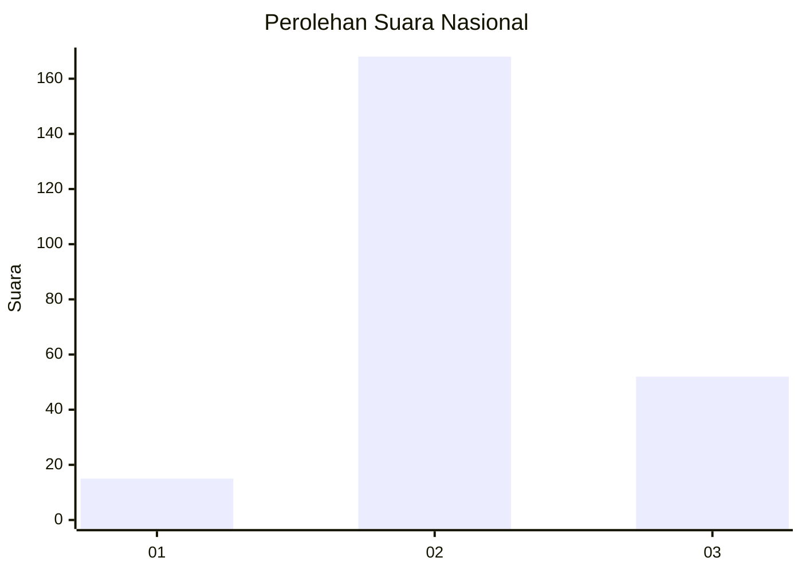
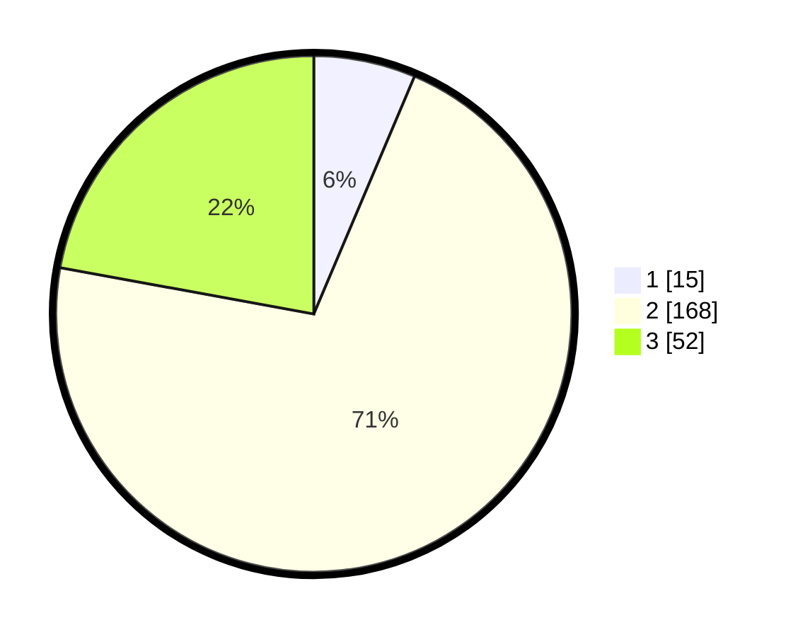

# Hasil

## Grafik

## Tabel

| No. | Nama Paslon    | Suara | Suara (raw) | Persentase |
|:--- |:-------------- | -----:| -----------:| ----------:|
| 1   | ANIES MUHAIMIN | 15    | [15][p-1]   | 6,38       |
| 2   | PRABOWO GIBRAN | 168   | [168][p-2]  | 71,49      |
| 3   | GANJAR MAHFUD  | 52    | [52][p-3]   | 22,13      |

[p-1]: https://github.com/gigit-pemilu/pemilu-2024/blob/main/pilpres/hitung-suara/sub/34-di-yogyakarta/sub/03-gunungkidul/sub/07-tepus/sub/2002-sumberwungu/sub/019-tps/sub/paslon-1.txt
[p-2]: https://github.com/gigit-pemilu/pemilu-2024/blob/main/pilpres/hitung-suara/sub/34-di-yogyakarta/sub/03-gunungkidul/sub/07-tepus/sub/2002-sumberwungu/sub/019-tps/sub/paslon-2.txt
[p-3]: https://github.com/gigit-pemilu/pemilu-2024/blob/main/pilpres/hitung-suara/sub/34-di-yogyakarta/sub/03-gunungkidul/sub/07-tepus/sub/2002-sumberwungu/sub/019-tps/sub/paslon-3.txt

## Foto C Plano

https://sirekap-obj-formc.kpu.go.id/037f/pemilu/ppwp/34/03/07/20/02/3403072002019-20240214-195606--790b1190-05e7-421e-8d76-727c8e97c8b8.jpg

https://sirekap-obj-formc.kpu.go.id/037f/pemilu/ppwp/34/03/07/20/02/3403072002019-20240214-195803--b2ee87f3-358c-4663-9f8d-5f797891aed1.jpg

https://sirekap-obj-formc.kpu.go.id/037f/pemilu/ppwp/34/03/07/20/02/3403072002019-20240214-195909--00ac4693-caaa-4ec9-a224-49f1cc6a34b6.jpg

## Metadata

| Key        | Value               |
| ---------- | ------------------- |
| Time Stamp | 2024-02-15 00:41:44 |

