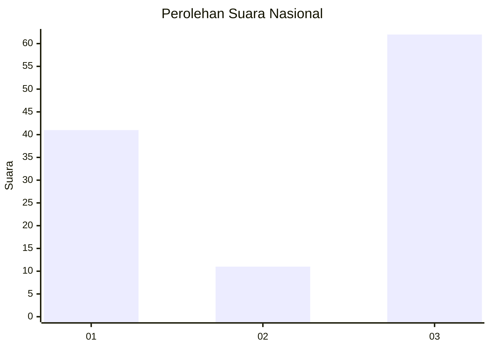
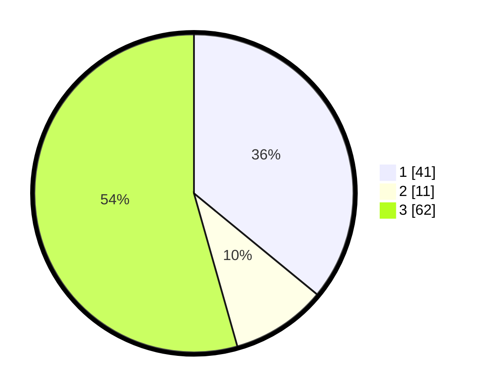

# Hasil

## Grafik

## Tabel

| No. | Nama Paslon    | Suara | Suara (raw) | Persentase |
|:--- |:-------------- | -----:| -----------:| ----------:|
| 1   | ANIES MUHAIMIN | 41    | [41][p-1]   | 35,96      |
| 2   | PRABOWO GIBRAN | 11    | [11][p-2]   | 9,65       |
| 3   | GANJAR MAHFUD  | 62    | [62][p-3]   | 54,39      |

[p-1]: https://github.com/gigit-pemilu/pemilu-2024/blob/main/pilpres/hitung-suara/sub/34-di-yogyakarta/sub/03-gunungkidul/sub/07-tepus/sub/2002-sumberwungu/sub/022-tps/sub/paslon-1.txt
[p-2]: https://github.com/gigit-pemilu/pemilu-2024/blob/main/pilpres/hitung-suara/sub/34-di-yogyakarta/sub/03-gunungkidul/sub/07-tepus/sub/2002-sumberwungu/sub/022-tps/sub/paslon-2.txt
[p-3]: https://github.com/gigit-pemilu/pemilu-2024/blob/main/pilpres/hitung-suara/sub/34-di-yogyakarta/sub/03-gunungkidul/sub/07-tepus/sub/2002-sumberwungu/sub/022-tps/sub/paslon-3.txt

## Foto C Plano

https://sirekap-obj-formc.kpu.go.id/cea1/pemilu/ppwp/34/03/07/20/02/3403072002022-20240215-082202--ad713a63-b1af-4efd-a9fc-712cc9572b74.jpg

https://sirekap-obj-formc.kpu.go.id/cea1/pemilu/ppwp/34/03/07/20/02/3403072002022-20240215-082407--ed01a575-5395-489b-bbae-fad48db58683.jpg

https://sirekap-obj-formc.kpu.go.id/cea1/pemilu/ppwp/34/03/07/20/02/3403072002022-20240215-082446--552c23af-7604-42ce-9075-3fb74076eb11.jpg

## Metadata

| Key        | Value               |
| ---------- | ------------------- |
| Time Stamp | 2024-02-19 06:16:00 |

