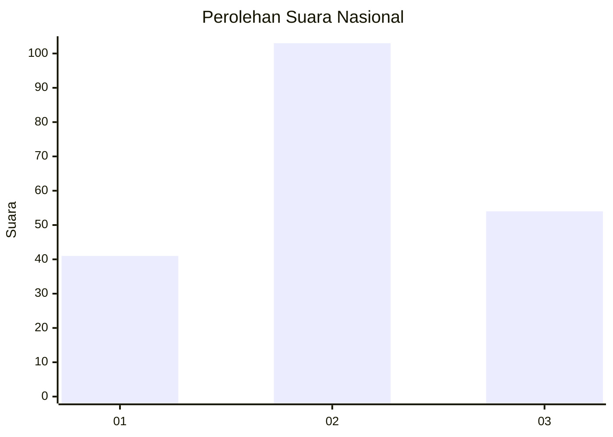
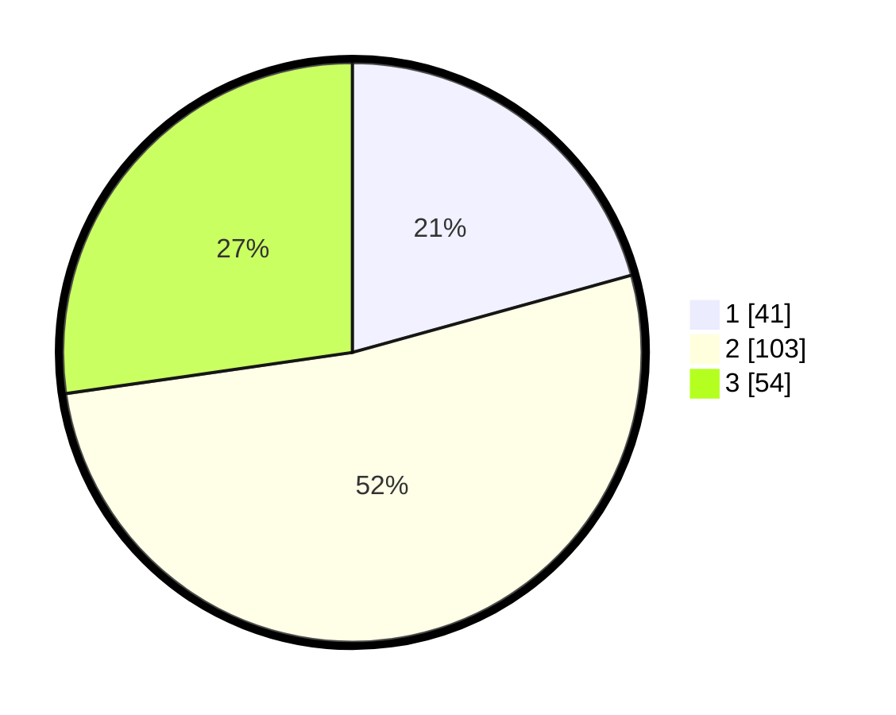

# Hasil

## Grafik

## Tabel

| No. | Nama Paslon    | Suara | Suara (raw) | Persentase |
|:--- |:-------------- | -----:| -----------:| ----------:|
| 1   | ANIES MUHAIMIN | 41    | [41][p-1]   | 20,71      |
| 2   | PRABOWO GIBRAN | 103   | [103][p-2]  | 52,02      |
| 3   | GANJAR MAHFUD  | 54    | [54][p-3]   | 27,27      |

[p-1]: https://github.com/gigit-pemilu/pemilu-2024/blob/main/pilpres/hitung-suara/sub/34-di-yogyakarta/sub/03-gunungkidul/sub/07-tepus/sub/2003-sidoharjo/sub/002-tps/sub/paslon-1.txt
[p-2]: https://github.com/gigit-pemilu/pemilu-2024/blob/main/pilpres/hitung-suara/sub/34-di-yogyakarta/sub/03-gunungkidul/sub/07-tepus/sub/2003-sidoharjo/sub/002-tps/sub/paslon-2.txt
[p-3]: https://github.com/gigit-pemilu/pemilu-2024/blob/main/pilpres/hitung-suara/sub/34-di-yogyakarta/sub/03-gunungkidul/sub/07-tepus/sub/2003-sidoharjo/sub/002-tps/sub/paslon-3.txt

## Foto C Plano

https://sirekap-obj-formc.kpu.go.id/be93/pemilu/ppwp/34/03/07/20/03/3403072003002-20240217-143652--f36d55fa-fe53-4a72-8fc7-ee902a2e10ea.jpg

https://sirekap-obj-formc.kpu.go.id/be93/pemilu/ppwp/34/03/07/20/03/3403072003002-20240217-143806--7d699f4e-cb05-4a01-a5cb-4f5d900fc09c.jpg

https://sirekap-obj-formc.kpu.go.id/be93/pemilu/ppwp/34/03/07/20/03/3403072003002-20240217-143852--ff2a6810-14a7-482d-9477-1168744584c1.jpg

## Metadata

| Key        | Value               |
| ---------- | ------------------- |
| Time Stamp | 2024-02-17 19:30:00 |

