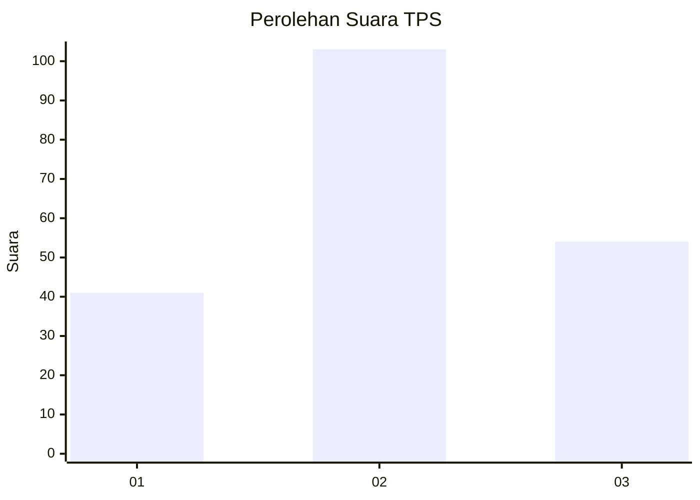
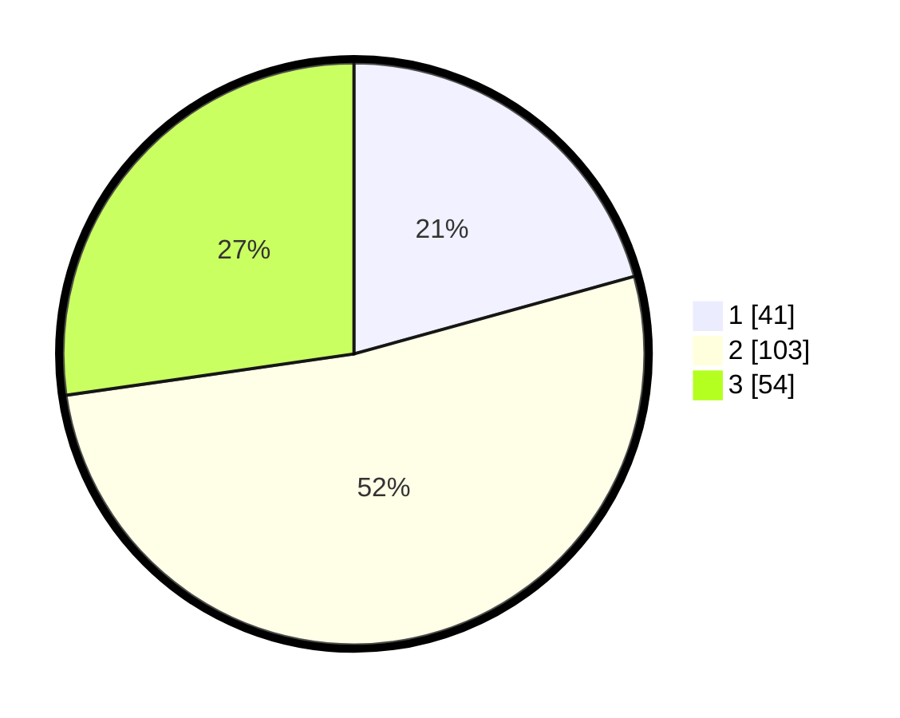

# Hasil

## Grafik

## Tabel

| No. | Nama Paslon    | Suara | Suara (raw) | Persentase |
|:--- |:-------------- | -----:| -----------:| ----------:|
| 1   | ANIES MUHAIMIN | 41    | [41][p-1]   | 20,71      |
| 2   | PRABOWO GIBRAN | 103   | [103][p-2]  | 52,02      |
| 3   | GANJAR MAHFUD  | 54    | [54][p-3]   | 27,27      |

[p-1]: https://github.com/gigit-pemilu/pemilu-2024-34-di-yogyakarta/blob/main/pilpres/hitung-suara/sub/34-di-yogyakarta/sub/03-gunungkidul/sub/07-tepus/sub/2003-sidoharjo/sub/003-tps/sub/paslon-1.txt
[p-2]: https://github.com/gigit-pemilu/pemilu-2024-34-di-yogyakarta/blob/main/pilpres/hitung-suara/sub/34-di-yogyakarta/sub/03-gunungkidul/sub/07-tepus/sub/2003-sidoharjo/sub/003-tps/sub/paslon-2.txt
[p-3]: https://github.com/gigit-pemilu/pemilu-2024-34-di-yogyakarta/blob/main/pilpres/hitung-suara/sub/34-di-yogyakarta/sub/03-gunungkidul/sub/07-tepus/sub/2003-sidoharjo/sub/003-tps/sub/paslon-3.txt

## Foto C Plano

https://sirekap-obj-formc.kpu.go.id/aa7b/pemilu/ppwp/34/03/07/20/03/3403072003003-20240217-184650--ea95164e-eeea-432c-b880-970e7a97693d.jpg

https://sirekap-obj-formc.kpu.go.id/aa7b/pemilu/ppwp/34/03/07/20/03/3403072003003-20240217-184800--abdf2534-5108-4c07-b923-8f0914cab4ee.jpg

https://sirekap-obj-formc.kpu.go.id/aa7b/pemilu/ppwp/34/03/07/20/03/3403072003003-20240217-184913--ebb8a9f4-9915-4bf5-885e-39d7cb693b5e.jpg

## Metadata

| Key        | Value               |
| ---------- | ------------------- |
| Time Stamp | 2024-02-17 19:30:00 |

