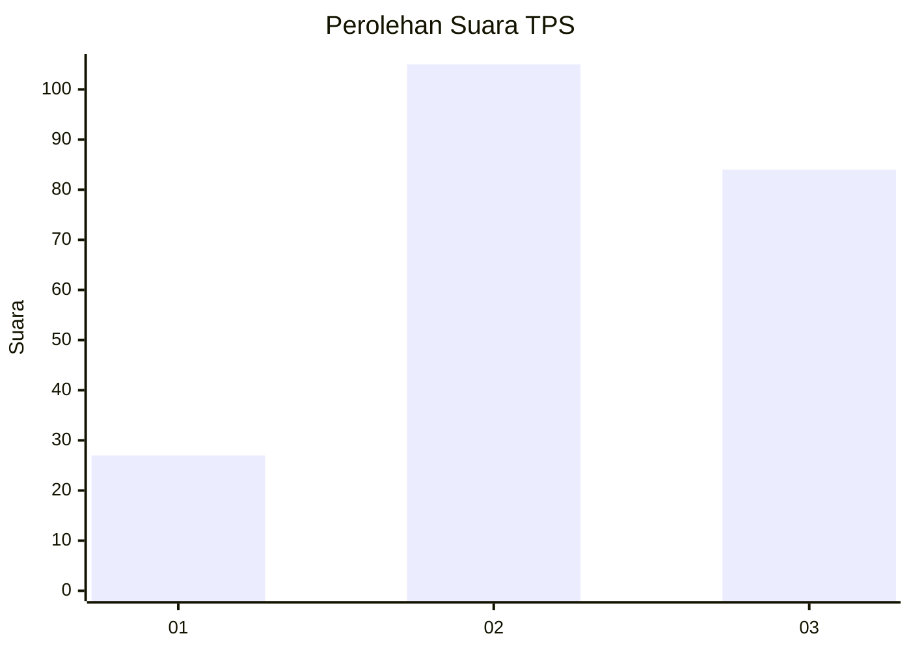
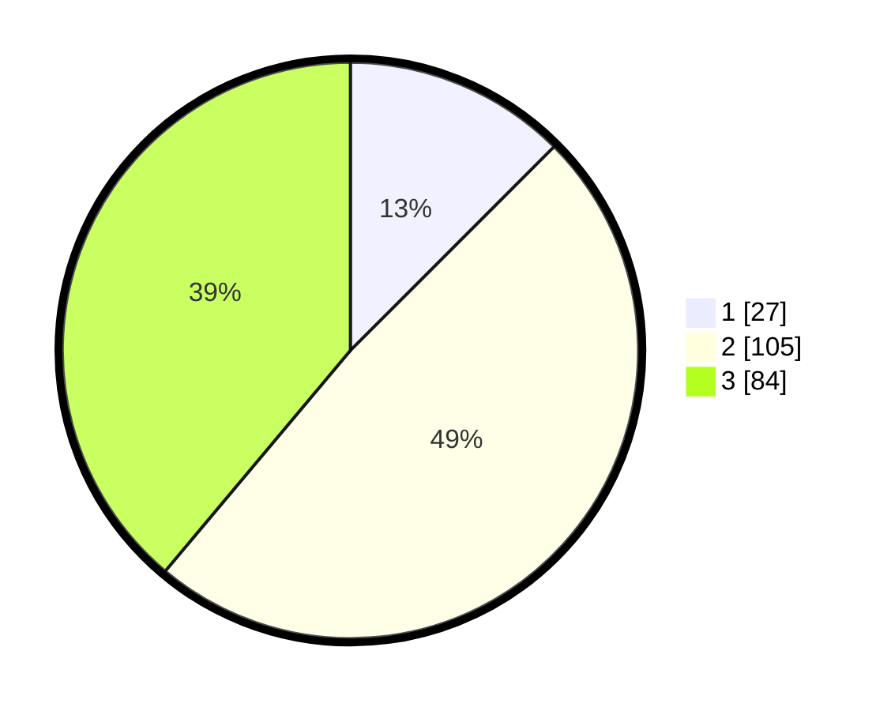

# Hasil

## Grafik

## Tabel

| No. | Nama Paslon    | Suara | Suara (raw) | Persentase |
|:--- |:-------------- | -----:| -----------:| ----------:|
| 1   | ANIES MUHAIMIN | 27    | [27][p-1]   | 12,50      |
| 2   | PRABOWO GIBRAN | 105   | [105][p-2]  | 48,61      |
| 3   | GANJAR MAHFUD  | 84    | [84][p-3]   | 38,89      |

[p-1]: https://github.com/gigit-pemilu/pemilu-2024-34-di-yogyakarta/blob/main/pilpres/hitung-suara/sub/34-di-yogyakarta/sub/03-gunungkidul/sub/07-tepus/sub/2003-sidoharjo/sub/004-tps/sub/paslon-1.txt
[p-2]: https://github.com/gigit-pemilu/pemilu-2024-34-di-yogyakarta/blob/main/pilpres/hitung-suara/sub/34-di-yogyakarta/sub/03-gunungkidul/sub/07-tepus/sub/2003-sidoharjo/sub/004-tps/sub/paslon-2.txt
[p-3]: https://github.com/gigit-pemilu/pemilu-2024-34-di-yogyakarta/blob/main/pilpres/hitung-suara/sub/34-di-yogyakarta/sub/03-gunungkidul/sub/07-tepus/sub/2003-sidoharjo/sub/004-tps/sub/paslon-3.txt

## Foto C Plano

https://sirekap-obj-formc.kpu.go.id/3e08/pemilu/ppwp/34/03/07/20/03/3403072003004-20240217-201927--5fd72ea3-1db6-4eed-a201-1b3885475bc9.jpg

https://sirekap-obj-formc.kpu.go.id/3e08/pemilu/ppwp/34/03/07/20/03/3403072003004-20240217-202046--8e493259-0e56-4807-bc22-ee05e7af3dd1.jpg

https://sirekap-obj-formc.kpu.go.id/3e08/pemilu/ppwp/34/03/07/20/03/3403072003004-20240217-202639--9a9de837-122c-4ff4-9187-0e353ddbc8a3.jpg

## Metadata

| Key        | Value               |
| ---------- | ------------------- |
| Time Stamp | 2024-02-20 11:00:00 |

