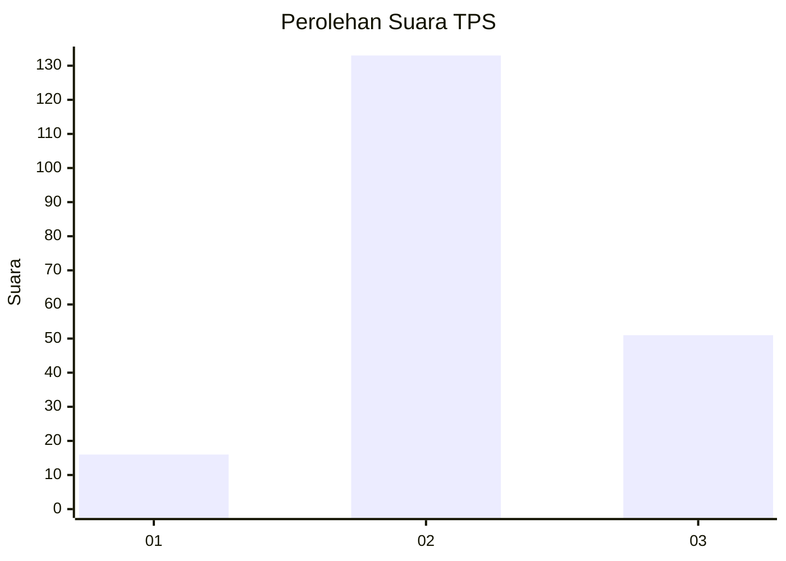
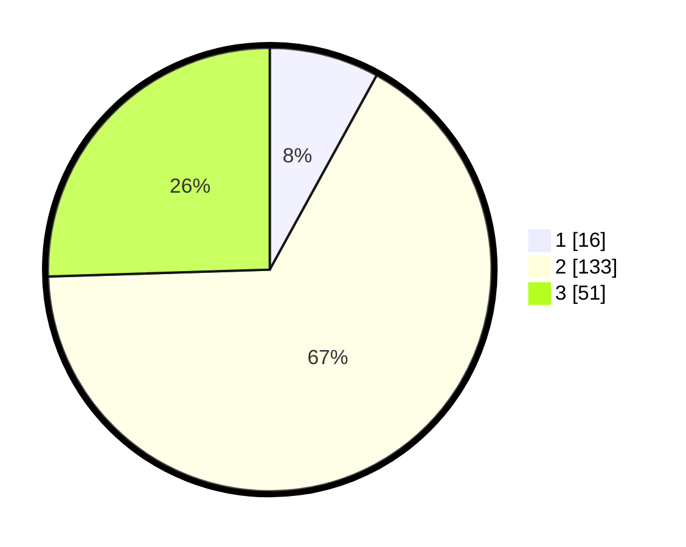

# Hasil

## Grafik

## Tabel

| No. | Nama Paslon    | Suara | Suara (raw) | Persentase |
|:--- |:-------------- | -----:| -----------:| ----------:|
| 1   | ANIES MUHAIMIN | 16    | [16][p-1]   | 8,00       |
| 2   | PRABOWO GIBRAN | 133   | [133][p-2]  | 66,50      |
| 3   | GANJAR MAHFUD  | 51    | [51][p-3]   | 25,50      |

[p-1]: https://github.com/gigit-pemilu/pemilu-2024-34-di-yogyakarta/blob/main/pilpres/hitung-suara/sub/34-di-yogyakarta/sub/03-gunungkidul/sub/07-tepus/sub/2004-tepus/sub/002-tps/sub/paslon-1.txt
[p-2]: https://github.com/gigit-pemilu/pemilu-2024-34-di-yogyakarta/blob/main/pilpres/hitung-suara/sub/34-di-yogyakarta/sub/03-gunungkidul/sub/07-tepus/sub/2004-tepus/sub/002-tps/sub/paslon-2.txt
[p-3]: https://github.com/gigit-pemilu/pemilu-2024-34-di-yogyakarta/blob/main/pilpres/hitung-suara/sub/34-di-yogyakarta/sub/03-gunungkidul/sub/07-tepus/sub/2004-tepus/sub/002-tps/sub/paslon-3.txt

## Foto C Plano

https://sirekap-obj-formc.kpu.go.id/36dd/pemilu/ppwp/34/03/07/20/04/3403072004002-20240216-134758--670cb491-dd84-4347-b30d-fc0643c0bc7b.jpg

https://sirekap-obj-formc.kpu.go.id/36dd/pemilu/ppwp/34/03/07/20/04/3403072004002-20240216-134759--2889bbbb-5986-427a-bfb7-7d9c5ff92689.jpg

https://sirekap-obj-formc.kpu.go.id/36dd/pemilu/ppwp/34/03/07/20/04/3403072004002-20240216-134759--0903bcaf-83b7-4974-b9c0-2b9d8ab8053c.jpg

## Metadata

| Key        | Value               |
| ---------- | ------------------- |
| Time Stamp | 2024-02-17 16:00:02 |

## DATA PEMILIH TETAP

Jumlah pemilih dalam DPT: **276**.
 * L: **130**.
 * P: **146**.

## DATA PENGGUNA HAK PILIH

Jumlah pengguna hak pilih dalam DPT: **207**.
 * L: **100**.
 * P: **107**.

Jumlah pengguna hak pilih dalam DPTb: **2**.
 * L: **2**.
 * P: **0**.

Jumlah pengguna hak pilih dalam DPK: **0**.
 * L: **3**.
 * P: **0**.

Jumlah pengguna hak pilih: **209**.
 * L: **102**.
 * P: **107**.

## JUMLAH SUARA SAH DAN TIDAK SAH

JUMLAH SELURUH SUARA SAH: **200**.

JUMLAH SUARA TIDAK SAH: **9**.

JUMLAH SELURUH SUARA SAH DAN SUARA TIDAK SAH: **209**.

