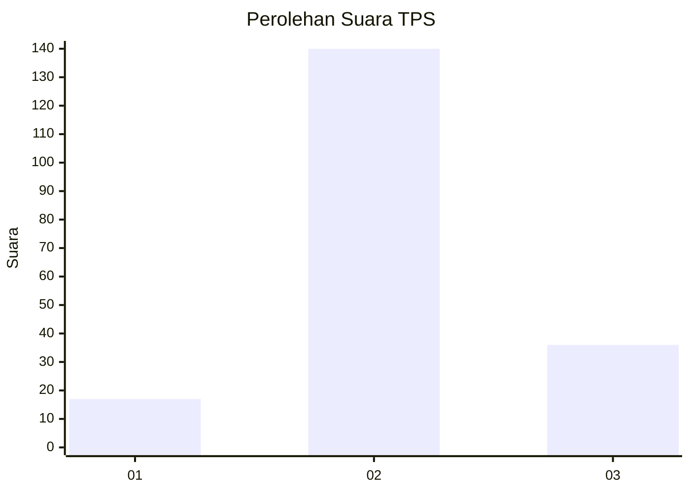
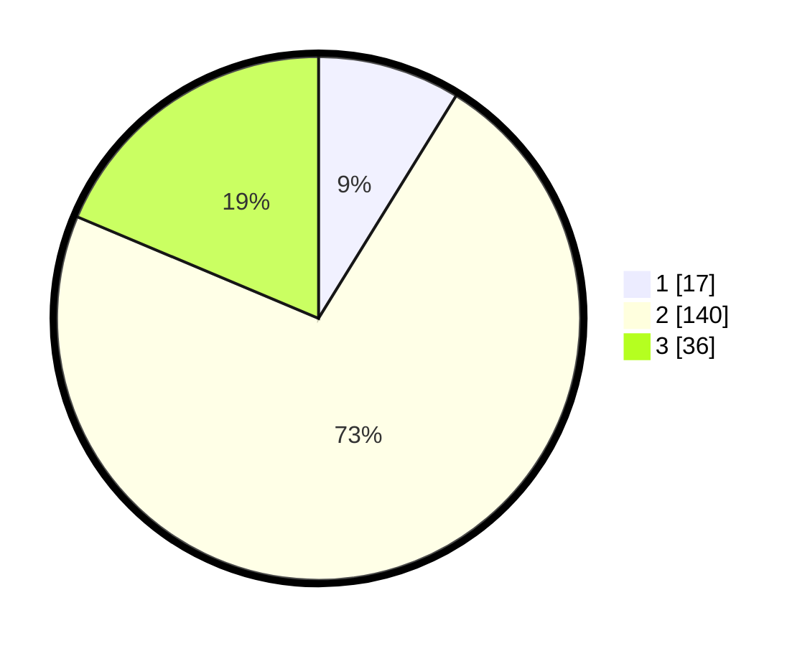

# Hasil

## Grafik

## Tabel

| No. | Nama Paslon    | Suara | Suara (raw) | Persentase |
|:--- |:-------------- | -----:| -----------:| ----------:|
| 1   | ANIES MUHAIMIN | 17    | [17][p-1]   | 8,81       |
| 2   | PRABOWO GIBRAN | 140   | [140][p-2]  | 72,54      |
| 3   | GANJAR MAHFUD  | 36    | [36][p-3]   | 18,65      |

[p-1]: https://github.com/gigit-pemilu/pemilu-2024-34-di-yogyakarta/blob/main/pilpres/hitung-suara/sub/34-di-yogyakarta/sub/03-gunungkidul/sub/07-tepus/sub/2004-tepus/sub/017-tps/sub/paslon-1.txt
[p-2]: https://github.com/gigit-pemilu/pemilu-2024-34-di-yogyakarta/blob/main/pilpres/hitung-suara/sub/34-di-yogyakarta/sub/03-gunungkidul/sub/07-tepus/sub/2004-tepus/sub/017-tps/sub/paslon-2.txt
[p-3]: https://github.com/gigit-pemilu/pemilu-2024-34-di-yogyakarta/blob/main/pilpres/hitung-suara/sub/34-di-yogyakarta/sub/03-gunungkidul/sub/07-tepus/sub/2004-tepus/sub/017-tps/sub/paslon-3.txt

## Foto C Plano

https://sirekap-obj-formc.kpu.go.id/bf36/pemilu/ppwp/34/03/07/20/04/3403072004017-20240215-044852--b0a0a1d7-5132-4bff-ba5c-13d38fc859ab.jpg

https://sirekap-obj-formc.kpu.go.id/bf36/pemilu/ppwp/34/03/07/20/04/3403072004017-20240215-042557--4c98c02c-42ba-4c21-b910-636cb0cbb731.jpg

https://sirekap-obj-formc.kpu.go.id/bf36/pemilu/ppwp/34/03/07/20/04/3403072004017-20240215-042741--2d212864-5afb-47bf-ab2c-04db34dcc472.jpg

## Metadata

| Key        | Value               |
| ---------- | ------------------- |
| Time Stamp | 2024-02-17 19:30:00 |

