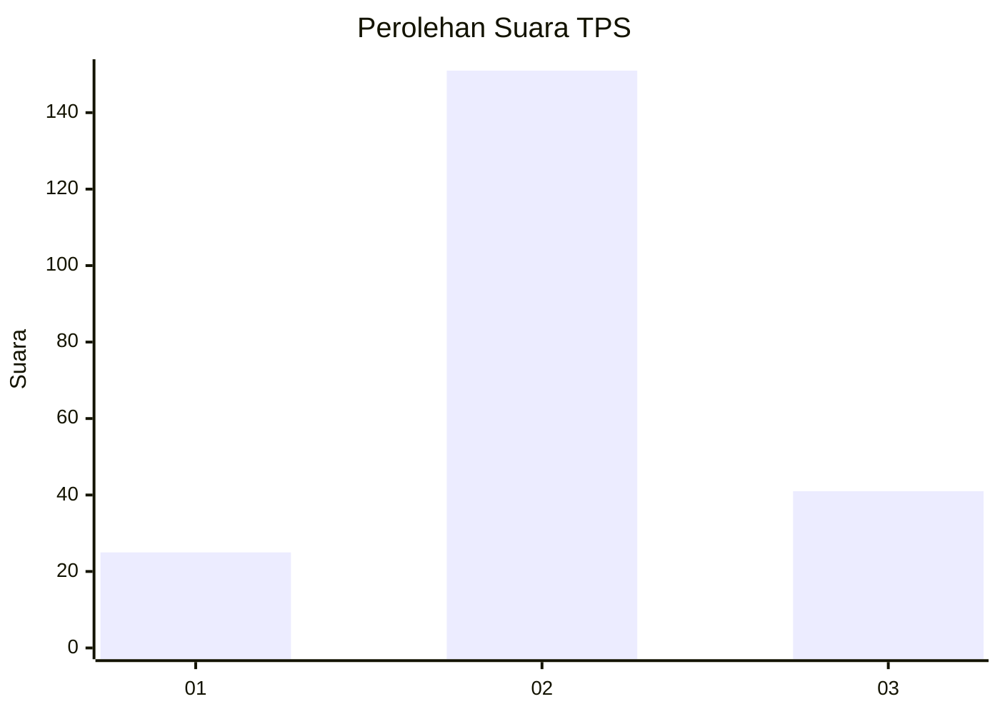
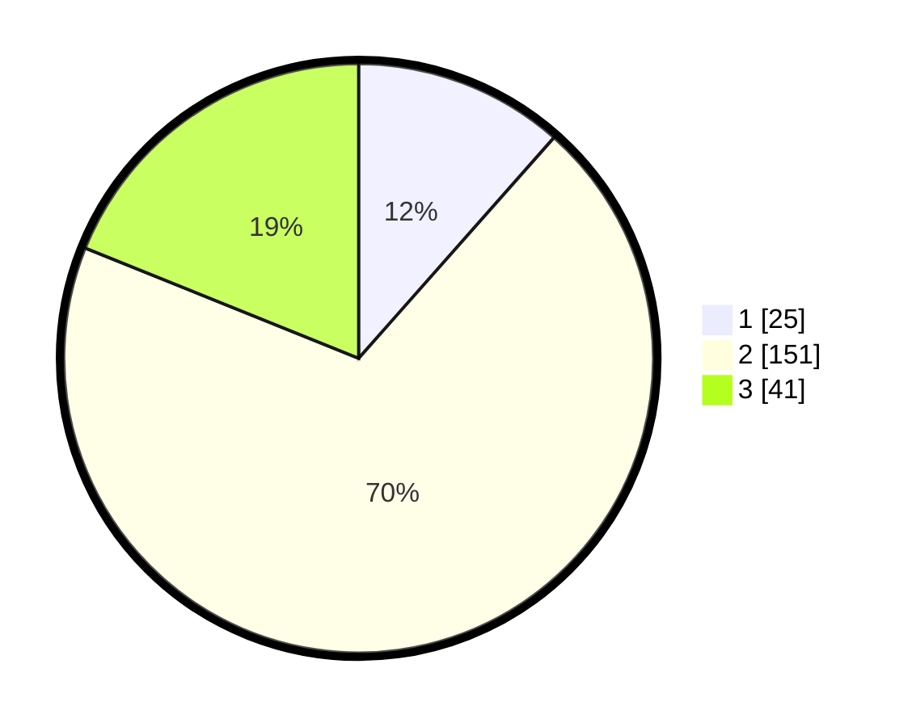

# Hasil

## Grafik

## Tabel

| No. | Nama Paslon    | Suara | Suara (raw) | Persentase |
|:--- |:-------------- | -----:| -----------:| ----------:|
| 1   | ANIES MUHAIMIN | 25    | [25][p-1]   | 11,52      |
| 2   | PRABOWO GIBRAN | 151   | [151][p-2]  | 69,59      |
| 3   | GANJAR MAHFUD  | 41    | [41][p-3]   | 18,89      |

[p-1]: https://github.com/gigit-pemilu/pemilu-2024-34-di-yogyakarta/blob/main/pilpres/hitung-suara/sub/34-di-yogyakarta/sub/03-gunungkidul/sub/07-tepus/sub/2004-tepus/sub/020-tps/sub/paslon-1.txt
[p-2]: https://github.com/gigit-pemilu/pemilu-2024-34-di-yogyakarta/blob/main/pilpres/hitung-suara/sub/34-di-yogyakarta/sub/03-gunungkidul/sub/07-tepus/sub/2004-tepus/sub/020-tps/sub/paslon-2.txt
[p-3]: https://github.com/gigit-pemilu/pemilu-2024-34-di-yogyakarta/blob/main/pilpres/hitung-suara/sub/34-di-yogyakarta/sub/03-gunungkidul/sub/07-tepus/sub/2004-tepus/sub/020-tps/sub/paslon-3.txt

## Foto C Plano

https://sirekap-obj-formc.kpu.go.id/a42c/pemilu/ppwp/34/03/07/20/04/3403072004020-20240219-125312--6d6a8734-88a9-45b1-9a7e-4e3347c780da.jpg

https://sirekap-obj-formc.kpu.go.id/a42c/pemilu/ppwp/34/03/07/20/04/3403072004020-20240219-125546--091b6465-6bec-42ff-8aae-d1fcff587da8.jpg

https://sirekap-obj-formc.kpu.go.id/a42c/pemilu/ppwp/34/03/07/20/04/3403072004020-20240219-125825--eee9ee1a-71cb-416a-85cd-00f395889572.jpg

## Metadata

| Key        | Value               |
| ---------- | ------------------- |
| Time Stamp | 2024-02-19 13:00:00 |

