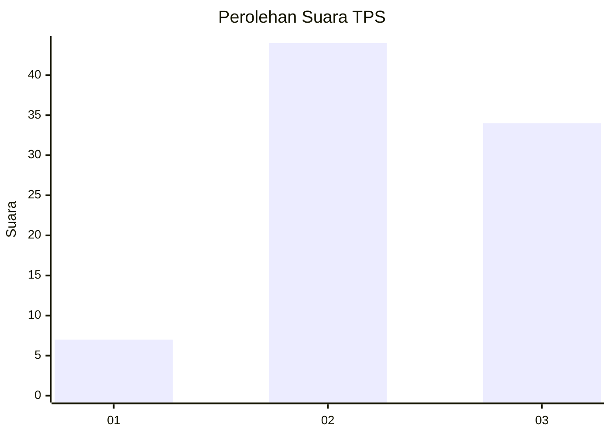
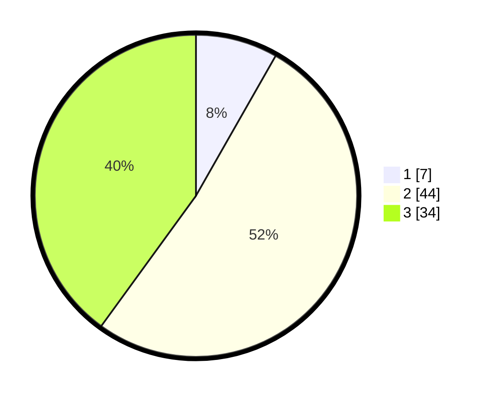

# Hasil

## Grafik

## Tabel

| No. | Nama Paslon    | Suara | Suara (raw) | Persentase |
|:--- |:-------------- | -----:| -----------:| ----------:|
| 1   | ANIES MUHAIMIN | 7     | [7][p-1]    | 8,24       |
| 2   | PRABOWO GIBRAN | 44    | [44][p-2]   | 51,76      |
| 3   | GANJAR MAHFUD  | 34    | [34][p-3]   | 40,00      |

[p-1]: https://github.com/gigit-pemilu/pemilu-2024-34-di-yogyakarta/blob/main/pilpres/hitung-suara/sub/34-di-yogyakarta/sub/03-gunungkidul/sub/08-semanu/sub/2001-ngeposari/sub/001-tps/sub/paslon-1.txt
[p-2]: https://github.com/gigit-pemilu/pemilu-2024-34-di-yogyakarta/blob/main/pilpres/hitung-suara/sub/34-di-yogyakarta/sub/03-gunungkidul/sub/08-semanu/sub/2001-ngeposari/sub/001-tps/sub/paslon-2.txt
[p-3]: https://github.com/gigit-pemilu/pemilu-2024-34-di-yogyakarta/blob/main/pilpres/hitung-suara/sub/34-di-yogyakarta/sub/03-gunungkidul/sub/08-semanu/sub/2001-ngeposari/sub/001-tps/sub/paslon-3.txt

## Foto C Plano

https://sirekap-obj-formc.kpu.go.id/a4d2/pemilu/ppwp/34/03/08/20/01/3403082001001-20240216-150011--05734771-dda6-489a-9d79-9a7b15549c84.jpg

https://sirekap-obj-formc.kpu.go.id/a4d2/pemilu/ppwp/34/03/08/20/01/3403082001001-20240216-150013--fc8e70e2-8828-42be-872a-3aaca93f8d90.jpg

https://sirekap-obj-formc.kpu.go.id/a4d2/pemilu/ppwp/34/03/08/20/01/3403082001001-20240216-150012--162e8f89-5baa-4a63-ae2d-3abb08951803.jpg

## Metadata

| Key        | Value               |
| ---------- | ------------------- |
| Time Stamp | 2024-02-17 11:00:02 |

## DATA PEMILIH TETAP

Jumlah pemilih dalam DPT: **88**.
 * L: **44**.
 * P: **44**.

## DATA PENGGUNA HAK PILIH

Jumlah pengguna hak pilih dalam DPT: **85**.
 * L: **41**.
 * P: **44**.

Jumlah pengguna hak pilih dalam DPTb: **1**.
 * L: **1**.
 * P: **0**.

Jumlah pengguna hak pilih dalam DPK: **0**.
 * L: **0**.
 * P: **0**.

Jumlah pengguna hak pilih: **86**.
 * L: **42**.
 * P: **44**.

## JUMLAH SUARA SAH DAN TIDAK SAH

JUMLAH SELURUH SUARA SAH: **85**.

JUMLAH SUARA TIDAK SAH: **1**.

JUMLAH SELURUH SUARA SAH DAN SUARA TIDAK SAH: **86**.

