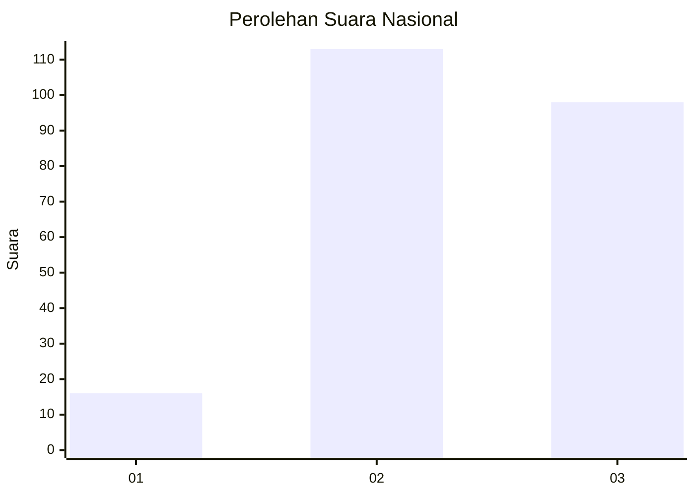
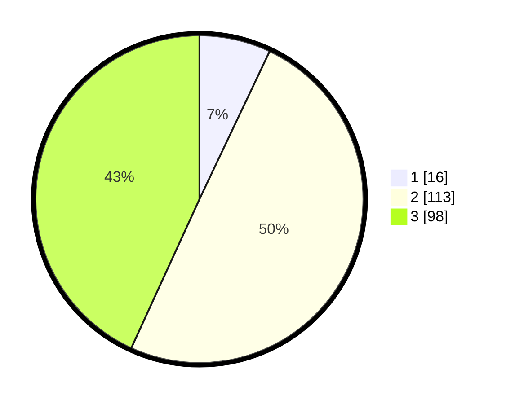

# Hasil

## Grafik

## Tabel

| No. | Nama Paslon    | Suara | Suara (raw) | Persentase |
|:--- |:-------------- | -----:| -----------:| ----------:|
| 1   | ANIES MUHAIMIN | 16    | [16][p-1]   | 7,05       |
| 2   | PRABOWO GIBRAN | 113   | [113][p-2]  | 49,78      |
| 3   | GANJAR MAHFUD  | 98    | [98][p-3]   | 43,17      |

[p-1]: https://github.com/gigit-pemilu/pemilu-2024/blob/main/pilpres/hitung-suara/sub/34-di-yogyakarta/sub/03-gunungkidul/sub/08-semanu/sub/2001-ngeposari/sub/003-tps/sub/paslon-1.txt
[p-2]: https://github.com/gigit-pemilu/pemilu-2024/blob/main/pilpres/hitung-suara/sub/34-di-yogyakarta/sub/03-gunungkidul/sub/08-semanu/sub/2001-ngeposari/sub/003-tps/sub/paslon-2.txt
[p-3]: https://github.com/gigit-pemilu/pemilu-2024/blob/main/pilpres/hitung-suara/sub/34-di-yogyakarta/sub/03-gunungkidul/sub/08-semanu/sub/2001-ngeposari/sub/003-tps/sub/paslon-3.txt

## Foto C Plano

https://sirekap-obj-formc.kpu.go.id/07a4/pemilu/ppwp/34/03/08/20/01/3403082001003-20240216-000130--c0091995-24bd-41c5-b9dd-f52bca9a21a5.jpg

https://sirekap-obj-formc.kpu.go.id/07a4/pemilu/ppwp/34/03/08/20/01/3403082001003-20240216-000132--5ebf07d7-37d9-4da6-948b-149a7b95b88f.jpg

https://sirekap-obj-formc.kpu.go.id/07a4/pemilu/ppwp/34/03/08/20/01/3403082001003-20240216-000131--fc7af477-7a0c-4b6f-a9c5-c2686aac7531.jpg

## Metadata

| Key        | Value               |
| ---------- | ------------------- |
| Time Stamp | 2024-02-16 14:00:34 |

## DATA PEMILIH TETAP

Jumlah pemilih dalam DPT: **263**.
 * L: **125**.
 * P: **138**.

## DATA PENGGUNA HAK PILIH

Jumlah pengguna hak pilih dalam DPT: **226**.
 * L: **107**.
 * P: **119**.

Jumlah pengguna hak pilih dalam DPTb: **1**.
 * L: **1**.
 * P: **0**.

Jumlah pengguna hak pilih dalam DPK: **0**.
 * L: **0**.
 * P: **0**.

Jumlah pengguna hak pilih: **227**.
 * L: **0**.
 * P: **0**.

## JUMLAH SUARA SAH DAN TIDAK SAH

JUMLAH SELURUH SUARA SAH: **227**.

JUMLAH SUARA TIDAK SAH: **0**.

JUMLAH SELURUH SUARA SAH DAN SUARA TIDAK SAH: **227**.

