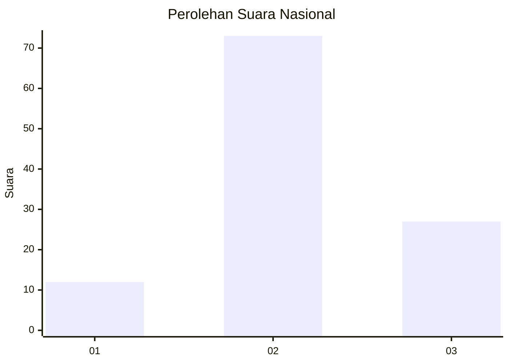
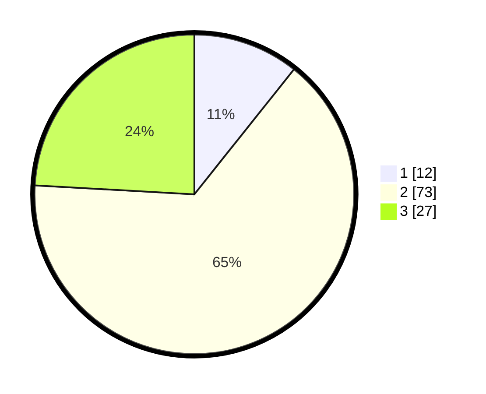

# Hasil

## Grafik

## Tabel

| No. | Nama Paslon    | Suara | Suara (raw) | Persentase |
|:--- |:-------------- | -----:| -----------:| ----------:|
| 1   | ANIES MUHAIMIN | 12    | [12][p-1]   | 10,71      |
| 2   | PRABOWO GIBRAN | 73    | [73][p-2]   | 65,18      |
| 3   | GANJAR MAHFUD  | 27    | [27][p-3]   | 24,11      |

[p-1]: https://github.com/gigit-pemilu/pemilu-2024/blob/main/pilpres/hitung-suara/sub/34-di-yogyakarta/sub/03-gunungkidul/sub/08-semanu/sub/2001-ngeposari/sub/010-tps/sub/paslon-1.txt
[p-2]: https://github.com/gigit-pemilu/pemilu-2024/blob/main/pilpres/hitung-suara/sub/34-di-yogyakarta/sub/03-gunungkidul/sub/08-semanu/sub/2001-ngeposari/sub/010-tps/sub/paslon-2.txt
[p-3]: https://github.com/gigit-pemilu/pemilu-2024/blob/main/pilpres/hitung-suara/sub/34-di-yogyakarta/sub/03-gunungkidul/sub/08-semanu/sub/2001-ngeposari/sub/010-tps/sub/paslon-3.txt

## Foto C Plano

https://sirekap-obj-formc.kpu.go.id/f795/pemilu/ppwp/34/03/08/20/01/3403082001010-20240214-141512--9152d1dd-b02a-4e7f-b6a2-e74b08a74c82.jpg

https://sirekap-obj-formc.kpu.go.id/f795/pemilu/ppwp/34/03/08/20/01/3403082001010-20240216-132437--45e37d5e-b9d5-46d6-a312-d147a5a85bbc.jpg

https://sirekap-obj-formc.kpu.go.id/f795/pemilu/ppwp/34/03/08/20/01/3403082001010-20240216-132437--1e96448b-1869-4011-8bfa-260ce794d004.jpg

## Metadata

| Key        | Value               |
| ---------- | ------------------- |
| Time Stamp | 2024-02-16 16:25:10 |

## DATA PEMILIH TETAP

Jumlah pemilih dalam DPT: **133**.
 * L: **67**.
 * P: **66**.

## DATA PENGGUNA HAK PILIH

Jumlah pengguna hak pilih dalam DPT: **108**.
 * L: **52**.
 * P: **56**.

Jumlah pengguna hak pilih dalam DPTb: **4**.
 * L: **2**.
 * P: **2**.

Jumlah pengguna hak pilih dalam DPK: **0**.
 * L: **0**.
 * P: **0**.

Jumlah pengguna hak pilih: **112**.
 * L: **54**.
 * P: **58**.

## JUMLAH SUARA SAH DAN TIDAK SAH

JUMLAH SELURUH SUARA SAH: **112**.

JUMLAH SUARA TIDAK SAH: **0**.

JUMLAH SELURUH SUARA SAH DAN SUARA TIDAK SAH: **112**.

