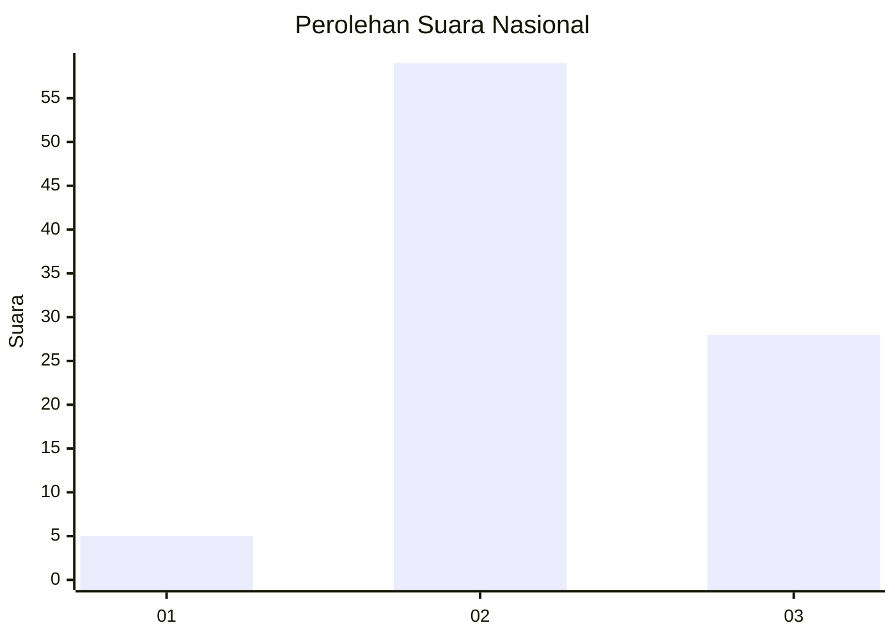
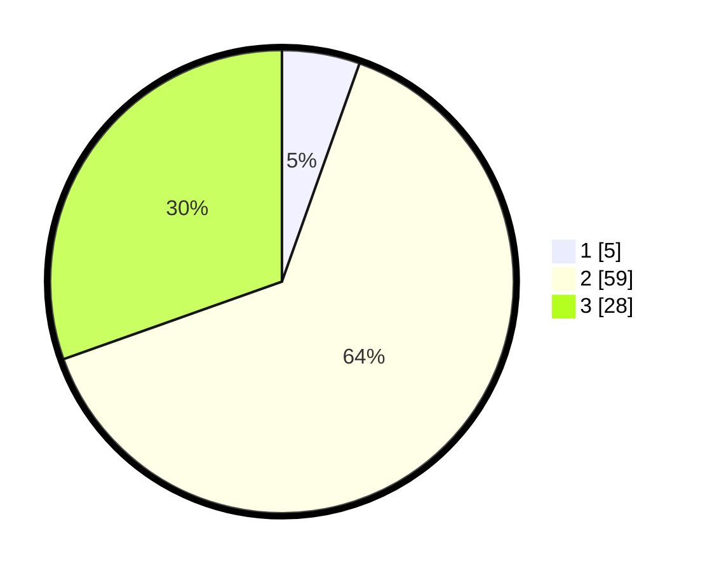

# Hasil

## Grafik

## Tabel

| No. | Nama Paslon    | Suara | Suara (raw) | Persentase |
|:--- |:-------------- | -----:| -----------:| ----------:|
| 1   | ANIES MUHAIMIN | 5     | [5][p-1]    | 5,43       |
| 2   | PRABOWO GIBRAN | 59    | [59][p-2]   | 64,13      |
| 3   | GANJAR MAHFUD  | 28    | [28][p-3]   | 30,43      |

[p-1]: https://github.com/gigit-pemilu/pemilu-2024/blob/main/pilpres/hitung-suara/sub/34-di-yogyakarta/sub/03-gunungkidul/sub/08-semanu/sub/2001-ngeposari/sub/020-tps/sub/paslon-1.txt
[p-2]: https://github.com/gigit-pemilu/pemilu-2024/blob/main/pilpres/hitung-suara/sub/34-di-yogyakarta/sub/03-gunungkidul/sub/08-semanu/sub/2001-ngeposari/sub/020-tps/sub/paslon-2.txt
[p-3]: https://github.com/gigit-pemilu/pemilu-2024/blob/main/pilpres/hitung-suara/sub/34-di-yogyakarta/sub/03-gunungkidul/sub/08-semanu/sub/2001-ngeposari/sub/020-tps/sub/paslon-3.txt

## Foto C Plano

https://sirekap-obj-formc.kpu.go.id/70bf/pemilu/ppwp/34/03/08/20/01/3403082001020-20240216-014507--a79f9dd5-13d5-4b65-9e86-8dd674b213ec.jpg

https://sirekap-obj-formc.kpu.go.id/70bf/pemilu/ppwp/34/03/08/20/01/3403082001020-20240216-011912--bf39a964-a1c4-4d81-8533-de6fa7201171.jpg

https://sirekap-obj-formc.kpu.go.id/70bf/pemilu/ppwp/34/03/08/20/01/3403082001020-20240216-014512--9e6cf2b2-0b79-4d8e-a5cb-78db0f374264.jpg

## Metadata

| Key        | Value               |
| ---------- | ------------------- |
| Time Stamp | 2024-02-17 11:00:02 |

## DATA PEMILIH TETAP

Jumlah pemilih dalam DPT: **110**.
 * L: **54**.
 * P: **56**.

## DATA PENGGUNA HAK PILIH

Jumlah pengguna hak pilih dalam DPT: **92**.
 * L: **44**.
 * P: **48**.

Jumlah pengguna hak pilih dalam DPTb: **0**.
 * L: **0**.
 * P: **0**.

Jumlah pengguna hak pilih dalam DPK: **0**.
 * L: **0**.
 * P: **0**.

Jumlah pengguna hak pilih: **92**.
 * L: **44**.
 * P: **48**.

## JUMLAH SUARA SAH DAN TIDAK SAH

JUMLAH SELURUH SUARA SAH: **92**.

JUMLAH SUARA TIDAK SAH: **0**.

JUMLAH SELURUH SUARA SAH DAN SUARA TIDAK SAH: **92**.

