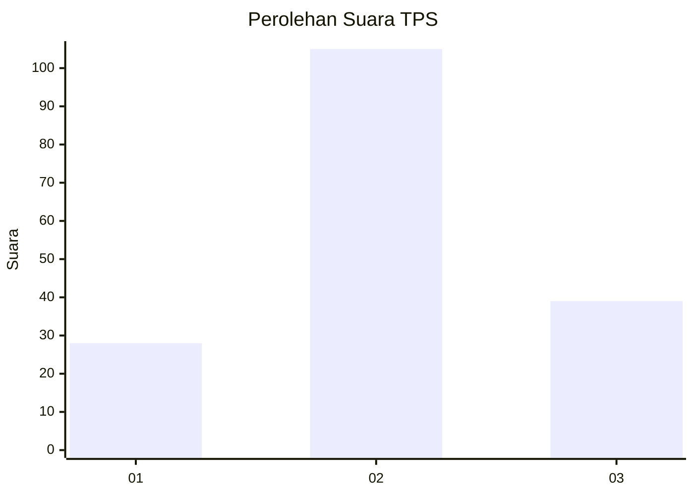
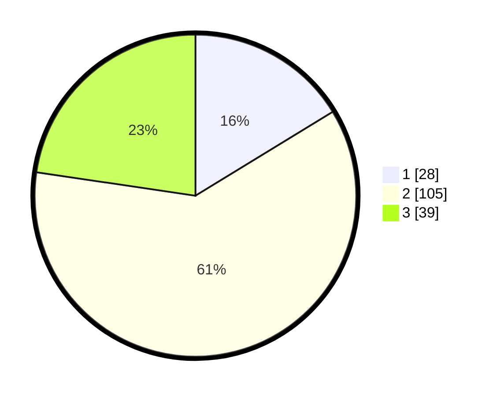

# Hasil

## Grafik

## Tabel

| No. | Nama Paslon    | Suara | Suara (raw) | Persentase |
|:--- |:-------------- | -----:| -----------:| ----------:|
| 1   | ANIES MUHAIMIN | 28    | [28][p-1]   | 16,28      |
| 2   | PRABOWO GIBRAN | 105   | [105][p-2]  | 61,05      |
| 3   | GANJAR MAHFUD  | 39    | [39][p-3]   | 22,67      |

[p-1]: https://github.com/gigit-pemilu/pemilu-2024-34-di-yogyakarta/blob/main/pilpres/hitung-suara/sub/34-di-yogyakarta/sub/03-gunungkidul/sub/08-semanu/sub/2002-semanu/sub/044-tps/sub/paslon-1.txt
[p-2]: https://github.com/gigit-pemilu/pemilu-2024-34-di-yogyakarta/blob/main/pilpres/hitung-suara/sub/34-di-yogyakarta/sub/03-gunungkidul/sub/08-semanu/sub/2002-semanu/sub/044-tps/sub/paslon-2.txt
[p-3]: https://github.com/gigit-pemilu/pemilu-2024-34-di-yogyakarta/blob/main/pilpres/hitung-suara/sub/34-di-yogyakarta/sub/03-gunungkidul/sub/08-semanu/sub/2002-semanu/sub/044-tps/sub/paslon-3.txt

## Foto C Plano

https://sirekap-obj-formc.kpu.go.id/842b/pemilu/ppwp/34/03/08/20/02/3403082002044-20240217-171050--e669cf29-5170-40d5-8281-acc5667580d1.jpg

https://sirekap-obj-formc.kpu.go.id/842b/pemilu/ppwp/34/03/08/20/02/3403082002044-20240217-171051--2daf458b-948f-470e-8b5c-5127b0632762.jpg

https://sirekap-obj-formc.kpu.go.id/842b/pemilu/ppwp/34/03/08/20/02/3403082002044-20240217-171050--5e973b96-07cc-49e1-9aae-5121720e4e0b.jpg

## Metadata

| Key        | Value               |
| ---------- | ------------------- |
| Time Stamp | 2024-02-24 22:31:28 |

## DATA PEMILIH TETAP

Jumlah pemilih dalam DPT: **207**.
 * L: **105**.
 * P: **102**.

## DATA PENGGUNA HAK PILIH

Jumlah pengguna hak pilih dalam DPT: **175**.
 * L: **83**.
 * P: **92**.

Jumlah pengguna hak pilih dalam DPTb: **1**.
 * L: **1**.
 * P: **0**.

Jumlah pengguna hak pilih dalam DPK: **0**.
 * L: **0**.
 * P: **0**.

Jumlah pengguna hak pilih: **176**.
 * L: **84**.
 * P: **92**.

## JUMLAH SUARA SAH DAN TIDAK SAH

JUMLAH SELURUH SUARA SAH: **28**.

JUMLAH SUARA TIDAK SAH: **105**.

JUMLAH SELURUH SUARA SAH DAN SUARA TIDAK SAH: **39**.

