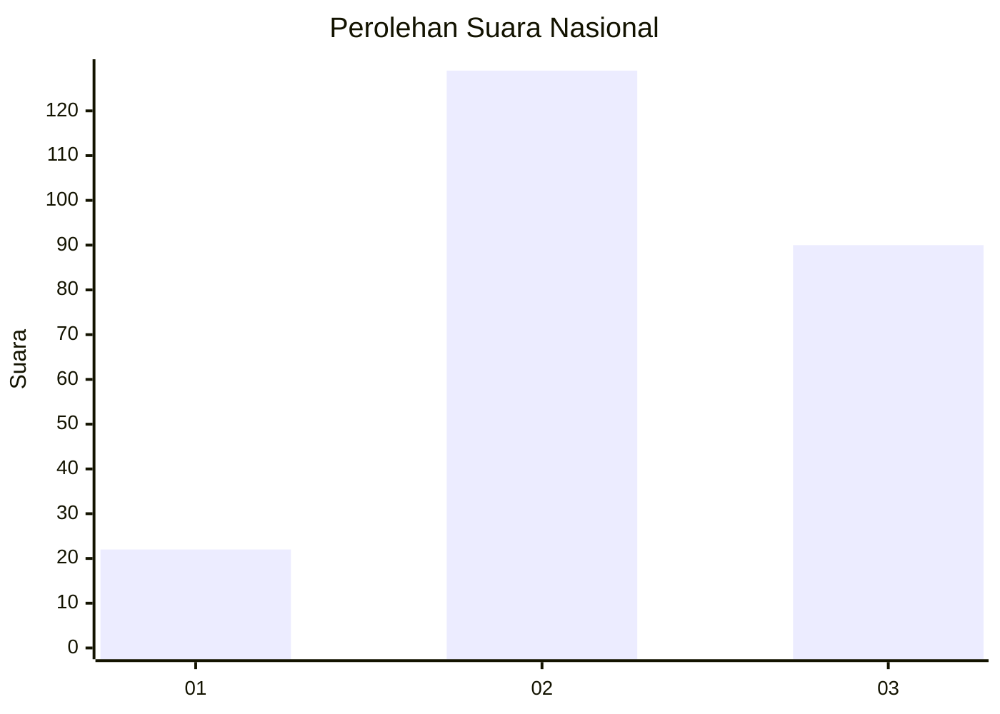
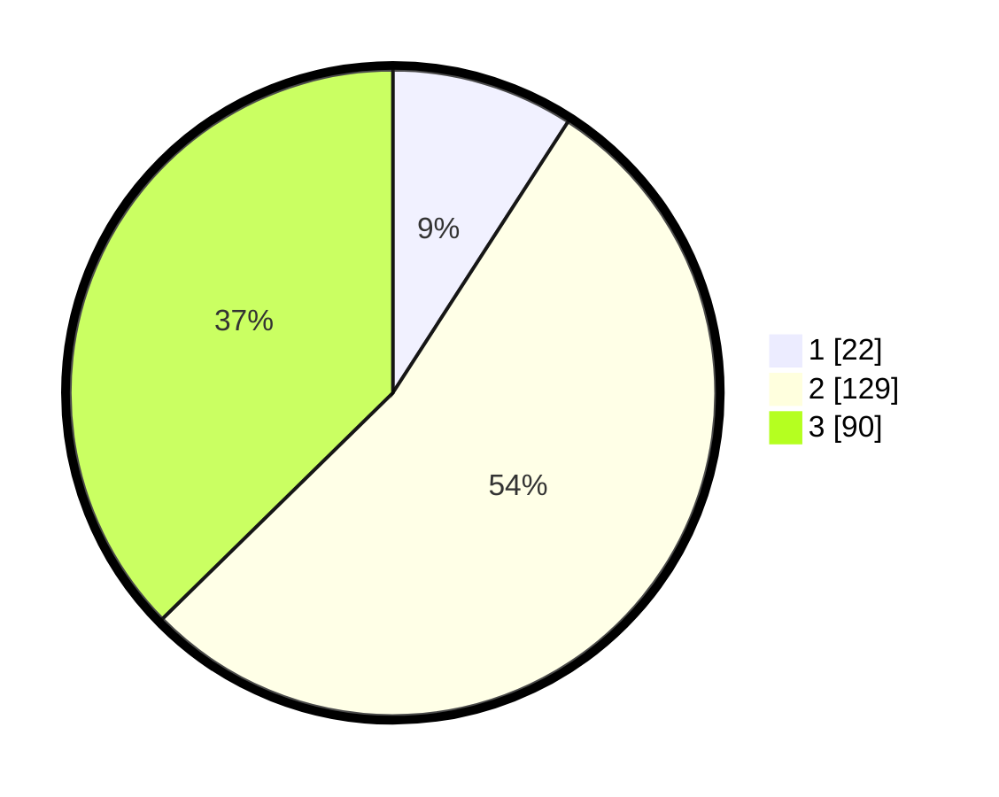

# Hasil

## Grafik

## Tabel

| No. | Nama Paslon    | Suara | Suara (raw) | Persentase |
|:--- |:-------------- | -----:| -----------:| ----------:|
| 1   | ANIES MUHAIMIN | 22    | [22][p-1]   | 9,13       |
| 2   | PRABOWO GIBRAN | 129   | [129][p-2]  | 53,53      |
| 3   | GANJAR MAHFUD  | 90    | [90][p-3]   | 37,34      |

[p-1]: https://github.com/gigit-pemilu/pemilu-2024/blob/main/pilpres/hitung-suara/sub/34-di-yogyakarta/sub/03-gunungkidul/sub/08-semanu/sub/2003-pacarejo/sub/021-tps/sub/paslon-1.txt
[p-2]: https://github.com/gigit-pemilu/pemilu-2024/blob/main/pilpres/hitung-suara/sub/34-di-yogyakarta/sub/03-gunungkidul/sub/08-semanu/sub/2003-pacarejo/sub/021-tps/sub/paslon-2.txt
[p-3]: https://github.com/gigit-pemilu/pemilu-2024/blob/main/pilpres/hitung-suara/sub/34-di-yogyakarta/sub/03-gunungkidul/sub/08-semanu/sub/2003-pacarejo/sub/021-tps/sub/paslon-3.txt

## Foto C Plano

https://sirekap-obj-formc.kpu.go.id/1d97/pemilu/ppwp/34/03/08/20/03/3403082003021-20240216-100432--b951e9ca-6c1a-4661-abeb-40af78af865c.jpg

https://sirekap-obj-formc.kpu.go.id/1d97/pemilu/ppwp/34/03/08/20/03/3403082003021-20240215-050359--25e2b032-1494-49a3-97d2-fbf292041a1c.jpg

https://sirekap-obj-formc.kpu.go.id/1d97/pemilu/ppwp/34/03/08/20/03/3403082003021-20240215-050511--5176c76d-ac0d-4ffc-99b1-bc11c451939c.jpg

## Metadata

| Key        | Value               |
| ---------- | ------------------- |
| Time Stamp | 2024-02-16 10:30:29 |

## DATA PEMILIH TETAP

Jumlah pemilih dalam DPT: **283**.
 * L: **132**.
 * P: **151**.

## DATA PENGGUNA HAK PILIH

Jumlah pengguna hak pilih dalam DPT: **241**.
 * L: **110**.
 * P: **131**.

Jumlah pengguna hak pilih dalam DPTb: **12**.
 * L: **3**.
 * P: **9**.

Jumlah pengguna hak pilih dalam DPK: **2**.
 * L: **1**.
 * P: **1**.

Jumlah pengguna hak pilih: **255**.
 * L: **114**.
 * P: **141**.

## JUMLAH SUARA SAH DAN TIDAK SAH

JUMLAH SELURUH SUARA SAH: **241**.

JUMLAH SUARA TIDAK SAH: **14**.

JUMLAH SELURUH SUARA SAH DAN SUARA TIDAK SAH: **255**.

