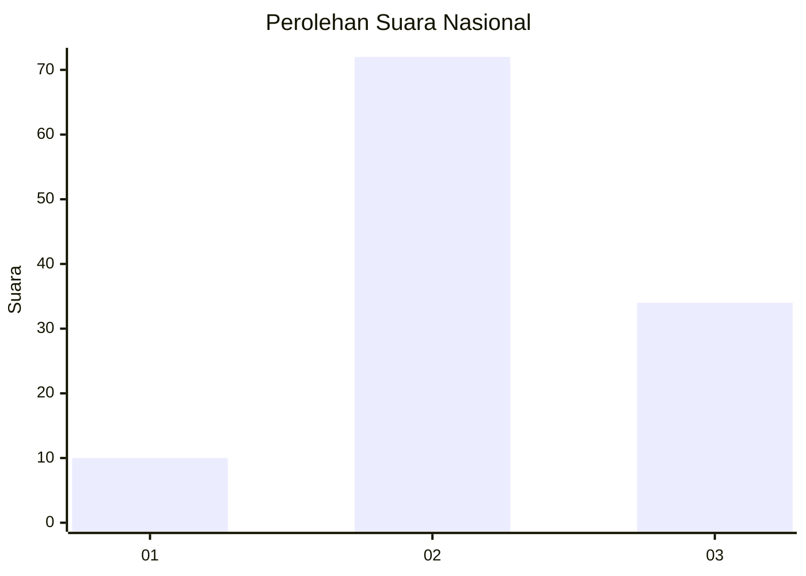
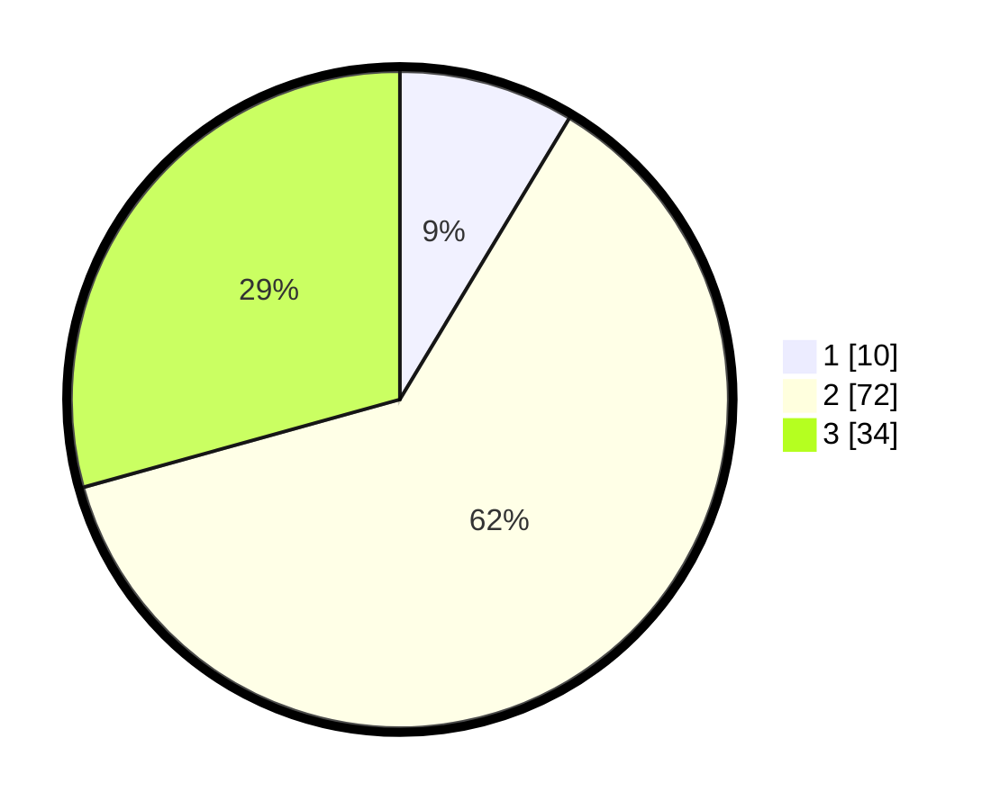

# Hasil

## Grafik

## Tabel

| No. | Nama Paslon    | Suara | Suara (raw) | Persentase |
|:--- |:-------------- | -----:| -----------:| ----------:|
| 1   | ANIES MUHAIMIN | 10    | [10][p-1]   | 8,62       |
| 2   | PRABOWO GIBRAN | 72    | [72][p-2]   | 62,07      |
| 3   | GANJAR MAHFUD  | 34    | [34][p-3]   | 29,31      |

[p-1]: https://github.com/gigit-pemilu/pemilu-2024/blob/main/pilpres/hitung-suara/sub/34-di-yogyakarta/sub/03-gunungkidul/sub/08-semanu/sub/2003-pacarejo/sub/024-tps/sub/paslon-1.txt
[p-2]: https://github.com/gigit-pemilu/pemilu-2024/blob/main/pilpres/hitung-suara/sub/34-di-yogyakarta/sub/03-gunungkidul/sub/08-semanu/sub/2003-pacarejo/sub/024-tps/sub/paslon-2.txt
[p-3]: https://github.com/gigit-pemilu/pemilu-2024/blob/main/pilpres/hitung-suara/sub/34-di-yogyakarta/sub/03-gunungkidul/sub/08-semanu/sub/2003-pacarejo/sub/024-tps/sub/paslon-3.txt

## Foto C Plano

https://sirekap-obj-formc.kpu.go.id/68cb/pemilu/ppwp/34/03/08/20/03/3403082003024-20240216-063349--da047cf5-bfb8-4e56-8cdc-ace8d0ad54c2.jpg

https://sirekap-obj-formc.kpu.go.id/68cb/pemilu/ppwp/34/03/08/20/03/3403082003024-20240216-104529--1f70bf20-8945-4b45-abb0-a88b83546450.jpg

https://sirekap-obj-formc.kpu.go.id/68cb/pemilu/ppwp/34/03/08/20/03/3403082003024-20240216-063353--807df811-b1a4-426c-8875-5a012fb383e6.jpg

## Metadata

| Key        | Value               |
| ---------- | ------------------- |
| Time Stamp | 2024-02-17 16:00:02 |

## DATA PEMILIH TETAP

Jumlah pemilih dalam DPT: **130**.
 * L: **64**.
 * P: **66**.

## DATA PENGGUNA HAK PILIH

Jumlah pengguna hak pilih dalam DPT: **105**.
 * L: **50**.
 * P: **55**.

Jumlah pengguna hak pilih dalam DPTb: **12**.
 * L: **4**.
 * P: **8**.

Jumlah pengguna hak pilih dalam DPK: **1**.
 * L: **1**.
 * P: **0**.

Jumlah pengguna hak pilih: **118**.
 * L: **55**.
 * P: **63**.

## JUMLAH SUARA SAH DAN TIDAK SAH

JUMLAH SELURUH SUARA SAH: **116**.

JUMLAH SUARA TIDAK SAH: **2**.

JUMLAH SELURUH SUARA SAH DAN SUARA TIDAK SAH: **118**.

