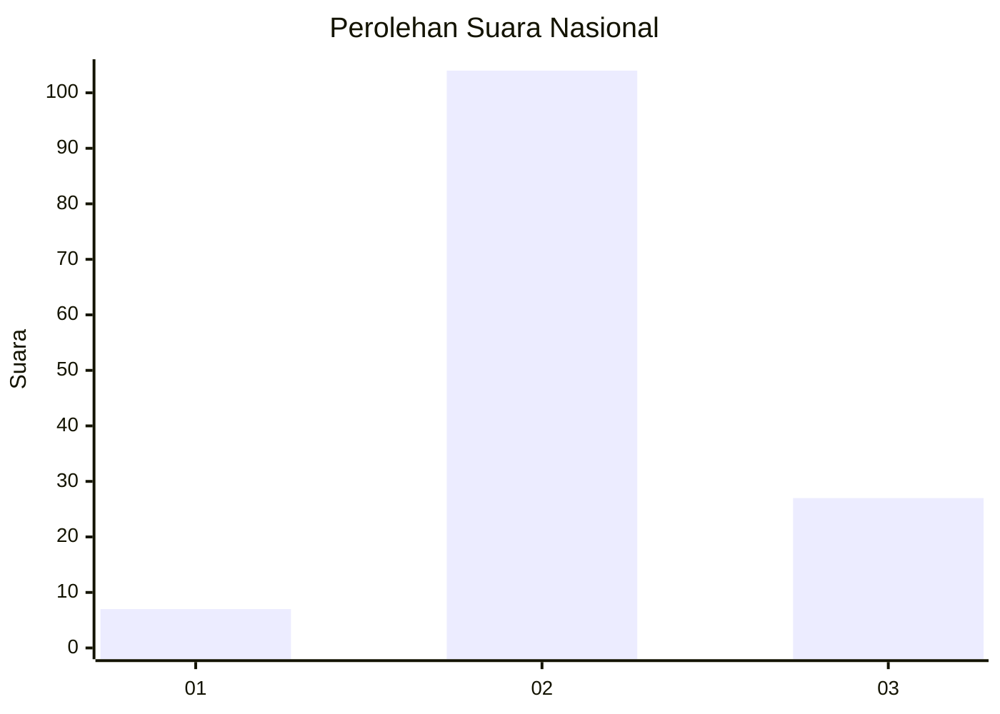

# Hasil

## Grafik

## Tabel

| No. | Nama Paslon    | Suara | Suara (raw) | Persentase |
|:--- |:-------------- | -----:| -----------:| ----------:|
| 1   | ANIES MUHAIMIN | 7     | [7][p-1]    | 5,07       |
| 2   | PRABOWO GIBRAN | 104   | [104][p-2]  | 75,36      |
| 3   | GANJAR MAHFUD  | 27    | [27][p-3]   | 19,57      |

[p-1]: https://github.com/gigit-pemilu/pemilu-2024/blob/main/pilpres/hitung-suara/sub/34-di-yogyakarta/sub/03-gunungkidul/sub/08-semanu/sub/2004-candirejo/sub/002-tps/sub/paslon-1.txt
[p-2]: https://github.com/gigit-pemilu/pemilu-2024/blob/main/pilpres/hitung-suara/sub/34-di-yogyakarta/sub/03-gunungkidul/sub/08-semanu/sub/2004-candirejo/sub/002-tps/sub/paslon-2.txt
[p-3]: https://github.com/gigit-pemilu/pemilu-2024/blob/main/pilpres/hitung-suara/sub/34-di-yogyakarta/sub/03-gunungkidul/sub/08-semanu/sub/2004-candirejo/sub/002-tps/sub/paslon-3.txt

## Foto C Plano

https://sirekap-obj-formc.kpu.go.id/5dde/pemilu/ppwp/34/03/08/20/04/3403082004002-20240216-025139--8dbd7ff9-9938-4d24-8b07-aba418bcf0fe.jpg

https://sirekap-obj-formc.kpu.go.id/5dde/pemilu/ppwp/34/03/08/20/04/3403082004002-20240216-025140--cd939eec-ea12-44ea-8a25-658cfb053ece.jpg

https://sirekap-obj-formc.kpu.go.id/5dde/pemilu/ppwp/34/03/08/20/04/3403082004002-20240216-025139--d9e7d57d-7962-4d4f-b4ca-74768f628b51.jpg

## Metadata

| Key        | Value               |
| ---------- | ------------------- |
| Time Stamp | 2024-02-17 16:00:02 |

## DATA PEMILIH TETAP

Jumlah pemilih dalam DPT: **145**.
 * L: **77**.
 * P: **68**.

## DATA PENGGUNA HAK PILIH

Jumlah pengguna hak pilih dalam DPT: **137**.
 * L: **72**.
 * P: **65**.

Jumlah pengguna hak pilih dalam DPTb: **1**.
 * L: **1**.
 * P: **0**.

Jumlah pengguna hak pilih dalam DPK: **1**.
 * L: **0**.
 * P: **1**.

Jumlah pengguna hak pilih: **139**.
 * L: **73**.
 * P: **66**.

## JUMLAH SUARA SAH DAN TIDAK SAH

JUMLAH SELURUH SUARA SAH: **138**.

JUMLAH SUARA TIDAK SAH: **1**.

JUMLAH SELURUH SUARA SAH DAN SUARA TIDAK SAH: **139**.

