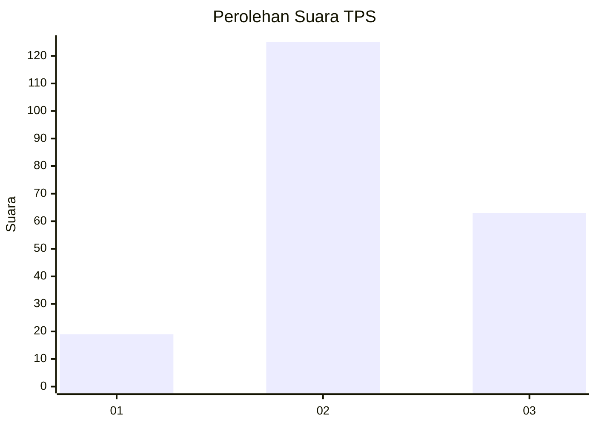
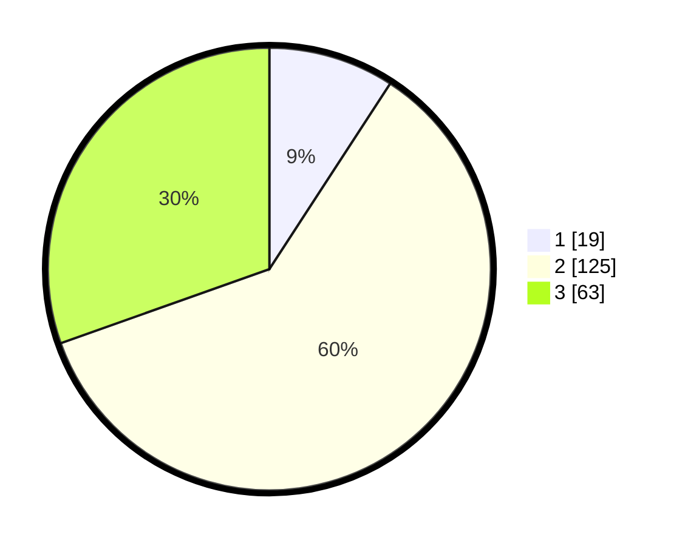

# Hasil

## Grafik

## Tabel

| No. | Nama Paslon    | Suara | Suara (raw) | Persentase |
|:--- |:-------------- | -----:| -----------:| ----------:|
| 1   | ANIES MUHAIMIN | 19    | [19][p-1]   | 9,18       |
| 2   | PRABOWO GIBRAN | 125   | [125][p-2]  | 60,39      |
| 3   | GANJAR MAHFUD  | 63    | [63][p-3]   | 30,43      |

[p-1]: https://github.com/gigit-pemilu/pemilu-2024-34-di-yogyakarta/blob/main/pilpres/hitung-suara/sub/34-di-yogyakarta/sub/03-gunungkidul/sub/08-semanu/sub/2004-candirejo/sub/010-tps/sub/paslon-1.txt
[p-2]: https://github.com/gigit-pemilu/pemilu-2024-34-di-yogyakarta/blob/main/pilpres/hitung-suara/sub/34-di-yogyakarta/sub/03-gunungkidul/sub/08-semanu/sub/2004-candirejo/sub/010-tps/sub/paslon-2.txt
[p-3]: https://github.com/gigit-pemilu/pemilu-2024-34-di-yogyakarta/blob/main/pilpres/hitung-suara/sub/34-di-yogyakarta/sub/03-gunungkidul/sub/08-semanu/sub/2004-candirejo/sub/010-tps/sub/paslon-3.txt

## Foto C Plano

https://sirekap-obj-formc.kpu.go.id/eb15/pemilu/ppwp/34/03/08/20/04/3403082004010-20240216-132204--6b212e11-9309-4ae7-ba96-d70cf388d80c.jpg

https://sirekap-obj-formc.kpu.go.id/eb15/pemilu/ppwp/34/03/08/20/04/3403082004010-20240216-132205--d86ef51f-4fa6-4104-a1bf-f7ad4d7ac644.jpg

https://sirekap-obj-formc.kpu.go.id/eb15/pemilu/ppwp/34/03/08/20/04/3403082004010-20240216-132205--08c88b86-5f0b-4055-a81e-2cae40f5331a.jpg

## Metadata

| Key        | Value               |
| ---------- | ------------------- |
| Time Stamp | 2024-02-17 16:36:25 |

## DATA PEMILIH TETAP

Jumlah pemilih dalam DPT: **221**.
 * L: **104**.
 * P: **117**.

## DATA PENGGUNA HAK PILIH

Jumlah pengguna hak pilih dalam DPT: **196**.
 * L: **95**.
 * P: **101**.

Jumlah pengguna hak pilih dalam DPTb: **13**.
 * L: **5**.
 * P: **8**.

Jumlah pengguna hak pilih dalam DPK: **2**.
 * L: **1**.
 * P: **1**.

Jumlah pengguna hak pilih: **211**.
 * L: **101**.
 * P: **110**.

## JUMLAH SUARA SAH DAN TIDAK SAH

JUMLAH SELURUH SUARA SAH: **207**.

JUMLAH SUARA TIDAK SAH: **4**.

JUMLAH SELURUH SUARA SAH DAN SUARA TIDAK SAH: **211**.

