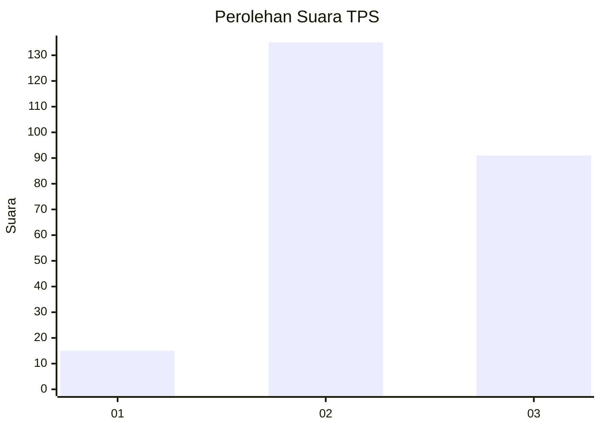
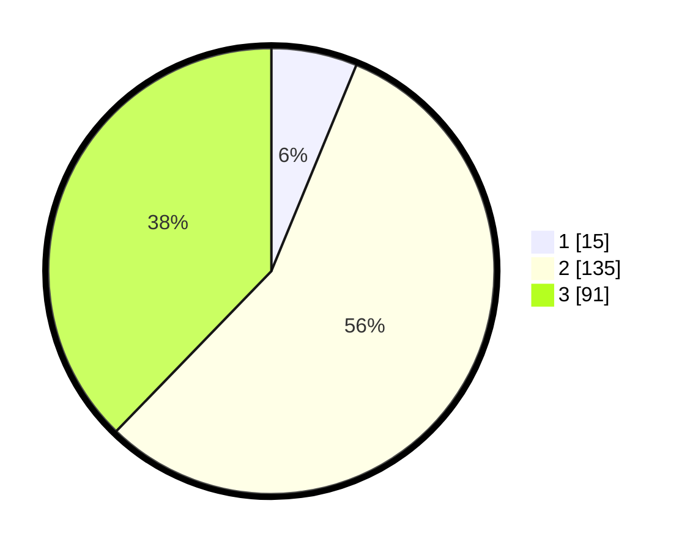

# Hasil

## Grafik

## Tabel

| No. | Nama Paslon    | Suara | Suara (raw) | Persentase |
|:--- |:-------------- | -----:| -----------:| ----------:|
| 1   | ANIES MUHAIMIN | 15    | [15][p-1]   | 6,22       |
| 2   | PRABOWO GIBRAN | 135   | [135][p-2]  | 56,02      |
| 3   | GANJAR MAHFUD  | 91    | [91][p-3]   | 37,76      |

[p-1]: https://github.com/gigit-pemilu/pemilu-2024-34-di-yogyakarta/blob/main/pilpres/hitung-suara/sub/34-di-yogyakarta/sub/03-gunungkidul/sub/08-semanu/sub/2004-candirejo/sub/011-tps/sub/paslon-1.txt
[p-2]: https://github.com/gigit-pemilu/pemilu-2024-34-di-yogyakarta/blob/main/pilpres/hitung-suara/sub/34-di-yogyakarta/sub/03-gunungkidul/sub/08-semanu/sub/2004-candirejo/sub/011-tps/sub/paslon-2.txt
[p-3]: https://github.com/gigit-pemilu/pemilu-2024-34-di-yogyakarta/blob/main/pilpres/hitung-suara/sub/34-di-yogyakarta/sub/03-gunungkidul/sub/08-semanu/sub/2004-candirejo/sub/011-tps/sub/paslon-3.txt

## Foto C Plano

https://sirekap-obj-formc.kpu.go.id/c271/pemilu/ppwp/34/03/08/20/04/3403082004011-20240214-190657--7eb9c120-aa32-4f4e-a3a8-064a6a4677cc.jpg

https://sirekap-obj-formc.kpu.go.id/c271/pemilu/ppwp/34/03/08/20/04/3403082004011-20240214-190813--ccc8e928-d5ae-491e-ac5a-ae43f4fd2387.jpg

https://sirekap-obj-formc.kpu.go.id/c271/pemilu/ppwp/34/03/08/20/04/3403082004011-20240214-190930--82c552d9-086a-4cd4-9199-b3f773ac0d51.jpg

## Metadata

| Key        | Value               |
| ---------- | ------------------- |
| Time Stamp | 2024-02-15 22:30:27 |

