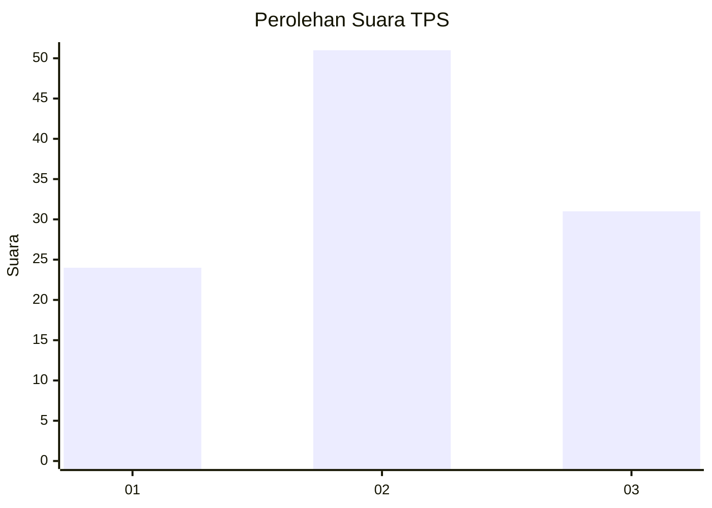
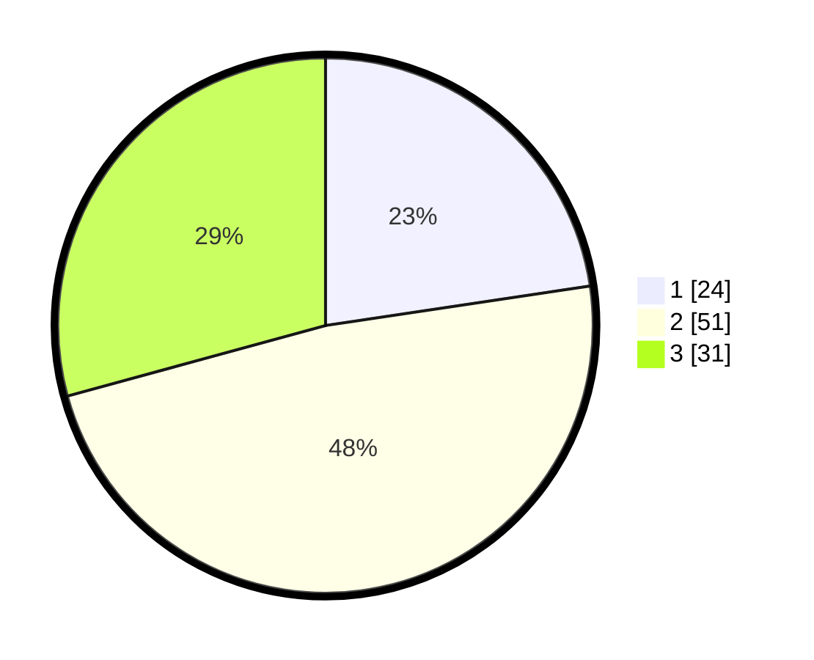

# Hasil

## Grafik

## Tabel

| No. | Nama Paslon    | Suara | Suara (raw) | Persentase |
|:--- |:-------------- | -----:| -----------:| ----------:|
| 1   | ANIES MUHAIMIN | 24    | [24][p-1]   | 22,64      |
| 2   | PRABOWO GIBRAN | 51    | [51][p-2]   | 48,11      |
| 3   | GANJAR MAHFUD  | 31    | [31][p-3]   | 29,25      |

[p-1]: https://github.com/gigit-pemilu/pemilu-2024-34-di-yogyakarta/blob/main/pilpres/hitung-suara/sub/34-di-yogyakarta/sub/03-gunungkidul/sub/08-semanu/sub/2005-dadapayu/sub/006-tps/sub/paslon-1.txt
[p-2]: https://github.com/gigit-pemilu/pemilu-2024-34-di-yogyakarta/blob/main/pilpres/hitung-suara/sub/34-di-yogyakarta/sub/03-gunungkidul/sub/08-semanu/sub/2005-dadapayu/sub/006-tps/sub/paslon-2.txt
[p-3]: https://github.com/gigit-pemilu/pemilu-2024-34-di-yogyakarta/blob/main/pilpres/hitung-suara/sub/34-di-yogyakarta/sub/03-gunungkidul/sub/08-semanu/sub/2005-dadapayu/sub/006-tps/sub/paslon-3.txt

## Foto C Plano

https://sirekap-obj-formc.kpu.go.id/9bdb/pemilu/ppwp/34/03/08/20/05/3403082005006-20240216-214201--f8bb87f1-0c39-49a8-9a08-09be84510096.jpg

https://sirekap-obj-formc.kpu.go.id/9bdb/pemilu/ppwp/34/03/08/20/05/3403082005006-20240216-214202--cede06ac-d560-4200-9995-5f08969f9cbc.jpg

https://sirekap-obj-formc.kpu.go.id/9bdb/pemilu/ppwp/34/03/08/20/05/3403082005006-20240216-214202--07621f97-1cc7-43f2-8adf-3bad1ba96761.jpg

## Metadata

| Key        | Value               |
| ---------- | ------------------- |
| Time Stamp | 2024-02-17 16:36:25 |

## DATA PEMILIH TETAP

Jumlah pemilih dalam DPT: **116**.
 * L: **57**.
 * P: **59**.

## DATA PENGGUNA HAK PILIH

Jumlah pengguna hak pilih dalam DPT: **106**.
 * L: **51**.
 * P: **55**.

Jumlah pengguna hak pilih dalam DPTb: **1**.
 * L: **0**.
 * P: **1**.

Jumlah pengguna hak pilih dalam DPK: **0**.
 * L: **0**.
 * P: **0**.

Jumlah pengguna hak pilih: **107**.
 * L: **51**.
 * P: **56**.

## JUMLAH SUARA SAH DAN TIDAK SAH

JUMLAH SELURUH SUARA SAH: **106**.

JUMLAH SUARA TIDAK SAH: **1**.

JUMLAH SELURUH SUARA SAH DAN SUARA TIDAK SAH: **107**.

