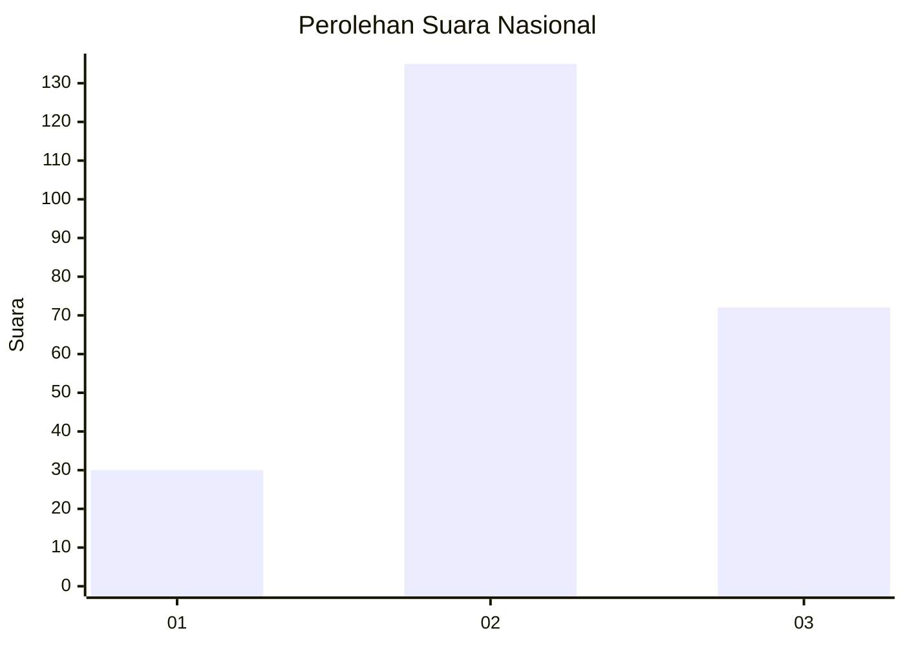
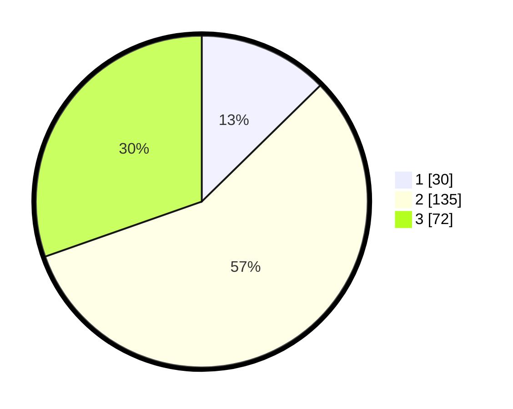

# Hasil

## Grafik

## Tabel

| No. | Nama Paslon    | Suara | Suara (raw) | Persentase |
|:--- |:-------------- | -----:| -----------:| ----------:|
| 1   | ANIES MUHAIMIN | 30    | [30][p-1]   | 12,66      |
| 2   | PRABOWO GIBRAN | 135   | [135][p-2]  | 56,96      |
| 3   | GANJAR MAHFUD  | 72    | [72][p-3]   | 30,38      |

[p-1]: https://github.com/gigit-pemilu/pemilu-2024/blob/main/pilpres/hitung-suara/sub/34-di-yogyakarta/sub/03-gunungkidul/sub/09-karangmojo/sub/2001-bejiharjo/sub/001-tps/sub/paslon-1.txt
[p-2]: https://github.com/gigit-pemilu/pemilu-2024/blob/main/pilpres/hitung-suara/sub/34-di-yogyakarta/sub/03-gunungkidul/sub/09-karangmojo/sub/2001-bejiharjo/sub/001-tps/sub/paslon-2.txt
[p-3]: https://github.com/gigit-pemilu/pemilu-2024/blob/main/pilpres/hitung-suara/sub/34-di-yogyakarta/sub/03-gunungkidul/sub/09-karangmojo/sub/2001-bejiharjo/sub/001-tps/sub/paslon-3.txt

## Foto C Plano

https://sirekap-obj-formc.kpu.go.id/6b65/pemilu/ppwp/34/03/09/20/01/3403092001001-20240216-154345--3ae4b2f5-703b-43d5-a721-223ac3cd4c63.jpg

https://sirekap-obj-formc.kpu.go.id/6b65/pemilu/ppwp/34/03/09/20/01/3403092001001-20240216-154346--16e873d8-b95e-4034-a523-982ea791f08f.jpg

https://sirekap-obj-formc.kpu.go.id/6b65/pemilu/ppwp/34/03/09/20/01/3403092001001-20240216-154345--6f202212-5e35-4438-b274-c3ca4ca9ee56.jpg

## Metadata

| Key        | Value               |
| ---------- | ------------------- |
| Time Stamp | 2024-02-17 13:37:34 |

## DATA PEMILIH TETAP

Jumlah pemilih dalam DPT: **0**.
 * L: **0**.
 * P: **0**.

## DATA PENGGUNA HAK PILIH

Jumlah pengguna hak pilih dalam DPT: **243**.
 * L: **118**.
 * P: **125**.

Jumlah pengguna hak pilih dalam DPTb: **0**.
 * L: **0**.
 * P: **0**.

Jumlah pengguna hak pilih dalam DPK: **1**.
 * L: **1**.
 * P: **0**.

Jumlah pengguna hak pilih: **244**.
 * L: **119**.
 * P: **125**.

## JUMLAH SUARA SAH DAN TIDAK SAH

JUMLAH SELURUH SUARA SAH: **237**.

JUMLAH SUARA TIDAK SAH: **7**.

JUMLAH SELURUH SUARA SAH DAN SUARA TIDAK SAH: **244**.

