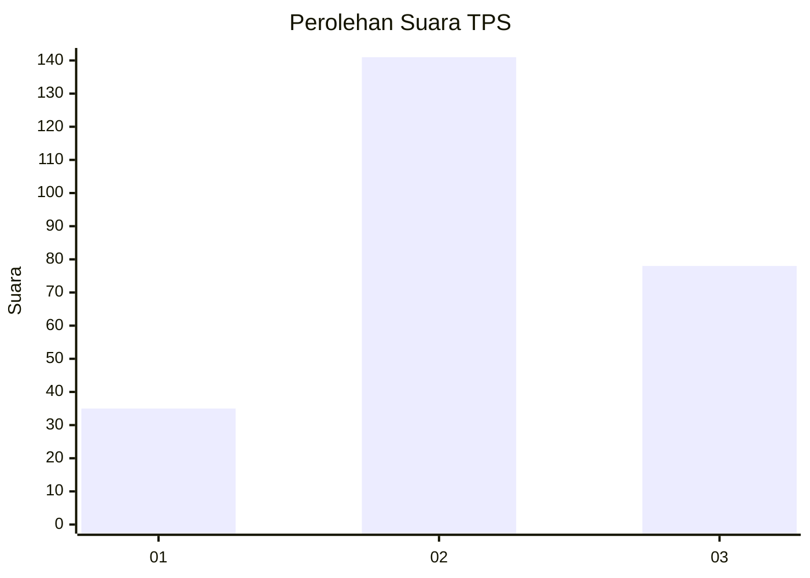
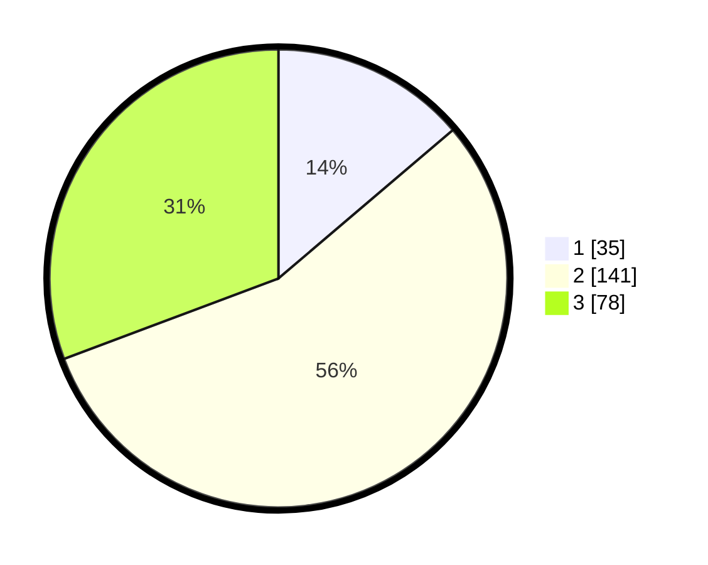

# Hasil

## Grafik

## Tabel

| No. | Nama Paslon    | Suara | Suara (raw) | Persentase |
|:--- |:-------------- | -----:| -----------:| ----------:|
| 1   | ANIES MUHAIMIN | 35    | [35][p-1]   | 13,78      |
| 2   | PRABOWO GIBRAN | 141   | [141][p-2]  | 55,51      |
| 3   | GANJAR MAHFUD  | 78    | [78][p-3]   | 30,71      |

[p-1]: https://github.com/gigit-pemilu/pemilu-2024-34-di-yogyakarta/blob/main/pilpres/hitung-suara/sub/34-di-yogyakarta/sub/03-gunungkidul/sub/09-karangmojo/sub/2001-bejiharjo/sub/002-tps/sub/paslon-1.txt
[p-2]: https://github.com/gigit-pemilu/pemilu-2024-34-di-yogyakarta/blob/main/pilpres/hitung-suara/sub/34-di-yogyakarta/sub/03-gunungkidul/sub/09-karangmojo/sub/2001-bejiharjo/sub/002-tps/sub/paslon-2.txt
[p-3]: https://github.com/gigit-pemilu/pemilu-2024-34-di-yogyakarta/blob/main/pilpres/hitung-suara/sub/34-di-yogyakarta/sub/03-gunungkidul/sub/09-karangmojo/sub/2001-bejiharjo/sub/002-tps/sub/paslon-3.txt

## Foto C Plano

https://sirekap-obj-formc.kpu.go.id/59ec/pemilu/ppwp/34/03/09/20/01/3403092001002-20240217-061446--f2e5471c-f44a-46bd-98cd-d9f1ea8f3788.jpg

https://sirekap-obj-formc.kpu.go.id/59ec/pemilu/ppwp/34/03/09/20/01/3403092001002-20240217-061447--e2f75b18-32e3-42f2-8d63-d985083813c3.jpg

https://sirekap-obj-formc.kpu.go.id/59ec/pemilu/ppwp/34/03/09/20/01/3403092001002-20240217-061447--32a5bfdc-f1e5-4395-b553-2ccc6b06e41b.jpg

## Metadata

| Key        | Value               |
| ---------- | ------------------- |
| Time Stamp | 2024-02-17 13:37:34 |

## DATA PEMILIH TETAP

Jumlah pemilih dalam DPT: **282**.
 * L: **144**.
 * P: **138**.

## DATA PENGGUNA HAK PILIH

Jumlah pengguna hak pilih dalam DPT: **258**.
 * L: **129**.
 * P: **129**.

Jumlah pengguna hak pilih dalam DPTb: **0**.
 * L: **0**.
 * P: **0**.

Jumlah pengguna hak pilih dalam DPK: **1**.
 * L: **1**.
 * P: **0**.

Jumlah pengguna hak pilih: **259**.
 * L: **130**.
 * P: **129**.

## JUMLAH SUARA SAH DAN TIDAK SAH

JUMLAH SELURUH SUARA SAH: **254**.

JUMLAH SUARA TIDAK SAH: **5**.

JUMLAH SELURUH SUARA SAH DAN SUARA TIDAK SAH: **259**.

