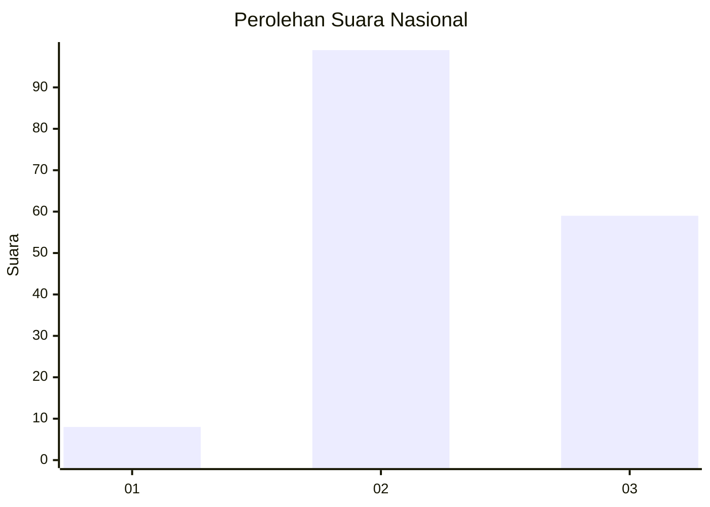
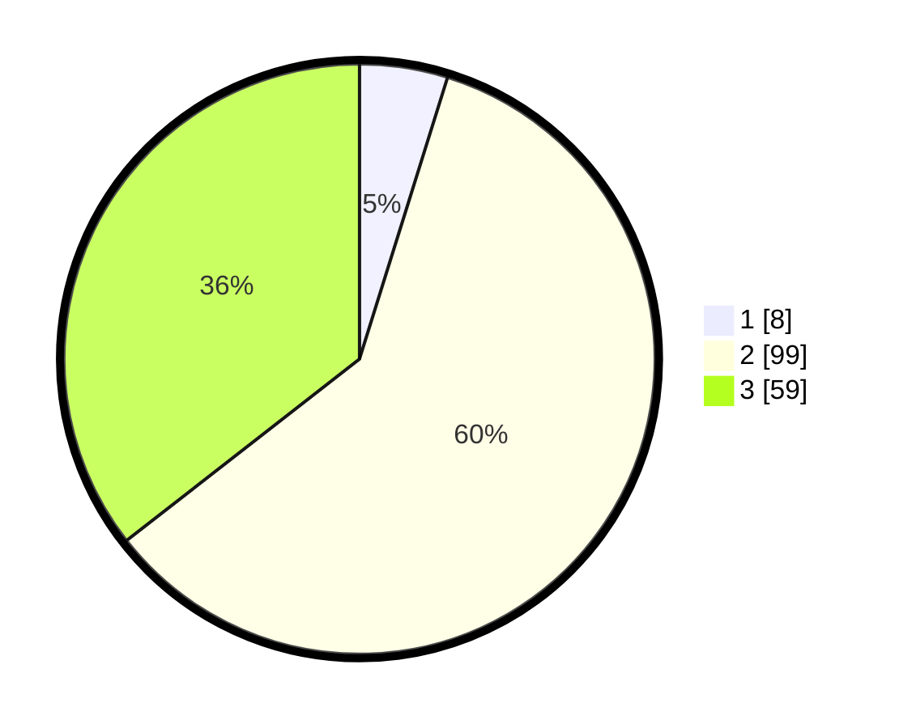

# Hasil

## Grafik

## Tabel

| No. | Nama Paslon    | Suara | Suara (raw) | Persentase |
|:--- |:-------------- | -----:| -----------:| ----------:|
| 1   | ANIES MUHAIMIN | 8     | [8][p-1]    | 4,82       |
| 2   | PRABOWO GIBRAN | 99    | [99][p-2]   | 59,64      |
| 3   | GANJAR MAHFUD  | 59    | [59][p-3]   | 35,54      |

[p-1]: https://github.com/gigit-pemilu/pemilu-2024/blob/main/pilpres/hitung-suara/sub/34-di-yogyakarta/sub/03-gunungkidul/sub/09-karangmojo/sub/2001-bejiharjo/sub/003-tps/sub/paslon-1.txt
[p-2]: https://github.com/gigit-pemilu/pemilu-2024/blob/main/pilpres/hitung-suara/sub/34-di-yogyakarta/sub/03-gunungkidul/sub/09-karangmojo/sub/2001-bejiharjo/sub/003-tps/sub/paslon-2.txt
[p-3]: https://github.com/gigit-pemilu/pemilu-2024/blob/main/pilpres/hitung-suara/sub/34-di-yogyakarta/sub/03-gunungkidul/sub/09-karangmojo/sub/2001-bejiharjo/sub/003-tps/sub/paslon-3.txt

## Foto C Plano

https://sirekap-obj-formc.kpu.go.id/af75/pemilu/ppwp/34/03/09/20/01/3403092001003-20240216-144148--576b849c-bb1a-4d25-8a46-a333312d6c15.jpg

https://sirekap-obj-formc.kpu.go.id/af75/pemilu/ppwp/34/03/09/20/01/3403092001003-20240214-160107--5a392a39-ae99-4075-b366-a9a8747b282b.jpg

https://sirekap-obj-formc.kpu.go.id/af75/pemilu/ppwp/34/03/09/20/01/3403092001003-20240216-144149--8971fe73-d192-4506-871a-704b93fd703a.jpg

## Metadata

| Key        | Value               |
| ---------- | ------------------- |
| Time Stamp | 2024-02-16 16:25:10 |

## DATA PEMILIH TETAP

Jumlah pemilih dalam DPT: **194**.
 * L: **92**.
 * P: **102**.

## DATA PENGGUNA HAK PILIH

Jumlah pengguna hak pilih dalam DPT: **171**.
 * L: **80**.
 * P: **91**.

Jumlah pengguna hak pilih dalam DPTb: **1**.
 * L: **1**.
 * P: **0**.

Jumlah pengguna hak pilih dalam DPK: **1**.
 * L: **1**.
 * P: **0**.

Jumlah pengguna hak pilih: **173**.
 * L: **82**.
 * P: **91**.

## JUMLAH SUARA SAH DAN TIDAK SAH

JUMLAH SELURUH SUARA SAH: **166**.

JUMLAH SUARA TIDAK SAH: **7**.

JUMLAH SELURUH SUARA SAH DAN SUARA TIDAK SAH: **173**.

