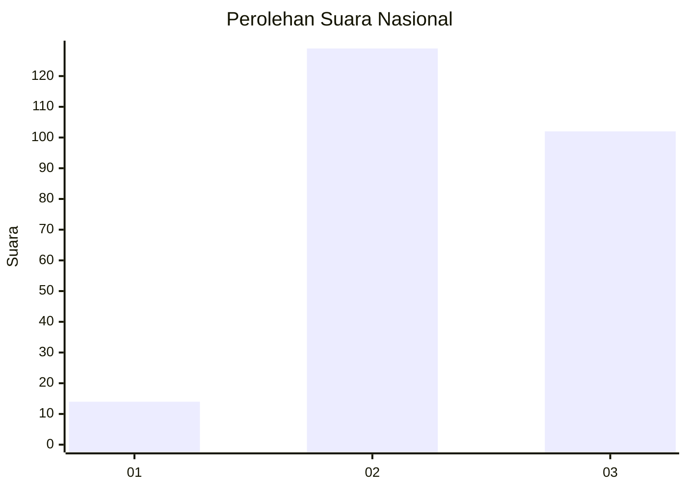
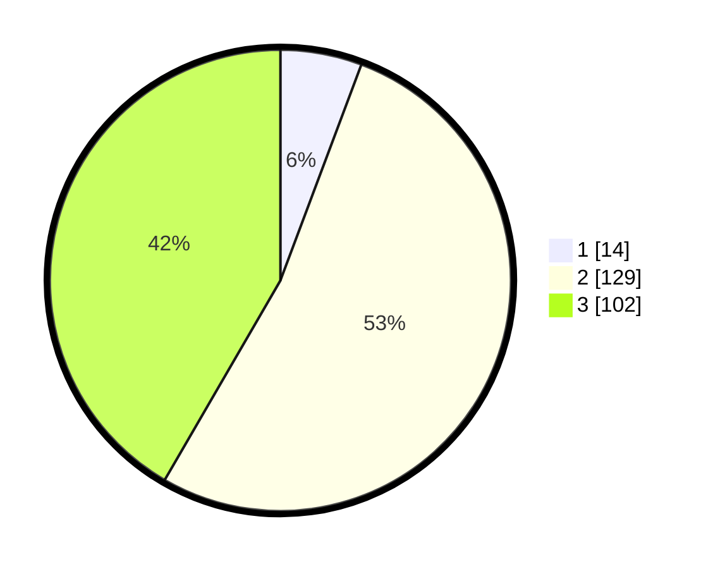

# Hasil

## Grafik

## Tabel

| No. | Nama Paslon    | Suara | Suara (raw) | Persentase |
|:--- |:-------------- | -----:| -----------:| ----------:|
| 1   | ANIES MUHAIMIN | 14    | [14][p-1]   | 5,71       |
| 2   | PRABOWO GIBRAN | 129   | [129][p-2]  | 52,65      |
| 3   | GANJAR MAHFUD  | 102   | [102][p-3]  | 41,63      |

[p-1]: https://github.com/gigit-pemilu/pemilu-2024/blob/main/pilpres/hitung-suara/sub/34-di-yogyakarta/sub/03-gunungkidul/sub/09-karangmojo/sub/2001-bejiharjo/sub/005-tps/sub/paslon-1.txt
[p-2]: https://github.com/gigit-pemilu/pemilu-2024/blob/main/pilpres/hitung-suara/sub/34-di-yogyakarta/sub/03-gunungkidul/sub/09-karangmojo/sub/2001-bejiharjo/sub/005-tps/sub/paslon-2.txt
[p-3]: https://github.com/gigit-pemilu/pemilu-2024/blob/main/pilpres/hitung-suara/sub/34-di-yogyakarta/sub/03-gunungkidul/sub/09-karangmojo/sub/2001-bejiharjo/sub/005-tps/sub/paslon-3.txt

## Foto C Plano

https://sirekap-obj-formc.kpu.go.id/29d0/pemilu/ppwp/34/03/09/20/01/3403092001005-20240214-222150--817f5bdf-9c87-4d87-947d-5961c432f035.jpg

https://sirekap-obj-formc.kpu.go.id/29d0/pemilu/ppwp/34/03/09/20/01/3403092001005-20240214-220940--5037b412-891e-46c7-b223-56ce14d93f90.jpg

https://sirekap-obj-formc.kpu.go.id/29d0/pemilu/ppwp/34/03/09/20/01/3403092001005-20240214-221139--1d891406-1939-40c9-9b94-10e6e5225e71.jpg

## Metadata

| Key        | Value               |
| ---------- | ------------------- |
| Time Stamp | 2024-02-15 15:30:25 |

