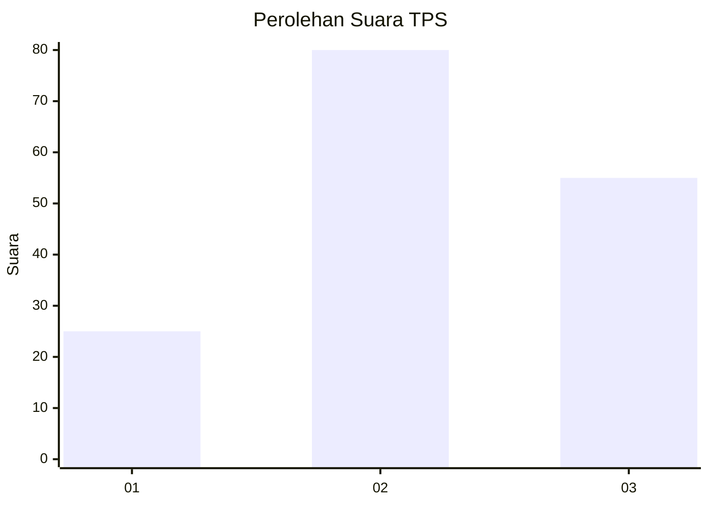
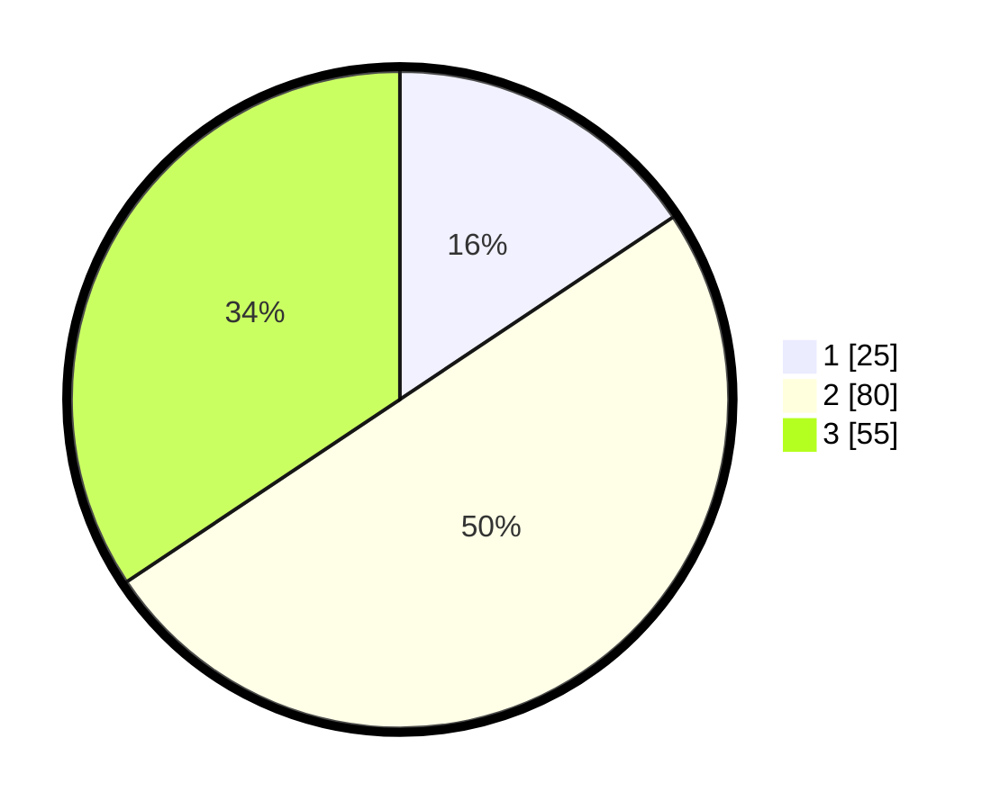

# Hasil

## Grafik

## Tabel

| No. | Nama Paslon    | Suara | Suara (raw) | Persentase |
|:--- |:-------------- | -----:| -----------:| ----------:|
| 1   | ANIES MUHAIMIN | 25    | [25][p-1]   | 15,63      |
| 2   | PRABOWO GIBRAN | 80    | [80][p-2]   | 50,00      |
| 3   | GANJAR MAHFUD  | 55    | [55][p-3]   | 34,38      |

[p-1]: https://github.com/gigit-pemilu/pemilu-2024-34-di-yogyakarta/blob/main/pilpres/hitung-suara/sub/34-di-yogyakarta/sub/03-gunungkidul/sub/09-karangmojo/sub/2001-bejiharjo/sub/021-tps/sub/paslon-1.txt
[p-2]: https://github.com/gigit-pemilu/pemilu-2024-34-di-yogyakarta/blob/main/pilpres/hitung-suara/sub/34-di-yogyakarta/sub/03-gunungkidul/sub/09-karangmojo/sub/2001-bejiharjo/sub/021-tps/sub/paslon-2.txt
[p-3]: https://github.com/gigit-pemilu/pemilu-2024-34-di-yogyakarta/blob/main/pilpres/hitung-suara/sub/34-di-yogyakarta/sub/03-gunungkidul/sub/09-karangmojo/sub/2001-bejiharjo/sub/021-tps/sub/paslon-3.txt

## Foto C Plano

https://sirekap-obj-formc.kpu.go.id/c148/pemilu/ppwp/34/03/09/20/01/3403092001021-20240214-141239--516e6d96-73ec-4f4f-bd8d-40ccbf4f575e.jpg

https://sirekap-obj-formc.kpu.go.id/c148/pemilu/ppwp/34/03/09/20/01/3403092001021-20240214-141454--369393c6-af60-4c1f-9865-aa5771634515.jpg

https://sirekap-obj-formc.kpu.go.id/c148/pemilu/ppwp/34/03/09/20/01/3403092001021-20240214-141205--eb4b4201-225f-45e8-8e0c-f4994c6ddae6.jpg

## Metadata

| Key        | Value               |
| ---------- | ------------------- |
| Time Stamp | 2024-02-14 21:46:01 |

