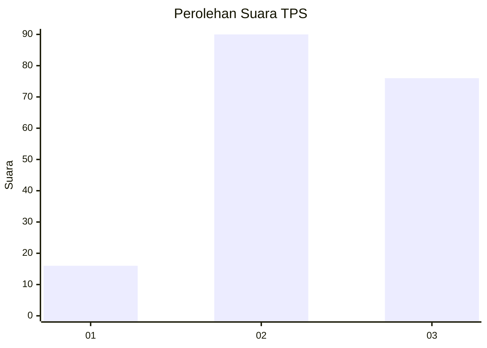
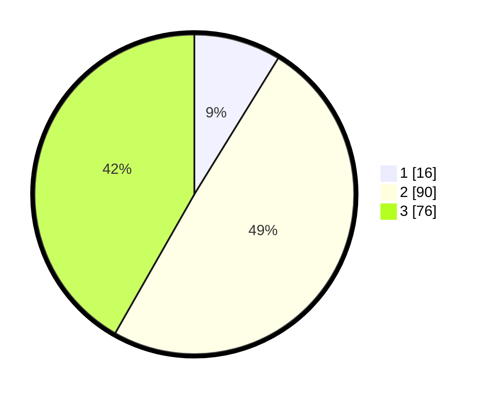

# Hasil

## Grafik

## Tabel

| No. | Nama Paslon    | Suara | Suara (raw) | Persentase |
|:--- |:-------------- | -----:| -----------:| ----------:|
| 1   | ANIES MUHAIMIN | 16    | [16][p-1]   | 8,79       |
| 2   | PRABOWO GIBRAN | 90    | [90][p-2]   | 49,45      |
| 3   | GANJAR MAHFUD  | 76    | [76][p-3]   | 41,76      |

[p-1]: https://github.com/gigit-pemilu/pemilu-2024-34-di-yogyakarta/blob/main/pilpres/hitung-suara/sub/34-di-yogyakarta/sub/03-gunungkidul/sub/09-karangmojo/sub/2001-bejiharjo/sub/022-tps/sub/paslon-1.txt
[p-2]: https://github.com/gigit-pemilu/pemilu-2024-34-di-yogyakarta/blob/main/pilpres/hitung-suara/sub/34-di-yogyakarta/sub/03-gunungkidul/sub/09-karangmojo/sub/2001-bejiharjo/sub/022-tps/sub/paslon-2.txt
[p-3]: https://github.com/gigit-pemilu/pemilu-2024-34-di-yogyakarta/blob/main/pilpres/hitung-suara/sub/34-di-yogyakarta/sub/03-gunungkidul/sub/09-karangmojo/sub/2001-bejiharjo/sub/022-tps/sub/paslon-3.txt

## Foto C Plano

https://sirekap-obj-formc.kpu.go.id/e966/pemilu/ppwp/34/03/09/20/01/3403092001022-20240215-000237--b35e7461-4ae7-42ff-9ec4-f5665b4507e9.jpg

https://sirekap-obj-formc.kpu.go.id/e966/pemilu/ppwp/34/03/09/20/01/3403092001022-20240215-000337--c3af0526-f247-40e1-8982-2387c8cbacb4.jpg

https://sirekap-obj-formc.kpu.go.id/e966/pemilu/ppwp/34/03/09/20/01/3403092001022-20240215-000454--31b1f8ab-ee3c-4a91-995c-53e3f5bcef26.jpg

## Metadata

| Key        | Value               |
| ---------- | ------------------- |
| Time Stamp | 2024-02-15 17:30:25 |

